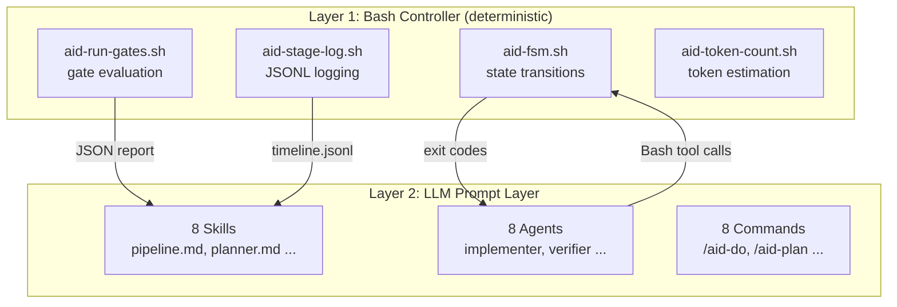
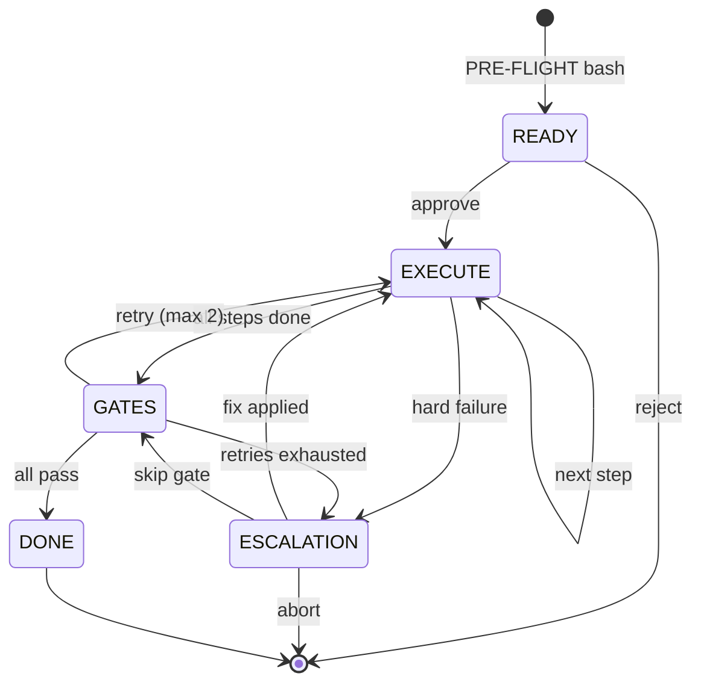
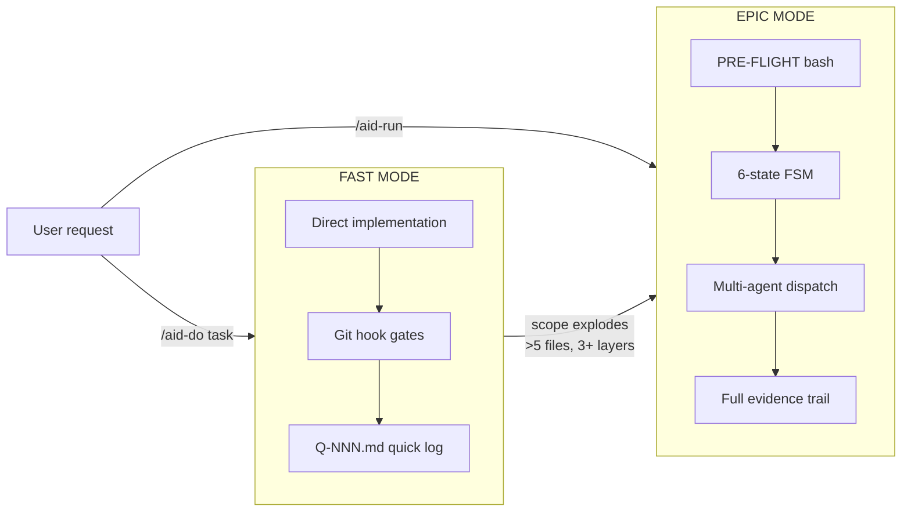
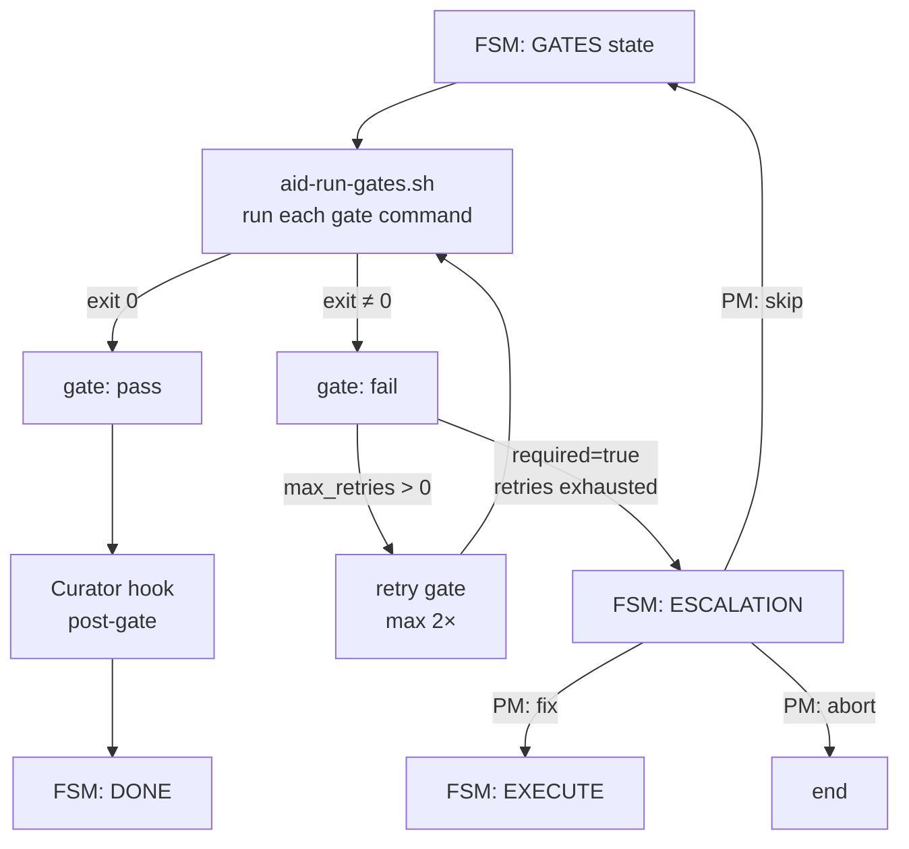
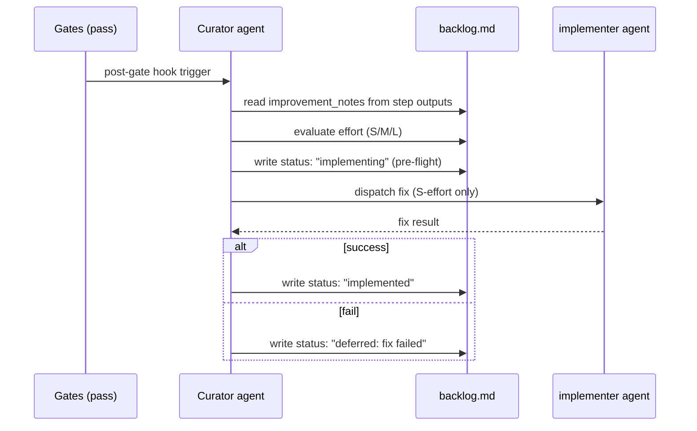
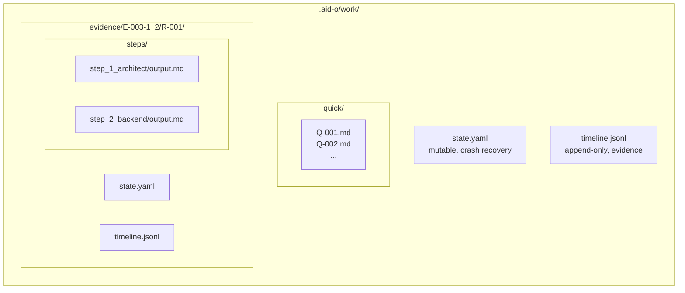
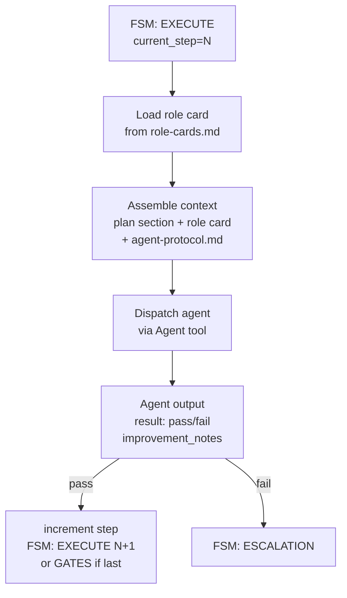

# Plan: AID Orchestrator v2.0 — Detailed Implementation Plan

> **Tento dokument** je implementační rozpracování návrhového dokumentu [REDESIGN-PLAN-v2.md](../../REDESIGN-PLAN-v2.md)
> a architektonického plánu [P022](P022-aid-orchestrator-v2-redesign.md).
> Obsahuje **step-by-step implementační instrukce** s přesnými file paths, logikou, error handling a acceptance criteria.

---

## Context

AID Orchestrator v1.7.0 has proven core value (FIRST AID, Curator 21 fixes, DAG dispatch, evidence trail).
A redesign to v2.0 addresses three root causes of unsustainability:

1. **~400K prompt tokens** — 27 skills with 36 cross-reference cycles
2. **Non-deterministic FSM** — state transitions as LLM instructions, not bash code
3. **30-60 min UX overhead** — no Fast Mode for tasks < 2h

**Architecture decision:** Phased Rewrite (Option A from P022) — v1 stays functional during entire redesign.
Reference architecture: `REDESIGN-PLAN-v2.md` sections 1–7.

---

## Goal

Deliver AID Orchestrator v2.0.0 with:
- 87% token reduction (~400K → ~50K prompt tokens)
- 6-state bash FSM (from 11 LLM-controlled states)
- FAST MODE (< 2 min overhead for tasks < 2h)
- CI pipeline (GitHub Actions for 92 bash tests + 32 Vitest files)
- Consolidated: 8 skills, 8 agents, 8 commands

---

## Scope

**In scope:** All phases 0–7 below.
**Out of scope (own EPICs):** GUI redesign (Phase GUI below, pending agent), VULCAN integration (Phase VULCAN below, pending agent), TypeScript rewrite of `aid-epic-to-json.sh`, Qdrant multi-project learning.

---

## Stack

- **Runtime:** bash 5.x, Node.js 20, TypeScript 5.x
- **Testing:** bats-core (bash), Vitest (TypeScript)
- **CI:** GitHub Actions
- **Plugin:** Claude Code plugin format (`plugins/aid-orchestrator/`)
- **Packages:** `packages/aid-gui` (Vite+React), `packages/aid-server` (Node.js), `packages/aid-contract` (NEW)

---

## Roles & Models

| Role | Model | Used for |
|------|-------|----------|
| architect | opus | Step design, data model decisions |
| implementer | sonnet | Bash scripts, Markdown skills/agents/commands |
| gate-fixer | haiku | Mechanical lint/test fixes |
| verifier | sonnet | Acceptance criteria validation |

---

## Implementation Steps

> Total: **34 steps** across 7 phases + 2 pending sections (GUI, VULCAN).
> Effort points: S=1, M=3, L=5. Total estimated: ~72 points.

---

## Phase 0: Foundation & CI (Steps 1–3)

> **Goal:** CI pipeline active before any redesign work. Green baseline established.
> **Duration:** 1–2 days
> **Can be dispatched independently:** Yes (no dependencies on redesign)

---

### Step 1: GitHub Actions — CI Pipeline

**Objective:** Add 3 GitHub Actions workflows so that 92 bash tests and 32 Vitest files run automatically on every PR and push to main.

**Role:** implementer | **Model:** sonnet | **Effort:** M

**Files:**
- Create: `.github/workflows/ci.yml`
- Create: `.github/workflows/markdown-lint.yml`
- Create: `.github/workflows/version-sync.yml`
- Create: `scripts/check-path-validation.js`

**Implementation Detail:**

`.github/workflows/ci.yml`:
```yaml
name: CI
on:
  push:
    branches: [main]
  pull_request:
    branches: [main]
jobs:
  bash-tests:
    runs-on: ubuntu-latest
    steps:
      - uses: actions/checkout@v4
      - name: Install jq
        run: sudo apt-get install -y jq
      - name: Run bash test suite
        run: |
          chmod +x plugins/aid-orchestrator/scripts/tests/run-all-tests.sh
          plugins/aid-orchestrator/scripts/tests/run-all-tests.sh --verbose
        timeout-minutes: 5

  vitest:
    runs-on: ubuntu-latest
    steps:
      - uses: actions/checkout@v4
      - uses: actions/setup-node@v4
        with: { node-version: '20', cache: 'npm' }
      - run: npm ci
      - run: npm test
        timeout-minutes: 10

  build-check:
    needs: [vitest]
    runs-on: ubuntu-latest
    steps:
      - uses: actions/checkout@v4
      - uses: actions/setup-node@v4
        with: { node-version: '20', cache: 'npm' }
      - run: npm ci
      - run: npm run build
        working-directory: packages/aid-gui
        timeout-minutes: 10

  security-regression:
    runs-on: ubuntu-latest
    steps:
      - uses: actions/checkout@v4
      - uses: actions/setup-node@v4
        with: { node-version: '20', cache: 'npm' }
      - run: npm ci
      - run: node scripts/check-path-validation.js
        timeout-minutes: 2
```

`scripts/check-path-validation.js` — validates all Express route handlers that accept `epicId`/`runId` params have path validation:
```javascript
#!/usr/bin/env node
const fs = require('fs');
const path = require('path');
const routesDir = path.join(__dirname, '../packages/aid-server/src/routes');
const files = fs.readdirSync(routesDir).filter(f => f.endsWith('.ts'));
let exitCode = 0;
for (const file of files) {
  const content = fs.readFileSync(path.join(routesDir, file), 'utf8');
  const hasRouteParam = /req\.params\.(epicId|runId|id)/.test(content);
  const hasValidation = /isValidPathComponent|validateEpicId|path\.basename/.test(content);
  if (hasRouteParam && !hasValidation) {
    console.error(`FAIL: ${file} reads route params without path validation (CWE-22)`);
    exitCode = 1;
  }
}
process.exit(exitCode);
```

`markdown-lint.yml` — checks structural requirements on skill/command/agent markdown:
```yaml
name: Markdown Lint
on:
  pull_request:
    paths:
      - 'plugins/aid-orchestrator/skills/**'
      - 'plugins/aid-orchestrator/commands/**'
      - 'plugins/aid-orchestrator/agents/**'
jobs:
  lint:
    runs-on: ubuntu-latest
    steps:
      - uses: actions/checkout@v4
      - name: Check Last Updated footer
        run: |
          missing=$(grep -rL "Last Updated:" \
            plugins/aid-orchestrator/skills/ \
            plugins/aid-orchestrator/commands/ \
            plugins/aid-orchestrator/agents/ 2>/dev/null || true)
          [ -z "$missing" ] || (echo "Missing 'Last Updated:' in: $missing" && exit 1)
      - name: Warn on files over 800 lines
        run: |
          find plugins/aid-orchestrator/skills/ plugins/aid-orchestrator/commands/ \
            plugins/aid-orchestrator/agents/ -name "*.md" | \
            xargs awk 'END{if(NR>800)print "WARNING: " FILENAME " has " NR " lines (limit 800)"}'
```

`version-sync.yml` — 8 version locations must agree:
```yaml
name: Version Sync
on:
  push:
    branches: [main]
jobs:
  check:
    runs-on: ubuntu-latest
    steps:
      - uses: actions/checkout@v4
      - name: All version locations must match
        run: |
          VERSION=$(jq -r .version package.json)
          echo "Expected version: $VERSION"
          check_version() { local file=$1 pattern=$2
            actual=$(grep -oP "$pattern" "$file" | head -1)
            [ "$actual" = "$VERSION" ] || (echo "MISMATCH in $file: $actual != $VERSION" && exit 1)
          }
          check_version "packages/aid-gui/package.json" '(?<="version": ")[^"]+'
          check_version "packages/aid-server/package.json" '(?<="version": ")[^"]+'
          check_version "plugins/aid-orchestrator/.claude-plugin/plugin.json" '(?<="version": ")[^"]+'
          # Add remaining version locations as they are identified
```

**Error Handling:**
- If `run-all-tests.sh` exits non-zero, CI fails with visible output (already handled by `--verbose`)
- If `scripts/check-path-validation.js` cannot find routesDir: `fs.readdirSync` throws, job fails with stack trace — acceptable (means project structure broke)
- If version locations change count in future: update `version-sync.yml` explicitly (no dynamic discovery — too fragile)

**Edge Cases:**
- `markdown-lint.yml` runs only when skill/command/agent files change — not on every PR (performance)
- `build-check` depends on `vitest` passing first — if types break, build fails anyway (saves CI minutes)
- `scripts/check-path-validation.js` is Node (not TypeScript) — runs without `tsc` step

**Dependencies:** None (Phase 0 is independent)

**Acceptance Criteria:**
- [ ] `git push` to main branch → all 4 CI jobs appear in GitHub Actions UI
- [ ] `plugins/aid-orchestrator/scripts/tests/run-all-tests.sh --verbose` exits 0 in CI
- [ ] `npm test` exits 0 in CI (all 32 Vitest files pass)
- [ ] `npm run build` in `packages/aid-gui` exits 0
- [ ] `node scripts/check-path-validation.js` exits 0 (no path traversal regressions)
- [ ] Modify a skill file without "Last Updated:" → `markdown-lint.yml` fails

---

### Step 1a: Docs Baseline — Architecture Diagrams (součást Phase 0)

**Objective:** Create 3 Docusaurus pages under `docs/docs/architecture/` with the v2 architecture diagrams as a "living document" baseline. These pages are updated throughout Phases 1–7 as the implementation progresses.

**Role:** implementer | **Model:** sonnet | **Effort:** S

**Files:**
- Create: `docs/docs/architecture/diagrams.md` — all 8 Mermaid diagrams with descriptions
- Create: `docs/docs/architecture/fsm.md` — 6-state FSM diagram (Diagram 2) as primary reference
- Create: `docs/docs/architecture/execution-modes.md` — Dual execution modes (Diagram 3)

**Implementation Detail:**

`diagrams.md` — index page linking to all 8 diagrams, with brief description of each. Copy diagrams from the Documentation Policy section of this plan verbatim. Each diagram gets a `## Diagram N: Title` heading and a 2-3 sentence description below the Mermaid block.

`fsm.md` — dedicated page for Diagram 2 (6-State FSM). Most-referenced architecture diagram. Include:
```markdown
# 6-State FSM

AID v2.0 uses a deterministic bash FSM with 6 states.

[Diagram 2 Mermaid block]

## State Reference

| State | Entered when | Exits when |
|-------|--------------|------------|
| READY | PRE-FLIGHT bash completes | PM approves |
| EXECUTE | PM approves | All steps done OR hard failure |
| GATES | All steps done | All gates pass OR retries exhausted |
| ESCALATION | Gate fails OR hard failure | PM decides: fix / skip / abort |
| DONE | All gates pass | (terminal) |
| ERROR | Unrecoverable error | Manual intervention needed |

Bash implementation: `scripts/aid-fsm.sh`
```

`execution-modes.md` — Diagram 3 with /aid-do vs /aid-run comparison table:
```markdown
| Feature | FAST MODE (/aid-do) | EPIC MODE (/aid-run) |
|---------|--------------------|--------------------|
| Overhead | < 2 min | 5–30 min (planning) |
| Evidence | Q-NNN.md quick log | Full timeline.jsonl |
| Gates | git pre-commit hooks | aid-run-gates.sh |
| Best for | 1-file fixes, small features | Multi-step, multi-role work |
```

**Acceptance Criteria:**
- [ ] `npm run build` in `docs/` exits 0 (Docusaurus builds without errors)
- [ ] All 8 Mermaid diagrams render in preview (verify locally: `npm run start` → check architecture pages)
- [ ] `docs/docs/architecture/fsm.md` state reference table has all 6 states
- [ ] `docs/docs/architecture/execution-modes.md` comparison table present
- [ ] No broken links (Docusaurus build would fail on broken internal links)

---

### Step 2: Security Gate Upgrade + Backlog Sync Fix

**Objective:** Promote `security_scan_pass` to `required: true` in gates config; fix IMP-051 and IMP-052 backlog status from stale to "implemented".

**Role:** implementer | **Model:** sonnet | **Effort:** S

**Files:**
- Modify: `plugins/aid-orchestrator/defaults/policies/gates.yaml` — `security_scan_pass.required: true`
- Modify: `.aid-o/04-engine/memory/backlog.md` — IMP-051, IMP-052 status → "implemented"

**Implementation Detail:**
In `gates.yaml`, find `security_scan_pass` entry and change:
```yaml
# Before:
security_scan_pass:
  command: "bandit -q -r . -ll"
  required: false

# After:
security_scan_pass:
  command: "bandit -q -r . -ll"
  required: true
  # Making this required: any future EPIC must pass security scan before DONE state
```

In `backlog.md`, find IMP-051 and IMP-052 entries and update their status fields:
```markdown
<!-- IMP-051: was "open", change to: -->
status: implemented
implemented_at: 2026-03-03
note: Fix confirmed in audit — backlog was not updated after implementation

<!-- IMP-052: same pattern -->
status: implemented
implemented_at: 2026-03-03
note: Fix confirmed in audit — backlog was not updated after implementation
```

**Error Handling:**
- If `bandit` is not installed in project: gates.yaml change is correct but gate will fail with "command not found" → document in `execution.yaml` that `bandit` must be in PATH or in CI environment

**Edge Cases:**
- Making security_scan required=true means any EPIC that previously passed GATES without running bandit will now fail → this is intentional (security regression prevention)

**Dependencies:** Step 1 (CI must be green before adding required gate — ensures we see failures in CI)

**Acceptance Criteria:**
- [ ] `gates.yaml` has `security_scan_pass.required: true`
- [ ] IMP-051 status in backlog.md is "implemented"
- [ ] IMP-052 status in backlog.md is "implemented"
- [ ] Run any existing EPIC through GATES phase → security_scan_pass is evaluated and required

---

### Step 3: Deterministický scope_check bash gate

**Objective:** Replace the LLM-evaluated `scope_check` rule gate with a deterministic bash script that uses `git diff --stat` and allowed_paths config.

**Role:** implementer | **Model:** sonnet | **Effort:** M

**Files:**
- Create: `plugins/aid-orchestrator/scripts/gates/scope-check.sh`
- Create: `plugins/aid-orchestrator/scripts/tests/test-scope-check.sh`
- Modify: `plugins/aid-orchestrator/defaults/policies/gates.yaml` — scope_check entry

**Implementation Detail:**

`scope-check.sh`:
```bash
#!/usr/bin/env bash
# scope-check.sh — Deterministická validace scope EPICu
# Usage: scope-check.sh <allowed_paths_file> <base_commit>
# Exit 0 = scope OK, Exit 1 = scope violation
# Stdout = JSON report

set -euo pipefail

ALLOWED_PATHS_FILE="${1:?allowed_paths_file required}"
BASE_COMMIT="${2:?base_commit required}"

if [[ ! -f "$ALLOWED_PATHS_FILE" ]]; then
  echo '{"result":"fail","reason":"allowed_paths_file not found","files_changed":[]}'
  exit 1
fi

# Get changed files since base commit
CHANGED_FILES=$(git diff --name-only "$BASE_COMMIT" HEAD 2>/dev/null) || {
  echo '{"result":"fail","reason":"git diff failed — is base_commit valid?","files_changed":[]}'
  exit 1
}

if [[ -z "$CHANGED_FILES" ]]; then
  echo '{"result":"pass","reason":"no files changed","files_changed":[]}'
  exit 0
fi

# Load allowed path patterns (one per line, supports globs via bash)
mapfile -t ALLOWED < "$ALLOWED_PATHS_FILE"

VIOLATIONS=()
while IFS= read -r file; do
  allowed=false
  for pattern in "${ALLOWED[@]}"; do
    [[ -z "$pattern" || "$pattern" == \#* ]] && continue  # skip empty/comments
    # shellcheck disable=SC2254
    case "$file" in
      $pattern) allowed=true; break ;;
    esac
  done
  $allowed || VIOLATIONS+=("$file")
done <<< "$CHANGED_FILES"

# Build JSON output
FILES_JSON=$(printf '%s\n' "${CHANGED_FILES}" | jq -R . | jq -cs .)
VIOLATIONS_JSON=$(printf '%s\n' "${VIOLATIONS[@]:-}" | jq -R . | jq -cs .)

if [[ ${#VIOLATIONS[@]} -gt 0 ]]; then
  echo "{\"result\":\"fail\",\"reason\":\"${#VIOLATIONS[@]} file(s) outside allowed scope\",\"violations\":${VIOLATIONS_JSON},\"files_changed\":${FILES_JSON}}"
  exit 1
else
  echo "{\"result\":\"pass\",\"reason\":\"all ${#CHANGED_FILES[@]} changed files within allowed scope\",\"files_changed\":${FILES_JSON}}"
  exit 0
fi
```

`test-scope-check.sh` (bats-core format):
```bash
#!/usr/bin/env bats
# Tests for scope-check.sh

setup() {
  TEST_DIR=$(mktemp -d)
  cd "$TEST_DIR"
  git init -q
  git commit --allow-empty -m "base"
  BASE_COMMIT=$(git rev-parse HEAD)
  ALLOWED_FILE="$TEST_DIR/allowed.txt"
  echo "src/**" > "$ALLOWED_FILE"
  echo "tests/**" >> "$ALLOWED_FILE"
}

teardown() { rm -rf "$TEST_DIR"; }

@test "passes when no files changed" {
  run scope-check.sh "$ALLOWED_FILE" "$BASE_COMMIT"
  [ "$status" -eq 0 ]
  echo "$output" | jq -e '.result == "pass"'
}

@test "passes when all changes within allowed paths" {
  mkdir -p src; echo "code" > src/main.ts
  git add -A; git commit -m "change"
  run scope-check.sh "$ALLOWED_FILE" "$BASE_COMMIT"
  [ "$status" -eq 0 ]
}

@test "fails when file outside allowed paths" {
  echo "change" > README.md
  git add -A; git commit -m "change"
  run scope-check.sh "$ALLOWED_FILE" "$BASE_COMMIT"
  [ "$status" -eq 1 ]
  echo "$output" | jq -e '.result == "fail"'
}

@test "exits 1 with error JSON if allowed_paths_file missing" {
  run scope-check.sh "/nonexistent/file" "$BASE_COMMIT"
  [ "$status" -eq 1 ]
  echo "$output" | jq -e '.result == "fail"'
}
```

Update `gates.yaml` scope_check entry:
```yaml
# Before (LLM rule):
scope_check:
  type: rule
  description: "Verify changes are within EPIC scope"
  required: true

# After (deterministický bash):
scope_check:
  command: "plugins/aid-orchestrator/scripts/gates/scope-check.sh .aid-o/work/evidence/{epic_id}/allowed_paths.txt {base_commit}"
  required: true
  type: deterministic
  max_retries: 0   # scope violation = immediate escalation, no retry
```

**Error Handling:**
- Invalid `base_commit` → script outputs JSON error, exits 1 (handled by gates runner as gate fail → escalation)
- `git diff` fails (detached HEAD, shallow clone) → JSON error with reason
- `allowed_paths.txt` missing → gate fails with "file not found" reason; run validator should catch missing allowed_paths during PRE-FLIGHT

**Edge Cases:**
- Binary files (images, compiled artifacts) in changed files → git diff --name-only handles them correctly
- Deleted files → still appear in `git diff --name-only`, should be validated against scope (deleting outside scope = still a violation)
- Symlinks → treated as regular paths

**Dependencies:** Step 1

**Acceptance Criteria:**
- [ ] `bash plugins/aid-orchestrator/scripts/tests/test-scope-check.sh` exits 0 (all bats tests pass)
- [ ] `scope-check.sh` without arguments exits 1 (not 0) with usage error
- [ ] gates.yaml has `scope_check.type: deterministic`
- [ ] Run EPIC with files changed outside allowed_paths.txt → GATES fails, ESCALATION triggered (no LLM evaluation)

---

## Phase 1: Bash Controller Layer (Steps 4–9)

> **Goal:** Deterministic state management and logging in bash.
> **Duration:** 1 week
> **Must be complete before Phase 2** (Phase 2 skills reference bash scripts)

---

### Step 4: aid-stage-log.sh — Structured JSONL Logging

**Objective:** Create `lib/aid-stage-log.sh` with `log_event()` function that appends valid JSONL to timeline.jsonl atomically, replacing all current `echo >> stage_log.jsonl` patterns in skills.

**Role:** implementer | **Model:** sonnet | **Effort:** M

**Files:**
- Create: `plugins/aid-orchestrator/scripts/lib/aid-stage-log.sh`
- Create: `plugins/aid-orchestrator/scripts/tests/test-stage-log.sh`

**Implementation Detail:**

`lib/aid-stage-log.sh`:
```bash
#!/usr/bin/env bash
# aid-stage-log.sh — Structured JSONL event logging
# Source this file, then call: log_event <timeline_file> <event> [key=value ...]
# NEVER exits non-zero (logging must not interrupt pipeline)

log_event() {
  local timeline_file="$1"
  local event="$2"
  shift 2

  # Build timestamp
  local ts
  ts=$(date -u +"%Y-%m-%dT%H:%M:%SZ")

  # Start JSON object
  local json="{\"ts\":\"${ts}\",\"event\":\"${event}\""

  # Parse key=value pairs, escape values for JSON
  local key val
  for kv in "$@"; do
    key="${kv%%=*}"
    val="${kv#*=}"
    # Escape special JSON characters
    val="${val//\\/\\\\}"
    val="${val//\"/\\\"}"
    val="${val//$'\n'/\\n}"
    val="${val//$'\t'/\\t}"
    # Detect numeric values (int or float, no quoting)
    if [[ "$val" =~ ^-?[0-9]+(\.[0-9]+)?$ ]]; then
      json+=",\"${key}\":${val}"
    elif [[ "$val" == "true" || "$val" == "false" || "$val" == "null" ]]; then
      json+=",\"${key}\":${val}"
    else
      json+=",\"${key}\":\"${val}\""
    fi
  done

  json+="}"

  # Validate JSON before writing (requires jq)
  if command -v jq &>/dev/null; then
    if ! echo "$json" | jq -e . &>/dev/null; then
      # Invalid JSON: write error event instead, never block pipeline
      local err_json="{\"ts\":\"${ts}\",\"event\":\"log_error\",\"original_event\":\"${event}\",\"error\":\"invalid JSON generated\"}"
      echo "$err_json" >> "${timeline_file}" 2>/dev/null || true
      return 0
    fi
  fi

  # Atomic append (>> is atomic for short writes on Linux ext4/xfs)
  echo "$json" >> "${timeline_file}" 2>/dev/null || true
  return 0
}

# Export for use in subshells
export -f log_event
```

`test-stage-log.sh` (bats-core):
```bash
#!/usr/bin/env bats
setup() {
  TEST_DIR=$(mktemp -d)
  TIMELINE="$TEST_DIR/timeline.jsonl"
  source plugins/aid-orchestrator/scripts/lib/aid-stage-log.sh
}
teardown() { rm -rf "$TEST_DIR"; }

@test "creates valid JSONL entry with string value" {
  log_event "$TIMELINE" "step_dispatch" state=EXECUTE role=architect
  run jq -e '.event == "step_dispatch"' "$TIMELINE"
  [ "$status" -eq 0 ]
}

@test "numeric values are not quoted in JSON" {
  log_event "$TIMELINE" "step_complete" duration_s=120
  run jq -e '.duration_s == 120' "$TIMELINE"
  [ "$status" -eq 0 ]
}

@test "boolean values are not quoted in JSON" {
  log_event "$TIMELINE" "gate_run" required=true
  run jq -e '.required == true' "$TIMELINE"
  [ "$status" -eq 0 ]
}

@test "never exits non-zero even with invalid timeline path" {
  run log_event "/nonexistent/dir/timeline.jsonl" "test_event"
  [ "$status" -eq 0 ]
}

@test "special characters in values are escaped" {
  log_event "$TIMELINE" "test" message='hello "world"'
  run jq -e '.message == "hello \"world\""' "$TIMELINE"
  [ "$status" -eq 0 ]
}

@test "multiple events produce valid JSONL (one per line)" {
  log_event "$TIMELINE" "event_1" step=1
  log_event "$TIMELINE" "event_2" step=2
  run jq -s 'length == 2' "$TIMELINE"
  [ "$status" -eq 0 ]
}
```

**Error Handling:**
- `timeline_file` directory doesn't exist → `>>` fails silently, `|| true` prevents exit
- jq not installed → skip validation, write anyway (best-effort logging)
- Invalid characters in values → escape logic handles `\`, `"`, newlines, tabs; other chars pass through
- Concurrent writes from parallel agents → `>>` append is atomic for short writes on Linux; acceptable race condition risk (JSONL lines may interleave but each line is valid)

**Edge Cases:**
- Empty event name → writes `{"ts":"...","event":""}` — valid JSON, accepted
- Value containing `=` sign → `${kv#*=}` takes everything after FIRST `=`, correct
- Very long values (> 4096 chars) → written correctly, but may approach pipe buffer limits

**Dependencies:** None

**Acceptance Criteria:**
- [ ] `bats plugins/aid-orchestrator/scripts/tests/test-stage-log.sh` exits 0 (all tests pass)
- [ ] `source aid-stage-log.sh; log_event /tmp/t.jsonl "test" key=value; jq . /tmp/t.jsonl` outputs valid JSON
- [ ] Logging function never exits non-zero (verified by test)
- [ ] Run 100 concurrent `log_event` calls → all entries appear in file, all are valid JSON (concurrent test)

---

### Step 5: aid-token-count.sh — Token Estimation

**Objective:** Create `lib/aid-token-count.sh` that estimates token count from character count with content-type-aware ratios, replacing the defunct `token-estimator.md` skill.

**Role:** implementer | **Model:** sonnet | **Effort:** S

**Files:**
- Create: `plugins/aid-orchestrator/scripts/lib/aid-token-count.sh`
- Create: `plugins/aid-orchestrator/scripts/tests/test-token-count.sh`

**Implementation Detail:**

`lib/aid-token-count.sh`:
```bash
#!/usr/bin/env bash
# aid-token-count.sh — Token estimation from character count
# Usage: count_tokens <file_or_text> [content_type: prose|code|mixed]
# Stdout: JSON {"estimated_tokens":N,"char_count":N,"content_type":"...","ratio":N}

count_tokens() {
  local input="$1"
  local content_type="${2:-mixed}"

  # Determine character count
  local char_count
  if [[ -f "$input" ]]; then
    char_count=$(wc -c < "$input")
  else
    char_count=${#input}
  fi

  # Content-type ratios (chars per token):
  # prose: ~4.0 (English text, GPT-4 empirical)
  # code: ~3.0 (more symbols, shorter tokens)
  # mixed: ~3.5 (skills/agents = prose + code)
  local ratio
  case "$content_type" in
    prose) ratio="4.0" ;;
    code)  ratio="3.0" ;;
    mixed) ratio="3.5" ;;
    *)     ratio="3.5"; content_type="mixed" ;;  # unknown = mixed
  esac

  local estimated_tokens
  estimated_tokens=$(awk "BEGIN {printf \"%d\", int($char_count / $ratio + 0.5)}")

  echo "{\"estimated_tokens\":${estimated_tokens},\"char_count\":${char_count},\"content_type\":\"${content_type}\",\"ratio\":${ratio}}"
  return 0
}

# Allow direct invocation
if [[ "${BASH_SOURCE[0]}" == "${0}" ]]; then
  count_tokens "${1:?Usage: aid-token-count.sh <file_or_text> [content_type]}" "${2:-mixed}"
fi

export -f count_tokens
```

**Error Handling:**
- File not found: treated as literal string (${#input} on non-existent path = path string length) — document this behavior; users should check file existence before calling
- Division-by-zero impossible (ratio is always > 0)
- Non-UTF8 files: `wc -c` counts bytes, not chars — acceptable approximation for token estimation

**Acceptance Criteria:**
- [ ] `aid-token-count.sh skills/pipeline.md` outputs valid JSON with `estimated_tokens > 0`
- [ ] Content type "code" produces ~17% more tokens than "prose" for same input (ratio 4.0 vs 3.0)
- [ ] Works as sourced library (`source aid-token-count.sh; count_tokens "hello world" prose`)
- [ ] All 4 bats tests pass

---

### Step 6: aid-fsm.sh — Deterministic State Machine

**Objective:** Create `scripts/aid-fsm.sh` implementing the 6-state FSM with validated transitions, replacing all LLM-based state management in pipeline.md.

**Role:** architect → implementer | **Model:** opus (design), sonnet (impl) | **Effort:** L

**Files:**
- Create: `plugins/aid-orchestrator/scripts/aid-fsm.sh`
- Create: `plugins/aid-orchestrator/scripts/tests/test-fsm.sh`

**Implementation Detail:**

Valid state transitions (from REDESIGN-PLAN-v2.md §1.2):
```
PRE-FLIGHT → READY     (bash pipeline completes)
READY → EXECUTE        (PM or auto approve)
READY → (end)          (reject)
EXECUTE → EXECUTE      (next step, internal)
EXECUTE → GATES        (all steps done)
EXECUTE → ESCALATION   (hard failure in step)
GATES → DONE           (all gates pass)
GATES → EXECUTE        (gate retry, max 2)
GATES → ESCALATION     (gate retry exhausted)
ESCALATION → EXECUTE   (fix applied, resume)
ESCALATION → GATES     (skip gate)
ESCALATION → (end)     (abort)
```

`aid-fsm.sh`:
```bash
#!/usr/bin/env bash
# aid-fsm.sh — AID Orchestrator 6-state FSM controller
# Usage:
#   aid-fsm.sh init <epic_id> <run_id> <total_steps> <mode> <branch> <base_commit> <state_file>
#   aid-fsm.sh transition <from> <to> <state_file>
#   aid-fsm.sh get-state <state_file>
#   aid-fsm.sh increment-step <state_file>
#   aid-fsm.sh get-field <field> <state_file>

set -euo pipefail

VALID_STATES="READY EXECUTE GATES ESCALATION DONE"

# Valid transitions map: "FROM:TO" pairs
VALID_TRANSITIONS=(
  "READY:EXECUTE"
  "EXECUTE:EXECUTE"
  "EXECUTE:GATES"
  "EXECUTE:ESCALATION"
  "GATES:DONE"
  "GATES:EXECUTE"
  "GATES:ESCALATION"
  "ESCALATION:EXECUTE"
  "ESCALATION:GATES"
)

is_valid_state() {
  local state="$1"
  [[ " $VALID_STATES " =~ " $state " ]]
}

is_valid_transition() {
  local from="$1" to="$2"
  local pair="${from}:${to}"
  for t in "${VALID_TRANSITIONS[@]}"; do
    [[ "$t" == "$pair" ]] && return 0
  done
  return 1
}

cmd_init() {
  local epic_id="$1" run_id="$2" total_steps="$3" mode="$4"
  local branch="$5" base_commit="$6" state_file="$7"

  if [[ -f "$state_file" ]]; then
    echo "ERROR: state_file already exists: $state_file (prevent duplicate init)" >&2
    exit 1
  fi

  mkdir -p "$(dirname "$state_file")"
  cat > "$state_file" << EOF
epic_id: $epic_id
run_id: $run_id
state: READY
current_step: 0
total_steps: $total_steps
mode: $mode
branch: $branch
base_commit: $base_commit
gate_retries: 0
escalation_count: 0
started_at: "$(date -u +"%Y-%m-%dT%H:%M:%SZ")"
EOF
  echo "Initialized state: READY" >&2
}

cmd_transition() {
  local from="$1" to="$2" state_file="$3"

  [[ -f "$state_file" ]] || { echo "ERROR: state_file not found: $state_file" >&2; exit 1; }

  local current_state
  current_state=$(grep '^state:' "$state_file" | awk '{print $2}')

  if [[ "$current_state" != "$from" ]]; then
    echo "ERROR: expected state $from but found $current_state" >&2
    exit 1
  fi

  if ! is_valid_state "$to"; then
    echo "ERROR: invalid target state: $to" >&2
    exit 1
  fi

  if ! is_valid_transition "$from" "$to"; then
    echo "ERROR: invalid transition $from → $to" >&2
    exit 1
  fi

  # Increment escalation_count when entering ESCALATION
  if [[ "$to" == "ESCALATION" ]]; then
    local count
    count=$(grep '^escalation_count:' "$state_file" | awk '{print $2}')
    sed -i "s/^escalation_count: .*/escalation_count: $((count + 1))/" "$state_file"
  fi

  # Update state (atomic via temp file + mv)
  local tmp_file="${state_file}.tmp"
  sed "s/^state: .*/state: $to/" "$state_file" > "$tmp_file"
  mv "$tmp_file" "$state_file"

  echo "Transition: $from → $to" >&2
}

cmd_get_state() {
  local state_file="$1"
  [[ -f "$state_file" ]] || { echo "ERROR: state_file not found" >&2; exit 1; }
  grep '^state:' "$state_file" | awk '{print $2}'
}

cmd_increment_step() {
  local state_file="$1"
  [[ -f "$state_file" ]] || { echo "ERROR: state_file not found" >&2; exit 1; }
  local step
  step=$(grep '^current_step:' "$state_file" | awk '{print $2}')
  local tmp="${state_file}.tmp"
  sed "s/^current_step: .*/current_step: $((step + 1))/" "$state_file" > "$tmp"
  mv "$tmp" "$state_file"
  echo "$((step + 1))"
}

cmd_get_field() {
  local field="$1" state_file="$2"
  [[ -f "$state_file" ]] || { echo "ERROR: state_file not found" >&2; exit 1; }
  grep "^${field}:" "$state_file" | awk '{print $2}' | tr -d '"'
}

# Dispatch
case "${1:-}" in
  init)        shift; cmd_init "$@" ;;
  transition)  shift; cmd_transition "$@" ;;
  get-state)   shift; cmd_get_state "$@" ;;
  increment-step) shift; cmd_increment_step "$@" ;;
  get-field)   shift; cmd_get_field "$@" ;;
  *)
    echo "Usage: aid-fsm.sh <init|transition|get-state|increment-step|get-field> [args...]" >&2
    exit 1 ;;
esac
```

**Error Handling:**
- `init` called twice with same state_file → exits 1 with clear error (prevents duplicate run initialization)
- `transition` with wrong current state → exits 1 with "expected X but found Y" (crash recovery: re-check state before transitions)
- Invalid YAML in state_file → `grep` returns empty string, transition will fail with "expected X but found " — acceptable behavior, file corruption should trigger escalation
- `mv` of tmp file fails → partial write leaves `.tmp` file; recovery: detect `.tmp` files in state directory during crash recovery

**Edge Cases:**
- Concurrent `transition` calls from parallel agents → `sed + mv` is not atomic across processes; FSM is designed for single-controller use (bash script as serial controller)
- `EXECUTE → EXECUTE` transition: valid (increment step, re-dispatch), no state file change needed beyond step counter

**Dependencies:** Steps 4 (aid-stage-log.sh for FSM transition logging)

**Acceptance Criteria:**
- [ ] `bats test-fsm.sh` — all tests pass including: valid init, valid transitions, all invalid transitions rejected
- [ ] `aid-fsm.sh init` with existing state_file exits 1
- [ ] `aid-fsm.sh transition READY EXECUTE state.yaml` succeeds when current state is READY
- [ ] `aid-fsm.sh transition READY DONE state.yaml` exits 1 (invalid transition)
- [ ] `aid-fsm.sh get-state state.yaml` outputs exactly "EXECUTE" (no extra whitespace)
- [ ] Transition to ESCALATION increments escalation_count in state.yaml

---

### Step 7: aid-run-gates.sh — Deterministic Gate Runner

**Objective:** Create `scripts/aid-run-gates.sh` that reads `execution.yaml`, runs each gate command, logs result to timeline.jsonl, and outputs JSON report compatible with `AidGatesReport` TypeScript interface.

**Role:** implementer | **Model:** sonnet | **Effort:** L

**Files:**
- Create: `plugins/aid-orchestrator/scripts/aid-run-gates.sh`
- Create: `plugins/aid-orchestrator/scripts/tests/test-run-gates.sh`

**Implementation Detail:**

`aid-run-gates.sh`:
```bash
#!/usr/bin/env bash
# aid-run-gates.sh — Deterministic gate runner
# Usage:
#   run_gate <gate_name> <command> <timeout_s> <log_file>   # single gate
#   run_all_gates <execution_yaml> <epic_id> <run_id>       # all gates from config

set -euo pipefail

source "$(dirname "${BASH_SOURCE[0]}")/lib/aid-stage-log.sh"

run_gate() {
  local gate_name="$1"
  local command="$2"
  local timeout_s="${3:-60}"
  local log_file="${4:-/dev/null}"

  local start_ms
  start_ms=$(date +%s%3N)

  local output exit_code=0
  output=$(timeout "$timeout_s" bash -c "$command" 2>&1) || exit_code=$?

  local end_ms
  end_ms=$(date +%s%3N)
  local duration_ms=$(( end_ms - start_ms ))

  local result="pass"
  [[ $exit_code -ne 0 ]] && result="fail"

  # Truncate output to 2000 chars for JSON safety
  local output_truncated="${output:0:2000}"
  # Escape for JSON
  output_truncated="${output_truncated//\\/\\\\}"
  output_truncated="${output_truncated//\"/\\\"}"
  output_truncated="${output_truncated//$'\n'/\\n}"

  local json="{\"gate\":\"${gate_name}\",\"result\":\"${result}\",\"exit_code\":${exit_code},\"duration_ms\":${duration_ms},\"output\":\"${output_truncated}\"}"
  echo "$json"

  # Log to file if provided
  [[ "$log_file" != "/dev/null" ]] && echo "$json" >> "$log_file"

  [[ $exit_code -eq 0 ]] && return 0 || return 1
}

run_all_gates() {
  local execution_yaml="$1"
  local epic_id="$2"
  local run_id="$3"
  local timeline_file="${4:-.aid-o/work/evidence/${epic_id}/${run_id}/timeline.jsonl}"

  [[ -f "$execution_yaml" ]] || { echo "ERROR: execution_yaml not found: $execution_yaml" >&2; exit 1; }

  # Parse gates from YAML (requires yq or awk-based parsing)
  # Using awk for portability (no yq dependency)
  local overall="pass"
  local gates_json="{"
  local first=true

  # Extract gate names from YAML
  local gate_names
  gate_names=$(awk '/^gates:/{p=1;next} p && /^  [a-z]/{gsub(/:.*$/,"",$1); print $1} /^[^ ]/{p=0}' "$execution_yaml")

  while IFS= read -r gate_name; do
    [[ -z "$gate_name" ]] && continue

    # Extract gate properties
    local command required max_retries
    command=$(awk "/^  ${gate_name}:/,/^  [a-z]/" "$execution_yaml" | grep 'command:' | sed 's/.*command: *//' | tr -d '"')
    required=$(awk "/^  ${gate_name}:/,/^  [a-z]/" "$execution_yaml" | grep 'required:' | awk '{print $2}')
    max_retries=$(awk "/^  ${gate_name}:/,/^  [a-z]/" "$execution_yaml" | grep 'max_retries:' | awk '{print $2}')
    max_retries="${max_retries:-1}"

    log_event "$timeline_file" "gate_start" gate="$gate_name" epic_id="$epic_id"

    local gate_result attempt=0 gate_exit=0
    for (( attempt=1; attempt<=max_retries+1; attempt++ )); do
      gate_result=$(run_gate "$gate_name" "$command" 60 /dev/null) || gate_exit=$?
      local result
      result=$(echo "$gate_result" | jq -r '.result')
      [[ "$result" == "pass" ]] && break
      [[ $attempt -le $max_retries ]] && echo "Gate ${gate_name} failed (attempt ${attempt}/${max_retries}), retrying..." >&2
    done

    log_event "$timeline_file" "gate_complete" gate="$gate_name" result="$(echo "$gate_result" | jq -r '.result')" attempt="$attempt"

    # Add to gates JSON
    $first || gates_json+=","
    first=false
    gates_json+="\"${gate_name}\":$(echo "$gate_result" | jq ". + {\"attempts\":${attempt}}")"

    # Mark overall fail if required gate fails
    if [[ "$(echo "$gate_result" | jq -r '.result')" == "fail" && "${required:-false}" == "true" ]]; then
      overall="fail"
    fi
  done <<< "$gate_names"

  gates_json+="}"

  local completed_at
  completed_at=$(date -u +"%Y-%m-%dT%H:%M:%SZ")

  local report="{\"epic_id\":\"${epic_id}\",\"run_id\":\"${run_id}\",\"overall\":\"${overall}\",\"completed_at\":\"${completed_at}\",\"gates\":${gates_json}}"
  echo "$report"

  log_event "$timeline_file" "gates_complete" overall="$overall" epic_id="$epic_id"

  [[ "$overall" == "pass" ]] && return 0 || return 1
}

# Dispatch
case "${1:-}" in
  run-gate)     shift; run_gate "$@" ;;
  run-all)      shift; run_all_gates "$@" ;;
  *)
    # Source mode — functions available to caller
    [[ "${BASH_SOURCE[0]}" != "${0}" ]] && return 0
    echo "Usage: aid-run-gates.sh <run-gate|run-all> [args...]" >&2; exit 1 ;;
esac
```

**Error Handling:**
- Command times out → `timeout` sends SIGTERM, exit code 124 → gate fails (exit_code 124 appears in JSON)
- `execution_yaml` gate command references env var that's not set → command fails, gate fails — expected behavior
- JSON output escaping for arbitrary command output: truncate + escape handles most cases; binary output in command output may corrupt JSON → add `LC_ALL=C` to command invocation

**Dependencies:** Steps 4 (aid-stage-log.sh), 5

**Acceptance Criteria:**
- [ ] `run_gate "tests" "exit 0" 10 /dev/null` → JSON with `result: "pass"`, `exit_code: 0`
- [ ] `run_gate "tests" "exit 1" 10 /dev/null` → JSON with `result: "fail"`, `exit_code: 1`
- [ ] `run_gate "tests" "sleep 100" 1 /dev/null` → exits within 2s, JSON with `exit_code: 124`
- [ ] `run_all_gates execution.yaml E-001 R-001` → reads all gates from yaml, runs each, outputs AidGatesReport JSON
- [ ] Required gate failure → `run_all_gates` exits 1 (non-zero), overall="fail"
- [ ] Timeline.jsonl has `gate_start` and `gate_complete` events for each gate

---

### Step 8: aid-release.sh — Release Automation

**Objective:** Create `scripts/aid-release.sh` that handles version bumping, changelog update, and git tagging, replacing the `release` agent.

**Role:** implementer | **Model:** sonnet | **Effort:** M

**Files:**
- Create: `plugins/aid-orchestrator/scripts/aid-release.sh`

**Implementation Detail:**

```bash
#!/usr/bin/env bash
# aid-release.sh — Version bumping, changelog, git tag
# Usage: aid-release.sh <patch|minor|major> [--dry-run]

set -euo pipefail

BUMP_TYPE="${1:?Usage: aid-release.sh <patch|minor|major> [--dry-run]}"
DRY_RUN=false
[[ "${2:-}" == "--dry-run" ]] && DRY_RUN=true

# Read current version from root package.json
CURRENT=$(jq -r .version package.json)
IFS='.' read -r MAJOR MINOR PATCH <<< "$CURRENT"

case "$BUMP_TYPE" in
  patch) NEW_VERSION="${MAJOR}.${MINOR}.$((PATCH + 1))" ;;
  minor) NEW_VERSION="${MAJOR}.$((MINOR + 1)).0" ;;
  major) NEW_VERSION="$((MAJOR + 1)).0.0" ;;
  *) echo "ERROR: bump type must be patch|minor|major" >&2; exit 1 ;;
esac

echo "Bumping: $CURRENT → $NEW_VERSION"

if $DRY_RUN; then
  echo "[DRY RUN] Would update version to $NEW_VERSION in all locations"
  exit 0
fi

# Update version in all locations (from execution.yaml version_files)
VERSION_FILES=(
  "package.json"
  "packages/aid-gui/package.json"
  "packages/aid-server/package.json"
  "plugins/aid-orchestrator/.claude-plugin/plugin.json"
)
for f in "${VERSION_FILES[@]}"; do
  [[ -f "$f" ]] || { echo "WARNING: $f not found, skipping" >&2; continue; }
  tmp=$(mktemp)
  jq ".version = \"$NEW_VERSION\"" "$f" > "$tmp" && mv "$tmp" "$f"
  echo "Updated: $f"
done

# Update CHANGELOG.md (prepend new version section)
CHANGELOG="CHANGELOG.md"
TODAY=$(date +%Y-%m-%d)
CHANGELOG_ENTRY="## [$NEW_VERSION] — $TODAY\n\n### Changed\n- Release $NEW_VERSION\n\n"
# Insert after the first line (# Changelog header)
sed -i "2s/^/$CHANGELOG_ENTRY/" "$CHANGELOG"

# Git commit + tag
git add "${VERSION_FILES[@]}" "$CHANGELOG"
git commit -m "chore: release v${NEW_VERSION}"
git tag -a "v${NEW_VERSION}" -m "Release v${NEW_VERSION}"

echo "Released v${NEW_VERSION}. Push with: git push && git push --tags"
```

**Acceptance Criteria:**
- [ ] `aid-release.sh patch --dry-run` outputs new version without changing any files
- [ ] `aid-release.sh patch` bumps patch in all 4 version files, commits, creates annotated tag
- [ ] `aid-release.sh invalid` exits 1 with usage error
- [ ] CHANGELOG.md gets new section prepended after header

---

### Step 9: New Bash Tests for Phase 1 Scripts

**Objective:** Add ~20 new bash tests covering Steps 4–8, ensuring Phase 1 scripts are tested before Phase 2 references them.

**Role:** implementer | **Model:** sonnet | **Effort:** M

**Files:**
- Extend: `plugins/aid-orchestrator/scripts/tests/` — new test files for each Phase 1 script
- Modify: `plugins/aid-orchestrator/scripts/tests/run-all-tests.sh` — include new test files

**Implementation Detail:**
Consolidate test files from Steps 4–8 into `run-all-tests.sh`. Add integration test:

```bash
# test-integration-fsm-log.sh — End-to-end integration test
@test "full FSM cycle: READY → EXECUTE → GATES → DONE with timeline logging" {
  STATE_FILE=$(mktemp -u).yaml
  TIMELINE=$(mktemp).jsonl

  aid-fsm.sh init E-TEST R-TEST 3 manual main abc123 "$STATE_FILE"
  log_event "$TIMELINE" "initialized" epic_id=E-TEST

  aid-fsm.sh transition READY EXECUTE "$STATE_FILE"
  log_event "$TIMELINE" "state_enter" state=EXECUTE

  aid-fsm.sh increment-step "$STATE_FILE"
  aid-fsm.sh transition EXECUTE GATES "$STATE_FILE"
  log_event "$TIMELINE" "state_enter" state=GATES

  aid-fsm.sh transition GATES DONE "$STATE_FILE"
  log_event "$TIMELINE" "state_enter" state=DONE

  [ "$(aid-fsm.sh get-state "$STATE_FILE")" = "DONE" ]
  [ "$(jq length "$TIMELINE")" -eq 4 ]  # 4 events logged
  run jq -s 'map(.ts) | length' "$TIMELINE"
  [ "$status" -eq 0 ]
}
```

**Acceptance Criteria:**
- [ ] `run-all-tests.sh` exits 0 with ≥ 112 tests (92 existing + ~20 new)
- [ ] All Phase 1 scripts have dedicated test file
- [ ] Integration test covers READY → EXECUTE → GATES → DONE cycle

---

## Phase 2: Skills Consolidation (Steps 10–17)

> **Goal:** Rewrite all 27 skills into 8. Must be done from scratch (36 cross-ref cycles prevent incremental refactor).
> **Duration:** 1 week
> **Prerequisite:** Phase 1 complete (bash scripts referenced in new skills)

---

### Step 10: agent-protocol.md — Agent I/O Boilerplate (~250 lines)

**Objective:** Write `skills/agent-protocol.md` as the universal boilerplate for all AID agents, eliminating repetition across 18 old agent files.

**Role:** implementer | **Model:** sonnet | **Effort:** M

**Files:**
- Create: `plugins/aid-orchestrator/skills/agent-protocol.md`

**Implementation Detail:**
The file must cover all sections that are currently repeated in each agent:

```markdown
# Agent Protocol

**Last Updated:** 2026-03-03

## Input Format

When you are dispatched as an AID agent, your task section will contain:
```yaml
step_id: step_2_backend
role: backend
epic_id: E-003-1_2
run_id: R-E003-1_2-1
context_files:
  - .aid-o/01-plans/P022-aid-orchestrator-v2-redesign.md#Step-2
  - packages/aid-server/src/routes/epics.ts
git_branch: task/E-003-1_2
base_commit: abc123f
```

## Output Format

Every agent output MUST end with:
```yaml
# AGENT OUTPUT
step_id: {step_id from input}
result: pass | fail | escalate
summary: |
  One paragraph: what was done, what files changed.
files_changed:
  - path: src/routes/epics.ts
    action: modified | created | deleted
improvement_notes:
  - effort: S | M | L
    area: code | docs | tests | architecture
    description: "What was observed and should be improved"
```

## Git Discipline
[...]

## Improvement Notes Schema
[...]

## Pre-Output Quality Check
[...]
```

Content follows patterns from existing `agent-core.md` and playbooks, consolidated into one file with clear sections.

**Acceptance Criteria:**
- [ ] File < 300 lines
- [ ] Contains: Input Format, Output Format, Git Discipline, Improvement Notes schema, Pre-Output Quality Check
- [ ] All 8 new agent files source this file by reference (no duplication)
- [ ] Markdown lint passes (Last Updated footer present)

---

### Step 11: role-cards.md — All Role & Focus Cards (~500 lines)

**Objective:** Write `skills/role-cards.md` containing all 8 implementer roles and 4 verifier focus cards, replacing 11 playbook files.

**Role:** implementer | **Model:** sonnet | **Effort:** L

**Files:**
- Create: `plugins/aid-orchestrator/skills/role-cards.md`
- Delete (after completion): all 11 files in `plugins/aid-orchestrator/defaults/playbooks/`

**Implementation Detail:**
Each role card structure (30–50 lines):
```markdown
## Role: backend

**Identity:** I implement server-side code — APIs, services, databases, integrations.
**Capabilities:**
- REST/GraphQL endpoints following existing routing patterns
- Service layer logic, repositories, DB queries
- Auth middleware integration
- Third-party API integrations with retry logic

**Constraints:**
- MUST follow API contract defined by architect step
- NEVER writes frontend code
- MUST include error handling for all external calls
- MUST write or update tests for changed code

**Improvement Hints:**
- Look for: N+1 queries, missing retry on external calls, swallowed exceptions
- Check: logging completeness, missing input validation

**Model:** opus
**Max Parallel:** 2 (different service layers)
```

Roles: `architect`, `backend`, `frontend`, `domain`, `observability`, `docs-writer`, `release` (→ bash), `security`
Focus cards: `qa`, `security-review`, `docs-review`, `code-review`

**Acceptance Criteria:**
- [ ] File ≤ 550 lines
- [ ] All 8 roles present, each with: Identity, Capabilities, Constraints, Improvement Hints, Model
- [ ] All 4 focus cards present
- [ ] All 11 playbook files deleted (no longer referenced anywhere)
- [ ] Markdown lint passes

---

### Step 12: pipeline.md — Central Orchestration Skill (~1200 lines)

**Objective:** Write `skills/pipeline.md` as the single authoritative reference for the 6-state FSM, replacing 14 old skill files.

**Role:** architect → implementer | **Model:** opus | **Effort:** L

**Files:**
- Create: `plugins/aid-orchestrator/skills/pipeline.md`
- Delete (after): `epic-orchestration.md`, `epic-state-machine.md`, `dispatch-protocol.md`, `gate-evaluation.md`, `first-aid-controller.md`, `auto-done-state.md`, `auto-escalation.md`, `parallel-dispatch.md`, `gates-engine.md`, `retry-engine.md`, `analysis-merge.md`, `cost-optimization.md`, `epic-queue.md`, `slack-mcp.md` (14 files)

**Structure of pipeline.md:**
```
§1 FSM States (6 states, when to enter/exit each)
§2 PRE-FLIGHT (bash scripts, no LLM)
§3 READY State (approval checkpoint)
§4 EXECUTE State (step dispatch, agent context assembly)
§5 GATES State (gate runner, Curator hook)
§6 ESCALATION State (PM decision tree)
§7 DONE State (merge, archive, queue)
§8 FAST MODE (aid-do, quick log)
§9 Autonomous Mode (FIRST AID, approval bypass)
§10 Multi-Agent Dispatch (DAG execution, parallel limits)
§11 Crash Recovery (state.yaml resume protocol)
§12 Queue Management (aid-queue-add.sh integration)
```

**Critical design rule:** Pipeline.md describes WHAT happens in each state. HOW (bash calls) is in scripts. LLM reads pipeline.md to understand its role within a state — never to implement state transitions.

**Acceptance Criteria:**
- [ ] File ≤ 1300 lines, organized per state in §sections
- [ ] Each state section: purpose, entry conditions, LLM actions, exit conditions, bash calls
- [ ] 14 old skill files deleted
- [ ] No self-references or circular dependencies
- [ ] Markdown lint passes

---

### Step 13: planner.md — Rewrite to Script Contract (~250 lines)

**Objective:** Rewrite `skills/planner.md` from its current 2000+ line LLM-algorithm spec to a ~250 line script contract. In v2, `aid-epic-to-json.sh` performs all computations; planner.md documents what the script does and how to invoke it.

**Role:** implementer | **Model:** sonnet | **Effort:** M

**Files:**
- Rewrite: `plugins/aid-orchestrator/skills/planner.md`

**What to REMOVE from current planner.md** (these sections are now IN `aid-epic-to-json.sh`):
- Section 2: Default Ordering Rules — complex dependency fallback logic, bash handles it
- Section 3: Granularity Heuristics (G1 layer splitting, G2 module splitting) — bash handles it
- Section 4: Analysis Groups auto-generation — **removed entirely** in v2 (no multi-perspective analysis groups)
- Section 5: Parallel Group Detection algorithm detail — bash handles it (keep a 5-line summary)
- Section 6: Step Enrichment (model tier from dispatch-config.yaml) — model comes from role-cards.md now
- Section 7: Budget Estimation algorithm — bash handles it
- Section 8: Plan JSON Schema (>100 lines of schema) — replace with "see `plan.schema.json`"
- Section 9: Validation Rules — bash validates, remove
- Section 10: Output Validation — remove
- All worked examples > 10 lines (keep only the 7-step EPIC example in §1, compress to 20 lines)

**What to KEEP:**
- §1 Dependency Graph Construction — algorithm summary (LLM needs to understand WHY the script exists)
- §11 Run Split Decision — LLM still makes this call based on step count heuristic
- Script invocation contract (how pipeline.md calls `aid-epic-to-json.sh`)
- Input/Output format (EPIC file → plan.json + plan_progress.json)

**New Structure:**
```markdown
# Planner — EPIC to Plan JSON

## Purpose
The planner converts an EPIC specification into a `plan.json` execution artifact.
All computation is performed by `aid-epic-to-json.sh`. This skill documents the
contract — inputs, outputs, and when the LLM must intervene.

## Script Contract
Invoked from pipeline.md PRE-FLIGHT (§2):
  aid-epic-to-json.sh <epic_file> <output_dir>
  → writes: plan.json, plan_progress.json, execution.yaml (gates config)
  → exits non-zero on: circular deps, unknown step IDs, no steps found

## Input: EPIC Format
[15-line EPIC example with steps + depends_on]

## Output: plan.json
[10-line abbreviated schema reference]

## Run Split Decision (LLM makes this call)
If plan.json has > 7 steps AND any step has depends_on: [], the LLM
should propose splitting into 2 runs. Heuristic:
  - Run 1: steps without predecessors + their immediate successors
  - Run 2: remaining steps
Present to PM before starting PRE-FLIGHT.

## Error Handling
[5-line table: error → LLM action]
```

**Acceptance Criteria:**
- [ ] File ≤ 280 lines
- [ ] Script invocation syntax documented with example
- [ ] Run Split Decision heuristic is actionable (not vague)
- [ ] All deleted sections NOT present (grep for "Analysis Group", "Granularity Heuristic" → 0 results)
- [ ] References `aid-epic-to-json.sh` (not inline algorithm)

---

### Step 14: brainstorming.md — Trim 3 Files Into 1 (~400 lines)

**Objective:** Merge brainstorming.md (575 lines) with relevant content from sub-skills, then remove workflow/knowledge sub-skills entirely. In v2 there is no Qdrant tier 2 (knowledge-augmented brainstorming) and no workflow detection sub-skill (replaced by VULCAN role card).

**Role:** implementer | **Model:** sonnet | **Effort:** M

**Files:**
- Rewrite: `plugins/aid-orchestrator/skills/brainstorming.md`
- Delete: `plugins/aid-orchestrator/skills/brainstorming-workflow.md`
- Delete: `plugins/aid-orchestrator/skills/brainstorming-knowledge.md`
- Delete: `plugins/aid-orchestrator/skills/workflow-intelligence.md`
- Delete: `plugins/aid-orchestrator/skills/knowledge-acquisition.md`

**What to REMOVE from brainstorming.md:**

| Section | Lines (approx) | Reason |
|---------|---------------|--------|
| "Knowledge-Augmented Brainstorming" | ~13 lines | knowledge-acquisition.md removed in v2 |
| "Workflow Detection & Docker/MCP Integration" | ~15 lines | brainstorming-workflow.md removed in v2 |
| Questioning Protocol RULE 9 (workflow inserts) | 4 lines | no more WF1-WF6 inserts |
| Approach Exploration RULE 8 (workflow-aware approaches) | 7 lines | no more W1-W5 rules |
| Pattern: "Workflow / Agent Project" | ~12 lines | handled by VULCAN role card in role-cards.md |
| MUST Rule 11 (Platform Detection Protocol) | 2 lines | platform detection removed |
| MUST Rule 12 (≤12 questions Docker/MCP count) | 2 lines | Docker/MCP detection removed |
| MUST Rules 13, 14 (Docker/MCP recommend/decline) | 4 lines | Docker/MCP detection removed |
| Reference to brainstorming-knowledge.md | 2 lines | file deleted |
| Reference to brainstorming-workflow.md | 2 lines | file deleted |
| Reference to workflow-intelligence.md | 2 lines | file deleted |

**What to ADD** (after Pattern: "Infrastructure / DevOps"):
```markdown
### Pattern: AI Platform / Multi-Tenant (e.g., VULCAN)

Questions focus on: tenant isolation model, agent capabilities, data privacy
Approaches focus on: single vs. multi-tenant DB, agent orchestration pattern
Design sections: Architecture (hub-and-spoke), Data Model (per-tenant schema), API
Roles typically: architect (opus) → backend (langgraph role) → security (sql-isolation) → qa
Note: Apply `langgraph`, `python-async`, `sql-isolation` role cards from role-cards.md
```

**Updated MUST Rules** (renumber 11–18 → 11–14 after removals):
```
11. ALWAYS present initial analysis before first question
12. ALWAYS present 2-3 options with recommendation at every directional decision point
13. ALWAYS explain why alternatives are less suitable
14. ALWAYS delegate plan writing to the plan-writing skill (pipeline.md §8)
```

**Acceptance Criteria:**
- [ ] File ≤ 420 lines (from 575)
- [ ] 4 sub-skill files deleted (brainstorming-workflow.md, brainstorming-knowledge.md, workflow-intelligence.md, knowledge-acquisition.md)
- [ ] No references to deleted sub-skills remain in the file
- [ ] MUST Rules renumbered correctly (11–14, not 11–18)
- [ ] Pattern: AI Platform added
- [ ] Language Handling section intact (PM lang / document lang split)

---

### Step 15: quality-gates.md — Rewrite for Bash Integration (~200 lines)

**Objective:** Rewrite `skills/quality-gates.md` from LLM-manual-checklist (v1: 6 gates run by LLM hand) to bash-integrated gate reference (v2: gates run via `aid-run-gates.sh`, invoked from pipeline.md GATES state).

**Role:** implementer | **Model:** sonnet | **Effort:** S

**Files:**
- Rewrite: `plugins/aid-orchestrator/skills/quality-gates.md`
- Delete: `plugins/aid-orchestrator/agents/quality-gates-runner.md` (replaced by bash)

**What to REMOVE from current quality-gates.md:**

| Section | Lines | Reason |
|---------|-------|--------|
| Gate 1a) "Backend + Frontend Log Check" with manual bash commands | ~30 lines | LLM no longer runs this manually; replaced by `build_pass` bash gate |
| Gate 1b) "Playwright UI Smoke Test" with Playwright MCP instructions | ~35 lines | Dev tool, not an orchestration gate; use in local dev, not CI |
| Gate 3: "Quick scan" bash commands | 5 lines | These are part of `security_scan` bash gate (bandit/etc.) |
| Gate 4: Git status manual commands | 8 lines | Handled pre-commit; not an orchestration gate in v2 |
| Gate 5: Commit message format manual | 10 lines | Enforced by git hooks, not orchestration gates |
| "Common Issues" section | 10 lines | Remove (tool-specific troubleshooting, not relevant) |
| Old Configuration paths (`.aid-o/04-engine/memory/project-profile.yaml`) | 5 lines | Update to v2 paths |
| Integration table (references removed skills) | 5 lines | Update |

**What REMAINS (core gate definitions):**
In v2, the 6 orchestration gates run via `execution.yaml` + `aid-run-gates.sh`:

```markdown
## Gate 1: tests_pass
Command: from execution.yaml → `tests_pass.command`
Required: true | Max retries: 2
Pass: exit 0. Fail: exit ≠ 0 → FSM: ESCALATION if required=true and retries exhausted.

## Gate 2: lint_pass
Command: from execution.yaml → `lint_pass.command`
Required: true | Max retries: 0 (auto-fix formatters, no retry needed)

## Gate 3: build_pass
Command: from execution.yaml → `build_pass.command`
Required: true | Max retries: 1

## Gate 4: security_scan
Command: from execution.yaml → `security_scan.command` (default: npm audit / bandit)
Required: true | Max retries: 2

## Gate 5: docs_updated
Command: from execution.yaml → `docs_updated.command`
Required: false (advisory) | Max retries: 1

## Gate 6: scope_check
Command: `bash scripts/gates/scope-check.sh`
Required: true | Max retries: 0 (deterministic result)
```

**v2 gate evaluation flow:**
```markdown
## How Gates Run in v2

1. FSM transitions to GATES state (pipeline.md §5)
2. `aid-run-gates.sh run-all execution.yaml {epic_id} {run_id}` executes all gates
3. Each gate: runs command → logs to timeline.jsonl → returns pass/fail
4. Required gate fails after retries → FSM: ESCALATION → PM decision
5. All gates pass → Curator hook → FSM: DONE

Gates are configured per-project in `.aid-o/config/execution.yaml`.
Default gates: tests_pass, lint_pass, build_pass, security_scan, scope_check.
Optional: docs_updated (enabled by default, non-blocking).
```

**Acceptance Criteria:**
- [ ] File ≤ 220 lines (from 306)
- [ ] 6 gate types documented with command/required/max_retries
- [ ] References `aid-run-gates.sh` as executor (not inline LLM execution)
- [ ] References `execution.yaml` for gate configuration
- [ ] `quality-gates-runner.md` agent deleted
- [ ] No Playwright instructions remain
- [ ] No manual bash gate commands in LLM-imperative form

---

### Step 16: run-management.md — Trim for v2 (~300 lines)

**Objective:** Trim `skills/run-management.md` from 589 lines to ~300 lines by removing v1-specific lifecycle sections (multi-run EPIC flow, old ID system, old templates), updating all paths, and simplifying the lifecycle to match the 6-state FSM.

**Role:** implementer | **Model:** sonnet | **Effort:** M

**Files:**
- Rewrite: `plugins/aid-orchestrator/skills/run-management.md`

**What to REMOVE:**

| Section | Lines | Reason |
|---------|-------|--------|
| "Multi-Run EPIC Flow" (How It Works + Controller Behavior + Handoff Between Runs + Archive Behavior) | ~75 lines | Replaced by 6-state FSM in pipeline.md |
| "Active-Work Protocol" (full section with When to Read/Update tables) | ~45 lines | Simplified to 5-line rule: "Read active.md at start, update at end" |
| "Templates Reference" table | ~15 lines | Old 40-file templates removed; v2 has 10-file init |
| "Configuration" section (old .aid-o paths) | ~30 lines | Replace with v2 paths |
| "Run Closure Mandatory Steps" Qdrant step 6 | 2 lines | Qdrant tier 2 removed |
| `plan_progress.json` references | 5+ lines | Replace with `state.yaml` |
| `stage_log.jsonl` references | 5+ lines | Replace with `timeline.jsonl` |
| `.aid-o/04-engine/` references | 10+ lines | Replace with `.aid-o/work/` |
| `.aid-o/02-epics/` references | 5+ lines | Replace with `.aid-o/tasks/` |
| Document Hierarchy paragraph about Plan/Epic/Run confusion | ~15 lines | Simplify: Plan→Task→Quick in v2 |

**Key path substitutions (apply globally):**
```
.aid-o/04-engine/evidence/     → .aid-o/work/evidence/
.aid-o/04-engine/memory/       → .aid-o/config/
.aid-o/04-engine/runs/         → .aid-o/work/tasks/
.aid-o/02-epics/               → .aid-o/tasks/
.aid-o/03-config/              → .aid-o/config/
plan_progress.json             → state.yaml
stage_log.jsonl                → timeline.jsonl
active-work.md                 → active.md
project-profile.yaml           → project.yaml
```

**What to ADD** — simplified Phase-End CHECKPOINT (retain verbatim, it's critical):
- Keep lines 179-194 (PHASE-END CHECKPOINT HARD STOP — MANDATORY) intact
- Keep Phase 4: Handoff block content intact
- Add 1-paragraph note: "In EPIC MODE, phase-end checkpoints map to FSM EXECUTE → GATES transition. FAST MODE has no checkpoints (Q-NNN.md written on completion)."

**Run Closure Mandatory Steps — update to v2:**
```markdown
### Run Closure (DONE state)
1. [ ] Write state.yaml: `state: DONE`
2. [ ] Append to timeline.jsonl: `{"eventType": "fsm_transition", "state": "DONE"}`
3. [ ] Run Curator agent (post-gate hook)
4. [ ] Write lessons to `.aid-o/work/backlog.md`
5. [ ] Archive task file to `.aid-o/tasks/archive/`
6. [ ] Update active.md: remove from current focus, add to Recent Work
```

**Acceptance Criteria:**
- [ ] File ≤ 320 lines (from 589)
- [ ] Zero references to old paths (grep for `.aid-o/04-engine`, `.aid-o/02-epics`, `plan_progress.json`, `stage_log.jsonl` → 0 results)
- [ ] PHASE-END HARD STOP checkpoint preserved verbatim
- [ ] Handoff block format intact
- [ ] Run Closure uses `state.yaml` + `timeline.jsonl`

---

### Step 17: memory.md — New File (~150 lines)

**Objective:** Create `skills/memory.md` as the new lightweight memory skill, replacing `memory-mcp.md` and `knowledge-acquisition.md` (both deleted). In v2 there is no Qdrant tier 2 for brainstorming augmentation. Shared brain access is optional via `integrations.yaml`.

**Role:** implementer | **Model:** sonnet | **Effort:** S

**Files:**
- Create: `plugins/aid-orchestrator/skills/memory.md`
- Delete: `plugins/aid-orchestrator/skills/memory-mcp.md`
- Delete: `plugins/aid-orchestrator/skills/knowledge-acquisition.md`

**Structure of new memory.md:**
```markdown
# Memory — Project Context and Knowledge

## Project Profile (always available)
Read at run start: `.aid-o/config/project.yaml`
Contains: name, type, languages, test_command, lint_command, build_command, framework.
Auto-generated by `/aid-init`. DO NOT edit manually — run `/aid-init` to regenerate.

## Active Work (always available)
Read at run start: `.aid-o/work/active.md`
Write at run end: update current focus, recent work, next steps.
Rule: Keep under 200 lines. Archive entries older than last 3 tasks.

## Timeline Queries (EPIC MODE)
To check current task status:
  bash: cat .aid-o/work/evidence/{epic_id}/{run_id}/state.yaml
  → shows: state, current_step, total_steps, gate_retries

To get recent events:
  bash: tail -20 .aid-o/work/evidence/{epic_id}/{run_id}/timeline.jsonl | jq .

## Backlog
Read: `.aid-o/work/backlog.md`
Written by: Curator agent (post-gate). DO NOT write directly.
Format: sections for Bugs / Features / Refactoring / Performance, each with
  IMP-{NNN} entries (status: pending|implementing|implemented|deferred).

## Quick Logs (FAST MODE)
Location: `.aid-o/work/quick/Q-NNN.md`
Auto-created by `/aid-do`. Read-only for agents.

## Optional: Shared Brain (if configured)
If `integrations.yaml` has `qdrant.enabled: true`:
  - Use `qdrant-find` for cross-project knowledge search (lessons, patterns)
  - Use `qdrant-store` after EPIC completion to index lessons
  If Qdrant unavailable: skip silently. Never block on Qdrant.

## Rules
- ALWAYS read project.yaml + active.md at run start (mandatory)
- NEVER write to project.yaml (read-only, auto-generated)
- NEVER delete entries from backlog.md
- Qdrant is optional — all workflows work without it
```

**Acceptance Criteria:**
- [ ] File ≤ 170 lines
- [ ] `memory-mcp.md` and `knowledge-acquisition.md` deleted
- [ ] File covers: project.yaml, active.md, timeline queries, backlog, quick logs, optional Qdrant
- [ ] No references to removed Qdrant tier 2 features (no `memory_index_run()`, no `cross_project.read_at_idle`)
- [ ] All paths use new `.aid-o/` structure

---

## Phase 3: Agents Consolidation (Steps 18–21)

> **Goal:** Replace 18 role-specific agents with 2 parametric + 6 utility agents.
> **Duration:** 3–5 days
> **Prerequisite:** Steps 10–11 (role-cards.md, agent-protocol.md must exist)

---

### Step 18: implementer.md — Parametric Implementer Agent

**Objective:** Write `agents/implementer.md` as a thin parametric wrapper (~20 lines) that loads role card at dispatch time, replacing 7 role-specific agents.

**Role:** implementer | **Model:** sonnet | **Effort:** S

**Files:**
- Create: `plugins/aid-orchestrator/agents/implementer.md`
- Delete: `agents/architect.md`, `agents/domain.md`, `agents/backend.md`, `agents/frontend.md`, `agents/observability.md`, `agents/release.md`, `agents/docs-writer.md` (7 files)

**Implementation Detail:**

```markdown
# Agent: implementer

**Last Updated:** 2026-03-03

You are an AID implementer agent. Your exact role is determined by the `role` field in your task input.

1. Read `skills/role-cards.md` — find your role section
2. Read `skills/agent-protocol.md` — follow Input/Output format exactly
3. Read all `context_files` from your task input
4. Execute according to your role card's Capabilities and Constraints
5. Produce output following agent-protocol.md Output Format

**Model selection (from role-cards.md):**
- If role in [architect, backend, frontend]: opus
- If role in [domain, observability, docs-writer]: sonnet
- Default: sonnet
```

**Acceptance Criteria:**
- [ ] File ≤ 25 lines
- [ ] References role-cards.md and agent-protocol.md (no inline role logic)
- [ ] 7 old agent files deleted
- [ ] Token count of new file: < 500 tokens (vs. old files: ~5000 tokens total)

---

### Step 19: verifier.md — Parametric Verifier Agent

**Objective:** Write `agents/verifier.md` as parametric verifier replacing 4 review agents.

**Role:** implementer | **Model:** sonnet | **Effort:** S

**Files:**
- Create: `plugins/aid-orchestrator/agents/verifier.md`
- Delete: `agents/code-reviewer.md`, `agents/docs-reviewer.md`, `agents/qa.md`, `agents/security.md` (4 files)

Similar pattern to Step 18 — loads focus card from role-cards.md.

**Acceptance Criteria:**
- [ ] File ≤ 25 lines, 4 old files deleted, focus cards in role-cards.md cover all verification scenarios

---

### Step 20: Curator Agent — Merge + Simplify

**Objective:** Merge `curator.md` and `lessons-extractor.md` into single `curator.md` with pre-flight status update protocol.

**Role:** implementer | **Model:** sonnet | **Effort:** M

**Files:**
- Rewrite: `plugins/aid-orchestrator/agents/curator.md` (~200 lines)
- Delete: `plugins/aid-orchestrator/agents/lessons-extractor.md`

**Key change:** Pre-flight status update protocol (from REDESIGN-PLAN-v2.md §2.4):
1. Approve proposal → write `status: implementing` to backlog.md BEFORE implementation
2. Implement fix
3. Write result to backlog.md (`status: implemented` or `status: deferred: fix failed`)

**Acceptance Criteria:**
- [ ] curator.md ≤ 200 lines, lessons-extractor.md deleted
- [ ] Pre-flight status update documented in curator.md with exact backlog.md format
- [ ] 3-tier evaluation simplified: YAML rules (keep), Qdrant tier 2 (removed), default approve-S

---

### Step 21: Remaining Utility Agents

---

### Step 21a: auditor.md — Trim to ~400 lines

**Objective:** Trim `agents/auditor.md` from 780 lines to ~400 by removing v1-specific advisory categories (I: Deterministic Work Detection — v1 transition tool), updating token baselines for v2, removing Slack integration, and updating all evidence paths.

**Role:** implementer | **Model:** sonnet | **Effort:** M

**Files:**
- Rewrite: `plugins/aid-orchestrator/agents/auditor.md`

**What to REMOVE:**

| Section | Lines | Reason |
|---------|-------|--------|
| Category I: Deterministic Work Detection (I.1–I.5) | ~130 lines | Was a v1→v2 transition detector. In v2, bash scripts ARE the implementation — no candidates to detect. |
| Category H: Token Efficiency per-role baseline table | 10 lines | Old baselines (583K tokens/step) are v1 numbers. Replace with v2 target (50K total). |
| Integration Flow / Slack section | ~20 lines | Slack integration removed in v2. Audit report goes to Controller directly. |
| Scoring Methodology — "Deterministic Work Detection 0%" row | 2 lines | Category I removed |
| Scoring Methodology — "Token Efficiency 0% advisory" note | 3 lines | Keep but update |

**What to UPDATE:**

Token Efficiency baselines → v2 numbers:
```yaml
# Replace old baselines (583K avg) with v2 target:
# Per-role v2 baseline (after 87% token reduction):
#   architect: 65,000 tokens/step
#   backend:   75,000 tokens/step
#   qa:        85,000 tokens/step
#   docs:      50,000 tokens/step
#   security:  75,000 tokens/step
# Overall v2 average: ~70,000 tokens/step (target: <50K when optimized)
```

Path substitutions (apply globally in file):
```
.aid-o/04-engine/evidence/   → .aid-o/work/evidence/
stage_log.jsonl              → timeline.jsonl
plan_progress.json           → state.yaml
.aid-o/04-engine/            → .aid-o/ (for non-evidence paths)
```

Audit trigger format update:
```yaml
# Before:
audit_trigger:
  evidence_dir: "evidence/{epic_id}/"
  merge_ref: "{merge commit SHA}"

# After:
audit_trigger:
  epic_id: "{epic_id}"
  run_id: "{run_id}"
  evidence_dir: ".aid-o/work/evidence/{epic_id}/{run_id}/"
  project_root: "{absolute path}"
  project_profile: ".aid-o/config/project.yaml"
```

F.2 Evidence Completeness checks — update file names:
```
stage_log.jsonl    → timeline.jsonl
plan_progress.json → state.yaml
```

**Acceptance Criteria:**
- [ ] File ≤ 420 lines (from 780)
- [ ] Category I completely removed (grep for "Deterministic Work" → 0 results)
- [ ] Token baselines updated to v2 numbers
- [ ] Slack section removed
- [ ] All evidence paths updated (grep for `.aid-o/04-engine` → 0 results)
- [ ] `stage_log.jsonl` → `timeline.jsonl` throughout (grep for `stage_log` → 0 results)
- [ ] `plan_progress.json` → `state.yaml` throughout

---

### Step 21b: project-scanner.md — Update Paths

**Objective:** Update `agents/project-scanner.md` output paths to match v2 `.aid-o/` structure. No functional changes — scanner logic unchanged.

**Role:** implementer | **Model:** haiku | **Effort:** S

**Files:**
- Modify: `plugins/aid-orchestrator/agents/project-scanner.md`

**Path substitutions to apply:**

| Old path | New path |
|----------|----------|
| `.aid-o/04-engine/memory/project-profile.yaml` | `.aid-o/config/project.yaml` |
| `.aid-o/04-engine/` | `.aid-o/` |
| `.aid-o/02-epics/` | `.aid-o/tasks/` |
| `.aid-o/03-config/` | `.aid-o/config/` |

**Specific changes in Quick Scan Output section:**
```yaml
# Before:
output_path: ".aid-o/04-engine/memory/project-profile.yaml"

# After:
output_path: ".aid-o/config/project.yaml"
```

**Acceptance Criteria:**
- [ ] grep for `.aid-o/04-engine` → 0 results
- [ ] Output path points to `.aid-o/config/project.yaml`
- [ ] All functional logic unchanged
- [ ] `npm run build` (if scanner is TypeScript-compiled) still exits 0

---

### Step 21c: run-validator.md — Update for v2 Task Format

**Objective:** Update `agents/run-validator.md` to validate v2 task/evidence format instead of v1 run file format. The ID format, required files, and validation checks all change.

**Role:** implementer | **Model:** haiku | **Effort:** S

**Files:**
- Rewrite: `plugins/aid-orchestrator/agents/run-validator.md`

**New validation rules (replace old rules entirely):**

```markdown
## What to Validate

### 1. state.yaml (FSM state file)
- `epic_id` present, format: E-{NNN} or E-{NNN}-{phase}_{total}
- `state` is one of: READY, EXECUTE, GATES, ESCALATION, DONE, ERROR
- `current_step` ≥ 0 and ≤ `total_steps`
- `mode` is "manual" or "auto"
- `started_at` is valid ISO 8601

### 2. timeline.jsonl (event log)
- File exists and is non-empty
- Each line is valid JSON
- Each entry has: `timestamp` (ISO 8601), `eventType` (string), `state` (AidFsmState)
- Timeline has at least one `fsm_transition` or `step_dispatch` event
- Timestamps are non-decreasing (minute granularity)

### 3. Quick Log Q-NNN.md (FAST MODE only)
- Frontmatter has: `id`, `task`, `started_at`, `duration_s`, `files_changed`, `commit`
- `commit` is a valid git short SHA (7+ hex chars)
- `escalated_to_epic` is boolean

### 4. Task File (EPIC MODE)
- File exists in `.aid-o/tasks/` (not in archive yet during run)
- Frontmatter has: `id` matching epic_id from state.yaml

## Output Format
[same structure as current: PASS/FAIL per check + OVERALL]
```

**What to REMOVE from current run-validator.md:**
- Frontmatter check for `S-YYYYMMDD-{4char}` ID format (v1 format — removed)
- Frontmatter check for `epic_id`, `epic_run`, `epic_file` (v1 run file fields — replaced)
- Phase validation (checking "status: done") — replaced by state.yaml FSM state
- "Commit hash referenced" check — now in timeline.jsonl

**Acceptance Criteria:**
- [ ] Validates `state.yaml` FSM state (not old run frontmatter)
- [ ] Validates `timeline.jsonl` exists and is valid JSONL
- [ ] Old `S-YYYYMMDD-{4char}` ID format NOT mentioned (grep → 0 results)
- [ ] PASS/FAIL output format preserved

---

### Step 21d: gate-fixer.md — Retain, Update Paths

**Objective:** Retain `agents/gate-fixer.md` as-is (already haiku-tier, mechanical). Only update evidence paths to match v2 structure.

**Role:** implementer | **Model:** haiku | **Effort:** S

**Files:**
- Modify: `plugins/aid-orchestrator/agents/gate-fixer.md` (paths only)

**Path substitutions:**
```
.aid-o/04-engine/evidence/   → .aid-o/work/evidence/
stage_log.jsonl              → timeline.jsonl
```

**Acceptance Criteria:**
- [ ] grep for `.aid-o/04-engine` → 0 results
- [ ] grep for `stage_log` → 0 results
- [ ] All functional gate-fixing logic unchanged

---

## Phase 4: Commands & UX (Steps 22–27)

> **Goal:** 14 commands → 8. New `/aid-do` Fast Mode. Progressive disclosure UX.
> **Duration:** 3–5 days
> **Prerequisite:** Phase 2 (skills must exist before commands reference them)

---

### Step 22: aid-do.md — Fast Mode Command (NEW)

**Objective:** Write `commands/aid-do.md` implementing FAST MODE: direct implementation + git hook branes + quick log, < 2 min overhead.

**Role:** implementer | **Model:** sonnet | **Effort:** M

**Files:**
- Create: `plugins/aid-orchestrator/commands/aid-do.md`

**Implementation Detail — Fast Mode flow:**
```
/aid-do <task>
  1. Check auto-init (aid-init if .aid-o/ missing)
  2. Determine scope estimate (from task description)
     - Count affected files/layers (heuristic from LLM analysis)
  3. If scope > 5 files OR 3+ layers: offer escalation to EPIC MODE
  4. Implement directly (no Plan, EPIC, FSM)
  5. Create .aid-o/work/quick/Q-NNN.md (auto-increment Q counter)
  6. Git commit via pre-commit hooks (hooks run gates)
  7. Output: quick log path, files changed, duration
```

Quick log format (`.aid-o/work/quick/Q-NNN.md`):
```markdown
---
id: Q-007
task: "Add login button with Google OAuth"
started_at: 2026-03-03T10:00:00Z
duration_s: 252
files_changed:
  - src/components/LoginButton.tsx
  - src/pages/api/auth/[...nextauth].ts
commit: abc123f
escalated_to_epic: false
---

## What was done
[implementation summary]
```

Auto-escalation triggers:
- > 5 files changed across 3+ layers (detected post-implementation via `git diff --stat`)
- DB migration needed (detected: migration file in changed files)
- User explicitly says "this is bigger than I thought"

**Acceptance Criteria:**
- [ ] `/aid-do "add a console.log"` completes in < 2 min with Q-NNN.md created
- [ ] Q counter auto-increments correctly
- [ ] Scope > threshold → escalation offered (not automatic — user decides)
- [ ] Quick log has all required fields

---

### Step 23: Merge aid-plan.md — Brainstorm + Write-Plan + Plan-Epic

**Objective:** Merge `/aid-brainstorm`, `/aid-write-plan`, `/aid-plan-epic` into single `/aid-plan [mode]` command.

**Role:** implementer | **Model:** sonnet | **Effort:** M

**Files:**
- Create: `plugins/aid-orchestrator/commands/aid-plan.md`
- Delete: `commands/aid-brainstorm.md`, `commands/aid-write-plan.md`, `commands/aid-plan-epic.md`

**Modes:**
- `/aid-plan` — auto-detect (brainstorm for unclear, write-plan for clear spec, plan-epic for existing plan)
- `/aid-plan brainstorm` — force 8-step brainstorm
- `/aid-plan write` — force plan writing from spec
- `/aid-plan epic` — force EPIC generation from plan

**Acceptance Criteria:**
- [ ] All 3 old commands deleted
- [ ] `/aid-plan` alone → asks clarifying question or brainstorms
- [ ] `/aid-plan write requirements.md` → writes P-NNN plan without brainstorm
- [ ] Backward compatibility: old behavior preserved behind mode flags

---

### Step 24: aid-status.md — Merge Epic-Status + Epic-Queue

**Objective:** Merge `commands/aid-epic-status.md` (155 lines) and `commands/aid-epic-queue.md` (206 lines) into single `commands/aid-status.md` with updated evidence paths for v2.

**Role:** implementer | **Model:** sonnet | **Effort:** S

**Files:**
- Create: `plugins/aid-orchestrator/commands/aid-status.md`
- Delete: `plugins/aid-orchestrator/commands/aid-epic-status.md`
- Delete: `plugins/aid-orchestrator/commands/aid-epic-queue.md`

**Merged command structure:**
```
/aid-status                              # EPIC overview + queue summary (default)
/aid-status <task-id>                    # detailed task status
/aid-status queue                        # queue management view
/aid-status queue add <path> [--priority]
/aid-status queue pause | resume
/aid-status queue reorder <id> --priority <level>
```

**Path updates (apply from old files):**
```
.aid-o/04-engine/evidence/{epic_id}/            → .aid-o/work/evidence/{epic_id}/{run_id}/
plan_progress.json                              → state.yaml
stage_log.jsonl (last N entries)                → timeline.jsonl (last N entries)
.aid-o/02-epics/                                → .aid-o/tasks/
.aid-o/04-engine/epic-queue.yaml                → .aid-o/config/queue.yaml (lazy-created)
```

**Status display — update for v2 fields (from state.yaml):**
```
TASK Status: E-003-1_2 — {title}
====================================
State: EXECUTE          ← from state.yaml .state
Step: 3/7               ← current_step / total_steps
Mode: manual            ← from state.yaml .mode
Branch: task/E-003-1_2  ← from state.yaml .branch
Gate retries: 0/2       ← gate_retries
Started: 2026-03-03T10:00Z

Recent events (last 5 from timeline.jsonl):
  10:05 step_complete step_2_backend — pass
  10:03 step_dispatch step_2_backend — dispatched
  ...
```

**Queue config — update queue file path and format:**
```yaml
# .aid-o/config/queue.yaml (was: .aid-o/04-engine/epic-queue.yaml)
# Same format, new path. Lazy-created on first /aid-status queue add.
```

**Acceptance Criteria:**
- [ ] `aid-epic-status.md` and `aid-epic-queue.md` deleted
- [ ] New `aid-status.md` ≤ 160 lines
- [ ] `/aid-status` (no args) shows overview + queue summary
- [ ] `/aid-status <id>` reads from `state.yaml` (not `plan_progress.json`)
- [ ] `/aid-status queue add` creates `.aid-o/config/queue.yaml` (not `04-engine/epic-queue.yaml`)
- [ ] grep for `stage_log.jsonl` in new file → 0 results
- [ ] grep for `plan_progress.json` in new file → 0 results

---

### Step 25: aid-init.md — Merge with aid-setup.md + 10-File Init

**Objective:** Merge `commands/aid-init.md` + `commands/aid-setup.md` into single `commands/aid-init.md`. Implements 10-file initialization (from Step 29 spec), auto-detect stack, idempotent, lazy-creates advanced config on first use.

**Role:** implementer | **Model:** sonnet | **Effort:** M

**Files:**
- Rewrite: `plugins/aid-orchestrator/commands/aid-init.md`
- Delete: `plugins/aid-orchestrator/commands/aid-setup.md`

**New aid-init.md structure:**

```markdown
# /aid-init — Initialize or Upgrade Workspace

Initialize a new .aid-o/ workspace or upgrade existing v1.x workspace to v2.0 structure.

## Usage
/aid-init                   # auto-detect mode (recommended)
/aid-init --upgrade         # upgrade existing v1 .aid-o/ to v2

## Files Created (10 total)

.aid-o/
  config/
    project.yaml          # auto-detected: name, type, languages, test_cmd, lint_cmd, build_cmd
    permissions.yaml      # default: autonomous_mode: false
  work/
    active.md             # current focus (empty template)
    backlog.md            # improvement backlog (empty sections)
  plans/                  # empty directory
  tasks/                  # empty directory (formerly 02-epics)

## Auto-Detection Logic

Reads project root to detect stack:
[5-line detection table: package.json → TypeScript, pyproject.toml → Python, etc.]

## Lazy-Created (NOT at init time — created on first use of feature)

- `.aid-o/config/execution.yaml`  — created on first `/aid-run`
- `.aid-o/config/queue.yaml`      — created on first `/aid-status queue add`
- `.aid-o/config/orchestration.yaml` — created on first EPIC run
- `.aid-o/work/evidence/`         — created when first EPIC run starts
- `.aid-o/work/quick/`            — created when first `/aid-do` runs

## Idempotency

Safe to run multiple times:
- Existing config files: NOT overwritten (show diff proposal instead)
- Existing work files: NOT overwritten (never lose active.md progress)
- New v2 dirs created if missing
- Run `/aid-init --upgrade` to migrate v1 paths to v2

## Upgrade (v1 → v2)

Maps old paths to new:
[3-line table: .aid-o/04-engine/memory/ → .aid-o/config/, etc.]
Shows what will be moved, asks PM confirmation before doing it.
```

**Acceptance Criteria:**
- [ ] `aid-setup.md` deleted
- [ ] New `aid-init.md` ≤ 110 lines
- [ ] Idempotency explicitly documented (second run safe)
- [ ] Lazy-created files listed with their trigger condition
- [ ] `--upgrade` flag documented for v1→v2 migration
- [ ] 10 file/dir names match exactly what Step 29 specifies

---

### Step 26: aid-run.md — Update for 6-State FSM + --auto Flag

**Objective:** Update `commands/aid-run.md` from v1 11-state FSM references to v2 6-state FSM. Add `--auto` flag (= FIRST AID autonomous mode, replaces `/aid-first-aid` command). Update paths and PRE-FLIGHT pipeline description.

**Role:** implementer | **Model:** sonnet | **Effort:** M

**Files:**
- Rewrite: `plugins/aid-orchestrator/commands/aid-run.md`
- Delete: `plugins/aid-orchestrator/commands/aid-first-aid.md` (functionality merged as `--auto`)

**What to UPDATE in current aid-run.md:**

States to replace:
```
# Remove references to these v1 states:
IDLE, PRE_FLIGHT, SCOPE_CHECK, PLAN, CURATOR_RESOLVE, PM_APPROVAL,
DEPLOY_CHECK, FINALIZING

# Replace with v2 states:
READY, EXECUTE, GATES, ESCALATION, DONE, ERROR
```

PRE-FLIGHT description — update to bash pipeline:
```markdown
## PRE-FLIGHT (before FSM starts)
Before FSM transitions to READY, the bash pipeline runs:
  1. aid-plan-to-epic.sh (if running from plan)
  2. aid-epic-to-json.sh (DAG → plan.json)
  3. aid-json-to-run.sh (plan.json → execution.yaml + state.yaml init)

These are bash scripts. No LLM involvement. Exit non-zero → abort with error message.
PM must fix the underlying issue (missing steps, circular deps, invalid EPIC format).
```

Add `--auto` flag:
```markdown
## Flags

/aid-run                    # manual mode (asks PM approval at each escalation)
/aid-run --auto             # autonomous mode: auto-approve S-effort fixes,
                            # use default decisions for M-effort
                            # L-effort and security issues ALWAYS escalate to PM
/aid-run --auto --epic <id> # start specific EPIC in auto mode
```

Delete from current file:
- FIRST AID section (separate command → merged as `--auto`)
- `auto_mode` configuration in `decision-policies.yaml` (→ `permissions.yaml` in v2)
- References to old `first-aid-controller.md` skill

**Acceptance Criteria:**
- [ ] `aid-first-aid.md` deleted
- [ ] New `aid-run.md` ≤ 160 lines
- [ ] 6 FSM states documented (READY, EXECUTE, GATES, ESCALATION, DONE, ERROR)
- [ ] `--auto` flag documented with escalation rules
- [ ] PRE-FLIGHT describes bash pipeline (not LLM operations)
- [ ] grep for IDLE, PRE_FLIGHT, SCOPE_CHECK, CURATOR_RESOLVE → 0 results
- [ ] References `pipeline.md §4 EXECUTE` and `§5 GATES` for state details

---

### Step 27: aid-help.md — Progressive Disclosure (Level 0–3)

**Objective:** Write new `commands/aid-help.md` with Level 0–3 progressive disclosure. New users see 3 commands; power users see everything. Replaces any existing aid-help.md.

**Role:** implementer | **Model:** sonnet | **Effort:** S

**Files:**
- Rewrite: `plugins/aid-orchestrator/commands/aid-help.md`

**Structure (exact sections):**

```markdown
# /aid-help — AID Orchestrator Help

/aid-help           # show your level (auto-detected)
/aid-help <topic>   # jump to topic: do, run, plan, status, gates, config, fsm

## Level 0: Getting Started (0 tasks completed)

Commands you need:
  /aid-do "task"    → Implement in < 2 min. No planning overhead.
  /aid-run          → Full EPIC pipeline. For complex multi-step work.
  /aid-status       → See what's running or queued.

Start here: /aid-do "your first task"
Need planning first? /aid-plan

## Level 1: Working with Tasks (1–4 tasks completed)

Queue management:
  /aid-status queue add .aid-o/tasks/E-001.md   → queue EPIC
  /aid-status queue pause | resume               → control auto-pickup

Planning:
  /aid-plan                → brainstorm + write plan
  /aid-plan write spec.md  → write plan from spec file
  /aid-plan epic plan.md   → generate EPIC from plan

## Level 2: Configuration (5+ tasks completed)

Gates: edit `.aid-o/config/execution.yaml` → customize test/lint/build commands
Project profile: `.aid-o/config/project.yaml` → stack, test/lint/build commands
Permissions: `.aid-o/config/permissions.yaml` → `autonomous_mode: true` for /aid-run --auto

Audit: /aid-audit → project health score (0-100) with recommendations

## Level 3: Power User (custom gates configured or autonomous mode used)

FSM debugging:
  /aid-status <task-id>                    → shows state.yaml FSM state
  cat .aid-o/work/evidence/{id}/*/timeline.jsonl | jq .  → full event log

Token monitoring:
  bash scripts/aid-token-count.sh plugins/aid-orchestrator/skills/*.md
  → shows token count per file (target: total < 50K)

Analytics: /aid-analytics → EPIC history, gate failure rates, token trends
Emergency: /aid-stop → halt running EPIC and enter ESCALATION state

## Help Topics
/aid-help do        → /aid-do deep dive (scope detection, escalation)
/aid-help run       → /aid-run deep dive (FSM, PRE-FLIGHT, --auto)
/aid-help gates     → gate types, execution.yaml configuration
/aid-help config    → orchestration.yaml, execution.yaml, permissions.yaml
/aid-help fsm       → 6-state FSM diagram reference
```

**Acceptance Criteria:**
- [ ] File ≤ 130 lines
- [ ] Level 0 shows exactly 3 commands (/aid-do, /aid-run, /aid-status)
- [ ] Level 3 mentions FSM debugging and token monitoring
- [ ] `/aid-help <topic>` dispatch pattern documented
- [ ] All commands listed exist in v2 command set (no deleted commands referenced)

---

## Phase 5: Config Consolidation (Steps 28–29)

> **Goal:** 10 YAML policy files → 3. Workspace initialization: ~40 files → ~10.
> **Duration:** 2–3 days

---

### Step 28: YAML Policy Consolidation

**Objective:** Merge 10 YAML policy files into 3: `orchestration.yaml`, `execution.yaml`, `integrations.yaml`.

**Role:** implementer | **Model:** sonnet | **Effort:** M

**Files:**
- Create: `plugins/aid-orchestrator/defaults/orchestration.yaml` (merge of 5 files)
- Create: `plugins/aid-orchestrator/defaults/execution.yaml` (merge of 2 files)
- Create: `plugins/aid-orchestrator/defaults/integrations.yaml` (merge of 2 optional files)
- Delete: 9 old policy YAML files

**orchestration.yaml** consolidates: `language.yaml`, `models.yaml`, `dispatch.yaml`, `escalation.yaml`, `fsm.yaml`:
```yaml
language:
  document_language: EN
  conversation_language: auto  # detected from PM input

models:
  opus: [architect, backend, frontend]
  sonnet: [qa, security, docs-writer, curator, auditor, implementer, verifier]
  haiku: [gate-fixer, run-validator]

dispatch:
  strategy: worktrees
  max_parallel: 4
  worktree_base: .claude/worktrees

escalation:
  max_per_session: 3
  triggers:
    - gate_retry_exhausted
    - security_required_fail
    - scope_violation

fsm:
  states: [READY, EXECUTE, GATES, ESCALATION, DONE]
  state_file: .aid-o/work/evidence/{epic_id}/{run_id}/state.yaml
  timeline_file: .aid-o/work/evidence/{epic_id}/{run_id}/timeline.jsonl
```

**Acceptance Criteria:**
- [ ] 3 new YAML files valid (parseable by yq or Python yaml)
- [ ] 9 old files deleted
- [ ] All bash scripts updated to read new config paths
- [ ] `/aid-init` generates new config structure

---

### Step 29: aid-init Redesign — 10 Files Instead of 40

**Objective:** Redesign `/aid-init` to create exactly 10 files at initialization time, with lazy creation for advanced features.

**Role:** implementer | **Model:** sonnet | **Effort:** M

**Files created by `/aid-init` v2:**
```
.aid-o/
  config/
    project.yaml          (auto-detected stack — languages, test cmd, lint cmd)
    permissions.yaml      (standard | autonomous mode toggle)
  work/
    active.md             (current focus)
    timeline.jsonl        (empty, will be populated by runs)
    backlog.md            (improvement backlog — empty)
  plans/                  (empty directory)
  tasks/                  (empty directory, formerly 02-epics)
```

**Lazy-created** (on first use of feature):
- `.aid-o/work/evidence/` — created when first EPIC run starts
- `.aid-o/work/quick/` — created when first `/aid-do` runs
- `.aid-o/config/gates.yaml` — created when `/aid-run` first evaluates gates
- `.aid-o/config/queue.yaml` — created when first EPIC added to queue

**Auto-detect logic** in `project.yaml`:
```yaml
# Auto-detected from project files:
name: my-project           # from package.json name or directory name
type: fullstack            # web-app | cli | library | service | fullstack
languages:
  - typescript             # detected: tsconfig.json, *.ts files
  - python                 # detected: pyproject.toml, *.py files
test_command: npm test     # detected: package.json scripts.test
lint_command: npm run lint # detected: package.json scripts.lint
build_command: npm run build
framework: react           # detected: react in dependencies
```

**Acceptance Criteria:**
- [ ] `/aid-init` creates exactly 10 files/dirs (5 files + 5 dirs)
- [ ] `project.yaml` has correct auto-detected stack for the ai-orchestrator project
- [ ] `/aid-init` is idempotent (safe to run twice)
- [ ] Lazy files NOT created until feature first used

---

## Phase 6: Packages (Steps 30–31)

---

### Step 30: packages/aid-contract — TypeScript Data Contract

**Objective:** Create `packages/aid-contract/` as shared TypeScript package with interfaces for all .aid-o/ file formats, enabling type-safe reading in aid-server.

**Role:** implementer | **Model:** sonnet | **Effort:** M

**Files:**
- Create: `packages/aid-contract/package.json`
- Create: `packages/aid-contract/tsconfig.json`
- Create: `packages/aid-contract/src/types.ts`
- Create: `packages/aid-contract/src/index.ts`
- Modify: `packages/aid-server/package.json` — add `@aid/contract` dependency

**types.ts** (full TypeScript interfaces from P022 Architecture section):
```typescript
export type AidFsmState = "READY" | "EXECUTE" | "GATES" | "ESCALATION" | "DONE";
export type AidMode = "manual" | "auto";
export type AidGateResult = "pass" | "fail" | "skipped";

export interface AidStateYaml {
  epic_id: string;
  run_id: string;
  state: AidFsmState;
  current_step: number;
  total_steps: number;
  mode: AidMode;
  branch: string;
  base_commit: string;
  gate_retries: number;
  escalation_count: number;
  started_at: string; // ISO 8601
}

export interface AidTimelineEntry {
  ts: string;        // ISO 8601
  event: string;     // "step_dispatch" | "step_complete" | "gate_run" | ...
  state?: AidFsmState;
  step_id?: string;
  role?: string;
  model?: string;
  result?: "pass" | "fail";
  duration_s?: number;
  [key: string]: unknown;
}

export interface AidGateDetail {
  result: AidGateResult;
  exit_code: number;
  duration_ms: number;
  output: string;
  attempts: number;
}

export interface AidGatesReport {
  epic_id: string;
  run_id: string;
  overall: "pass" | "fail";
  completed_at: string;
  gates: Record<string, AidGateDetail>;
}

export interface AidQuickLog {
  id: string;             // Q-001
  task: string;
  started_at: string;
  duration_s: number;
  files_changed: string[];
  commit: string;
  escalated_to_epic: boolean;
}

export interface AidProjectYaml {
  name: string;
  type: "web-app" | "cli" | "library" | "service" | "fullstack";
  languages: string[];
  test_command?: string;
  lint_command?: string;
  build_command?: string;
  framework?: string;
}
```

**Acceptance Criteria:**
- [ ] `npm run build` in `packages/aid-contract` exits 0 (TypeScript compiles)
- [ ] `packages/aid-server` can `import { AidStateYaml } from '@aid/contract'` without errors
- [ ] All interfaces match actual file formats produced by bash scripts (validated manually on sample files)
- [ ] `packages/aid-contract` is listed in root `package.json` workspaces

---

### Step 31: aid-server Updates for v2 Paths

**Objective:** Update `packages/aid-server/src/` to read from new .aid-o/ structure (timeline.jsonl, state.yaml, quick/ logs) instead of old paths.

**Role:** implementer | **Model:** sonnet | **Effort:** M

**Files:**
- Modify: `packages/aid-server/src/` — update .aid-o path constants to new structure
- Use `AidStateYaml`, `AidTimelineEntry` from `@aid/contract`

**Key path changes:**
```typescript
// Before:
const STAGE_LOG = '.aid-o/04-engine/logs/stage_log.jsonl'
// After:
const TIMELINE = '.aid-o/work/evidence/{epicId}/{runId}/timeline.jsonl'

// Before:
const QUICK_LOGS = '.aid-o/work/'
// After:
const QUICK_LOGS = '.aid-o/work/quick/'
```

**Acceptance Criteria:**
- [ ] `npm run build` in `packages/aid-server` exits 0
- [ ] All TypeScript types from `@aid/contract` used for file reading (no `any` for .aid-o/ types)
- [ ] Existing API endpoints return correct data from new paths

---

## Phase 7: Validation (Steps 32–34)

> **Goal:** Prove v2.0 works on a real project.
> **Prerequisite:** All Phases 0–6 complete

---

### Step 32: Plugin Manifest Update

**Objective:** Update `plugin.json` to reflect v2 manifest (8 agents, 8 skills, 8 commands) and remove deleted files.

**Role:** implementer | **Model:** sonnet | **Effort:** S

**Files:**
- Modify: `plugins/aid-orchestrator/.claude-plugin/plugin.json`

Expected manifest:
```json
{
  "name": "aid-orchestrator",
  "version": "2.0.0",
  "agents": ["implementer", "verifier", "gate-fixer", "curator", "auditor", "scanner", "run-validator"],
  "skills": ["agent-protocol", "pipeline", "planner", "brainstorming", "quality-gates", "run-management", "memory", "role-cards"],
  "commands": ["aid-do", "aid-plan", "aid-run", "aid-status", "aid-help", "aid-init", "aid-audit", "aid-stop"]
}
```

**Acceptance Criteria:**
- [ ] `plugin.json` lists exactly 7 agents, 8 skills, 8 commands
- [ ] All listed files exist
- [ ] No deleted files referenced

---

### Step 33: External Project Validation — assignment1

**Objective:** Run v2.0 on the assignment1 project (already in queue) to validate FAST MODE, EPIC MODE, Curator, and evidence trail.

**Role:** verifier | **Model:** sonnet | **Effort:** L

**Validation checklist:**
1. `/aid-do "small task on assignment1"` — verify < 2 min overhead, Q-NNN.md created
2. `/aid-run` on queued assignment1 EPIC — verify PRE-FLIGHT bash runs correctly
3. Full EPIC cycle: READY → EXECUTE (3+ steps) → GATES → DONE
4. Curator runs post-GATES, backlog updated with `status: implementing` before fix
5. Evidence trail: `timeline.jsonl` has all expected events, `state.yaml` reaches DONE
6. Token measurement: compare prompt tokens before/after (aim: < 50K)

**Acceptance Criteria:**
- [ ] assignment1 EPIC completes without manual intervention (FIRST AID mode)
- [ ] Quick log Q-001.md created by `/aid-do` with all fields populated
- [ ] `timeline.jsonl` has ≥ 10 events covering full EPIC lifecycle
- [ ] Curator applies ≥ 1 S-effort fix automatically
- [ ] Token count for new skills set < 50K (verified via `aid-token-count.sh`)
- [ ] All v1 behaviors that "just worked" still work (FIRST AID, Curator, DAG dispatch)

---

### Step 34: Release v2.0.0

**Objective:** Tag and release AID Orchestrator v2.0.0 with updated documentation.

**Role:** implementer | **Model:** sonnet | **Effort:** M

**Files:**
- Run: `scripts/aid-release.sh minor` (0.x.y → 2.0.0, requires special handling for major bump)
- Update: `CHANGELOG.md` — full v2.0.0 changelog
- Update: `README.md` — new command reference, quick start, feature list

**Acceptance Criteria:**
- [ ] `git tag v2.0.0` exists
- [ ] `npm run build` exits 0 (all packages build)
- [ ] `scripts/tests/run-all-tests.sh` exits 0 (≥ 112 tests pass)
- [ ] CHANGELOG.md has v2.0.0 section with breaking changes noted
- [ ] README.md shows new 8-command reference

---

## Phase GUI: GUI Redesign

> **Status:** Agent analýza dokončena 2026-03-03. Implementace jako **samostatný EPIC** po Phase 7.
> Plný výstup agenta: `/tmp/claude-1000/-opt--home/tasks/a088441881555337b.output`

### GUI v1 — Stav (Shrnutí)

**Stack:** React 19 + Zustand + Vite + WebSocket (`ws` library)
- `packages/aid-gui/` — SPA, 10 screens, 11 Zustand slices
- `packages/aid-server/` — Express + WebSocket server, Chokidar file watching
- 32 Vitest test files, Playwright e2e, fixture data

**Kritické problémy:**
1. **11-stavový FSM** (LegacyFSMState) je matoucí pro PM — v2 redukuje na 6 stavů
2. **WebSocket replay bez paginy** — 10k+ stage log entries = 20MB payload na connect
3. **Evidence Vault bez schema** — volné full-text search, žádné strukturované filtry
4. **Chybí FAST MODE UI** — GUI je postavena čistě na EPIC MODE

**Co zachovat:** Radix UI, Zustand slices pattern, Vite build, WebSocket architektura, Evidence Vault core.

---

### Phase GUI — Step GUI-1: packages/aid-contract

**Objective:** Vytvořit `packages/aid-contract/` jako sdílený TypeScript package s typy pro všechny .aid-o/ formáty.

**Role:** implementer | **Model:** sonnet | **Effort:** M

**Files:**
- Create: `packages/aid-contract/package.json`
- Create: `packages/aid-contract/src/types.ts`
- Create: `packages/aid-contract/src/index.ts`
- Modify: `packages/aid-server/package.json` → add `@aid/contract` workspace dependency

**Core Types (přesný TypeScript):**
```typescript
// types.ts
export type AidFsmState = "READY" | "EXECUTE" | "GATES" | "ESCALATION" | "DONE" | "ERROR";
export type AidMode = "fast" | "epic";
export type AidGateResult = "pass" | "fail" | "skipped";

export interface AidState {
  epicId: string;
  state: AidFsmState;
  currentStep: number;
  totalSteps: number;
  mode: AidMode;
  branch: string;
  baseCommit: string;
  gateRetries: number;
  escalationCount: number;
  updatedAt: string;
}

export type AidEventType =
  | "step_dispatch" | "step_complete" | "step_skip"
  | "gate_run" | "gate_fail"
  | "escalation" | "escalation_resolve"
  | "curator_auto_fix" | "fsm_transition"
  | "fast_mode_complete" | "error";

export interface AidTimelineEntry {
  timestamp: string;
  eventType: AidEventType;
  state: AidFsmState;
  stepId?: string;
  stepLabel?: string;
  role?: string;
  model?: "opus" | "sonnet" | "haiku";
  durationMs?: number;
  gateName?: string;
  gateResult?: "pass" | "fail";
  gateExitCode?: number;
  gateAttempt?: number;
  escalationReason?: string;
  escalationAction?: "fix" | "skip" | "abort";
  actor?: string;
  metadata?: Record<string, unknown>;
}

export interface AidQuickLog {
  id: string;             // "Q-003"
  timestamp: string;
  duration: string;
  command: string;
  files_changed: number;
  status: "complete" | "failed" | "escalated";
}
```

**Acceptance Criteria:**
- [ ] `npm run build` v `packages/aid-contract` exits 0
- [ ] `packages/aid-server` importuje z `@aid/contract` bez chyb
- [ ] Všechny interface odpovídají skutečným formátům souborů generovaných bash skripty

---

### Phase GUI — Step GUI-2: aid-server Nové Endpointy

**Objective:** Přidat 4 nové endpointy pro GUI v2 (paginated timeline, quick log, gates report, FSM state).

**Role:** implementer | **Model:** sonnet | **Effort:** M

**New Endpoints:**
```typescript
// GET /api/p/:projectId/pipeline/timeline?offset=0&limit=50&filter[eventType]=step_dispatch
// → { entries: AidTimelineEntry[], total: number, hasMore: boolean }

// GET /api/p/:projectId/work/quick/:qId
// → { id, timestamp, duration, command, filesChanged, status, body (Markdown) }

// GET /api/p/:projectId/gates/report
// → { gates: Record<name, {result, exitCode, attempt, type: "deterministic"|"llm"}> }

// GET /api/p/:projectId/pipeline/state
// → AidState (reads state.yaml)
```

**Server reads** (read-only, plugin writes):
- `state.yaml` → written by `aid-fsm.sh`
- `timeline.jsonl` → written by `aid-stage-log.sh`
- `Q-NNN.md` → written by `/aid-do`
- `gates/report.json` → written by `aid-run-gates.sh`

**WebSocket nová topics (v2):**
```typescript
// Rozšíření na existující EventTopic
| "pipeline.state"     // FSM state change: READY → EXECUTE
| "pipeline.timeline"  // New timeline entry appended
| "quick-log"          // Q-NNN.md created/completed
| "gates.report"       // Gates evaluation complete
| "escalation"         // Gate failed, awaiting PM decision
```

**Acceptance Criteria:**
- [ ] `GET /api/p/:projectId/pipeline/timeline?limit=10` vrací ≤ 10 entries + hasMore
- [ ] `GET /api/p/:projectId/work/quick/Q-001` parses front matter YAML správně
- [ ] Filters fungují: `filter[eventType]=gate_run` vrací jen gate events
- [ ] WebSocket emits "pipeline.state" event při FSM transition

---

### Phase GUI — Step GUI-3: Frontend — Nové Screeny

**Objective:** Vytvořit 3 nové screeny pro v2: QuickLogViewer, GatesReport, FsmStateDebugger.

**Role:** implementer | **Model:** opus | **Effort:** L

**New Files:**
- Create: `packages/aid-gui/src/screens/QuickLogViewer.tsx`
- Create: `packages/aid-gui/src/screens/GatesReport.tsx`
- Create: `packages/aid-gui/src/screens/FsmStateDebugger.tsx`
- Modify: `packages/aid-gui/src/screens/CommandCenter.tsx` — FAST MODE detection

**QuickLogViewer** — FAST MODE only, read-only:
```
Header: [✅] Q-001 · "add login button" · 4m 12s
Files: 3 changed, +240 -18 lines
Gates: ✅ build ✅ tests (5/5) ✅ lint ✅ security
Body: rendered Markdown
Footer: Git commit abc123d...
```

**GatesReport** — EPIC MODE:
```
[✅] tests_pass · 1/1 attempt · deterministic
[✅] lint_pass · 1/1 attempt · deterministic
[❌] docs_updated · 1/1 attempt · LLM optional
   → [Apply Auto-Fix] [Defer] [Manual Edit]
Summary: 2/3 gates passed, 1 auto-fixable
```

**FsmStateDebugger** — power users:
- SVG diagram 6 stavů + aktuální stav highlight
- Timeline přechodů (READY → EXECUTE → GATES → DONE)
- Per-state duration, gate retry counts, escalation budget

**CommandCenter FAST MODE:**
```typescript
if (mode === 'fast' && quickLog) {
  return <FastModeSuccess qId={quickLog.id} command={quickLog.command}
    duration={quickLog.duration} filesChanged={quickLog.filesChanged}
    gateResults={quickLog.gateResults}
    onDismiss={() => navigate('/')} />;
}
// else: existing EPIC MODE Kanban
```

**Acceptance Criteria:**
- [ ] `/quick/Q-001` route zobrazuje QuickLogViewer s daty
- [ ] GatesReport zobrazuje "deterministic" vs. "LLM" badge per gate
- [ ] FsmStateDebugger zvýrazní aktuální stav v SVG
- [ ] CommandCenter detekuje FAST MODE a zobrazuje jiné UI

---

### Phase GUI — Step GUI-4: Progressive Disclosure

**Objective:** Implementovat Level 0–3 progressive disclosure v Sidebar.

**Role:** implementer | **Model:** sonnet | **Effort:** S

**Files:**
- Create: `packages/aid-gui/src/lib/user-level.ts`
- Modify: `packages/aid-gui/src/components/Sidebar.tsx`

**User Level Detection:**
```typescript
type UserLevel = "beginner" | "intermediate" | "advanced" | "power-user";

function detectUserLevel(store: DashboardStore): UserLevel {
  const epicsCompleted = store.pipelineProgress?.epicsCompleted ?? 0;
  const autoModeUsed = store.autoModeSessions.length > 0;
  const hasCustomGates = store.gatesConfigIsCustom;

  if (hasCustomGates || autoModeUsed) return "power-user";
  if (epicsCompleted >= 5) return "advanced";
  if (epicsCompleted > 0) return "intermediate";
  return "beginner";
}
```

**Sidebar Visibility:**
| Screen | Min Level |
|--------|-----------|
| Command Center | beginner |
| Evidence Vault | beginner |
| Queue Scheduler | intermediate |
| Decision Hub | intermediate |
| EPIC Lifecycle | advanced |
| Health Observatory | advanced |
| FSM Debugger | power-user |

**Acceptance Criteria:**
- [ ] Nový uživatel (0 EPICs) vidí jen Command Center + Evidence Vault
- [ ] Po 1+ EPIC vidí + Queue + Decisions
- [ ] Power user vidí FSM Debugger
- [ ] Preference persists v localStorage

---

### Phase GUI — Acceptance Criteria (celá fáze)

- [ ] Scénář 1: `/aid-do add button` → Q-001.md created → WS event → CommandCenter zobrazí FAST MODE UI
- [ ] Scénář 2: EPIC run → timeline.jsonl events → real-time UI updates via WebSocket
- [ ] Scénář 3: Gate fails → escalation → PM Decision Hub → GUI updates
- [ ] WebSocket replay paginated: max 100 entries při connect, starší na demand
- [ ] `npm run build` (aid-gui) exits 0
- [ ] Všechny existující Vitest testy prochází

---

## Phase VULCAN: VULCAN Integration

> **Status:** Agent analýza dokončena 2026-03-03. Implementace jako **samostatný EPIC** po Phase 7 (AID v2.0 release).
> Plný výstup agenta: `/tmp/claude-1000/-opt--home/tasks/ac47c08a1a4da747c.output`
> **Doporučení agenta:** Scénář A — AID v2.0 NEJDŘÍVE, pak VULCAN. Paralelně možné jen Phase 0 spikes.

### VULCAN Platform — Shrnutí

**Repo (plánovaný):** `/opt/_home/VULCAN/`
**CML Scaffolding (existuje):** `/opt/_home/AI Agents/langflow-langchain/personal-agent/`
**Design docs:** `/opt/_home/AI Agents/langflow-langchain/personal-agent/docs/plans/`

**Co je VULCAN:**
Multi-tenant AI agent platforma. Hub-and-spoke architektura: orchestrátor (LangGraph Supervisor) routuje zprávy na shared/custom agenty per-tenant.

**Tech Stack:**
- Backend: Python 3.12+, FastAPI 0.115+, LangGraph 0.3+, SQLAlchemy + asyncpg
- Frontend: React + Vite + Tailwind v4 (CSS-first)
- Database: PostgreSQL (schema-per-tenant) + Qdrant (collection-per-tenant)
- Integrations: MCP servery, Telegram bot, Whisper STT (port 8830), Google Calendar

**MVP Roadmapa:**
- **MVP1** (~39 pracovních dní): Platform core + Thoughts agent + Calendar + GitHub + Monitoring + Telegram + Web UI skeleton. Tenant "Marek" + CML orchestrátor.
- **MVP2**: Helpdesk, multi-tenant middleware, Cloudflare tunnel (vl.aidlab.dev)
- **MVP3**: Van Leeuwen tenant, Cassette Condensing agent (migrace z N8N)

---

### VULCAN-Specifické Role Karty (přidat do role-cards.md)

Tyto role karty musí být přidány do `plugins/aid-orchestrator/skills/role-cards.md` jako součást Phase 2 (Step 11):

```markdown
## langgraph
**Identity:** Implementuji LangGraph agenty — StateGraph, Supervisor pattern, message routing, tools binding.
**Capabilities:** Agent def (async), ToolNode, conditional edges, streaming, AsyncPostgresSaver checkpointer.
**Constraints:** MUSÍ být kompatibilní s AsyncPostgresSaver. NIKDY neinicializuješ MCP na startup (lazy loading).
**Improvement hints:** Chybějící type hints na StateGraph, tools not bound, checkpointer not persisting.
**Model:** opus

## python-async
**Identity:** Implementuji async/await Python patterns — event loops, context managers, async context vars.
**Capabilities:** async def, async with, asyncpg, httpx async client, pytest-asyncio.
**Constraints:** NIKDY nevytvářej race conditions. VŽDY cleanup v finally/context manager.
**Improvement hints:** Event loop not running, missing `await`, resource leak (unclosed client).
**Model:** sonnet

## sql-isolation
**Identity:** Implementuji multi-tenant data isolation — schema per tenant, isolation validation.
**Capabilities:** SQLAlchemy schema_translate_map, tenant context propagation, query scoping, migration management.
**Constraints:** HARD RULE: query NIKDY nečte bez tenant scoping. MUSÍ mít isolation tests.
**Improvement hints:** Missing schema prefix, hardcoded schema, cross-tenant leak, no tenant_id where clause.
**Model:** sonnet
```

---

### Python Gate Configuration (přidat do execution.yaml)

Toto musí být součástí Step 28 (Phase 5 — Config Consolidation). VULCAN vyžaduje Python-specifické gates:

```yaml
# V execution.yaml — Python project gates
gates:
  tests_pass:
    command: "pytest -q --tb=short tests/"
    required: true
    max_retries: 2
    language: python  # NEW: language marker for role selection

  lint_pass:
    command: "ruff check . --fix && black ."
    required: true
    max_retries: 0   # auto-fix, no retry
    language: python

  type_check:
    command: "mypy vulcan/ --ignore-missing-imports"
    required: true
    max_retries: 1
    language: python

  security_scan:
    command: "bandit -r vulcan/ -ll"
    required: true
    max_retries: 2
    language: python

  isolation_check:
    command: "bash scripts/gates/check-tenant-isolation.sh"
    required: true
    language: python
    note: "VULCAN-specific: validates tenant data isolation"

  build_pass:
    command: "npm run build --prefix ui/ && python -m py_compile vulcan/"
    required: true
```

---

### Phase VULCAN — Step V-1: AID v2.0 Konfigurace pro VULCAN

**Objective:** Inicializovat AID v2.0 pro VULCAN projekt (po jeho vytvoření) s correct Python gate configuration, VULCAN role karty, a project-profile.yaml.

**Role:** implementer | **Model:** sonnet | **Effort:** M

**Prerequisite:** AID v2.0 (Phase 7) kompletní + VULCAN monorepo vytvořen v `/opt/_home/VULCAN/`

**Files:**
- Create: `/opt/_home/VULCAN/.aid-o/config/project-profile.yaml`
- Create: `/opt/_home/VULCAN/.aid-o/config/permissions.yaml`
- Create: `/opt/_home/VULCAN/scripts/gates/check-tenant-isolation.sh`

**project-profile.yaml:**
```yaml
project:
  name: "VULCAN"
  type: "ai-platform"
  primary_language: "python"
  secondary_language: "typescript"

document_language: "cs"

stack:
  backend: [python, fastapi, langgraph, sqlalchemy, asyncpg]
  frontend: [react, vite, tailwindcss]
  database: [postgresql, qdrant]
  integrations: [mcp, telegram, google-calendar, whisper-stt]

models:
  architect: "claude-opus-4"
  backend: "claude-opus-4"
  frontend: "claude-opus-4"
  langgraph: "claude-opus-4"
  security: "claude-sonnet-4"
  qa: "claude-sonnet-4"
  python: "claude-sonnet-4"
  curator: "claude-haiku-4"

dispatch:
  strategy: worktrees
  max_parallel: 4

permissions:
  autonomous_mode: false  # Phase 1–7: human approval

phase_tracking:
  phase_0: { name: "Pre-flight Spikes", status: "pending" }
  phase_1: { name: "Skeleton", status: "pending" }
  phase_2: { name: "Engine Core", status: "pending" }
  phase_3: { name: "Agent Migration", status: "pending" }
  phase_4: { name: "Thoughts System", status: "pending" }
  phase_5: { name: "Telegram Refactor", status: "pending" }
  phase_6a: { name: "API + Backend", status: "pending" }
  phase_6b: { name: "Web UI", status: "pending" }
  phase_7: { name: "Integration Testing", status: "pending" }
  phase_8: { name: "Polish", status: "pending" }
```

`check-tenant-isolation.sh` (deterministický security gate pro VULCAN):
```bash
#!/bin/bash
set -euo pipefail

# Check 1: No wildcard imports in vulcan/models
if grep -r "from vulcan.models import \*" vulcan/ --include="*.py"; then
  echo "[FAIL] Wildcard imports found — isolation risk!"
  exit 1
fi

# Check 2: All DB queries must have tenant scoping
if grep -r "db.query\|session.query" vulcan/ --include="*.py" | \
     grep -v "tenant_id" | grep -v "test_"; then
  echo "[FAIL] Unscoped queries found — isolation breach!"
  exit 1
fi

# Check 3: MCP client must be in async context
if grep -r "MultiServerMCPClient" vulcan/ --include="*.py" | \
     grep -v "async with"; then
  echo "[FAIL] MCP client not in async context — resource leak!"
  exit 1
fi

echo "[PASS] Tenant isolation checks passed."
exit 0
```

**Acceptance Criteria:**
- [ ] `/aid-init` v `/opt/_home/VULCAN/` vytvoří 10 souborů (lazy init)
- [ ] `project-profile.yaml` má správný stack (Python, FastAPI, LangGraph, React)
- [ ] `check-tenant-isolation.sh` prochází na clean VULCAN codebase
- [ ] Isolation check selže na záměrně vloženou wildcard import

---

### Phase VULCAN — Step V-2: VULCAN MVP1 EPIC Struktura

**Objective:** Vytvořit 9 EPICs pro VULCAN MVP1 fáze (E-001 až E-009) v AID formátu, připravených k orchestraci.

**Role:** architect | **Model:** opus | **Effort:** M

**EPIC Breakdown (9 EPICs pro MVP1):**

| EPIC | Fáze | Délka | Mode | FIRST AID? |
|------|------|-------|------|-----------|
| E-001 | Phase 0: Pre-flight Spikes | 2 dny | EPIC | Ne — vyžaduje spike review |
| E-001-2 | Phase 1: Skeleton | 2 dny | EPIC | Ano — boilerplate |
| E-002 | Phase 2: Engine Core | 5 dní | EPIC | Ne — architektonicky kritické |
| E-003 | Phase 3: Agent Migration | 5 dní | EPIC | Ano (po Phase 2 validaci) |
| E-004 | Phase 4: Thoughts System | 4 dny | EPIC | Ano — jasný spec |
| E-005 | Phase 5: Telegram Refactor | 3 dny | Mix | Ano (FAST MODE pro config) |
| E-006A | Phase 6A: API + Backend | 4 dny | EPIC | Ne — security decisions |
| E-006B | Phase 6B: Web UI | 8 dní | Mix | FAST MODE pro komponenty |
| E-007 | Phase 7: Integration Testing | 4 dny | EPIC | Ne — integration complexity |
| FAST | Phase 8: Polish | 2 dny | FAST | Ano — docs, edgecases |

**E-002 detailní kroky (Engine Core):**
```
1. architect — Tenant model + config loader design (1 den)
   → vulcan/engine/tenant.py, vulcan/models/tenant.py
   → Gates: tests_pass, lint_pass, security_scan, isolation_check

2. backend — Orchestrator (LangGraph Supervisor) + routing (2–3 dny)
   → vulcan/engine/orchestrator.py
   → Gates: idem + type_check

3. backend — Agent registry (1–2 dny)
   → vulcan/engine/registry.py
   → Gates: idem

4. qa — Integration test: load tenant, load agents, route message (1 den)
   → tests/integration/test_engine.py
   → Gate: Integration suite passes
```

**Acceptance Criteria:**
- [ ] 9 EPIC souborů vytvořeno v `.aid-o/tasks/`
- [ ] Každý EPIC má: phase marker, tenant_scope, multi_tenant_aware: true
- [ ] FIRST AID kandidáti mají `autonomous_mode: evaluate` (ne false)
- [ ] Dependencies mezi EPICs jsou explicitně uvedeny

---

### Phase VULCAN — Doporučené Pořadí (Timeline)

**Scénář A (doporučeno — AID v2.0 NEJDŘÍVE):**

```
Týden 1–2:   AID v2.0 Phase 0–3 (bash layer, skills, agents)
Týden 3:     VULCAN Phase 0 spikes PARALELNĚ s AID v2.0 Phase 4–5
Týden 4:     AID v2.0 validace na VULCAN skeleton (= assignment candidate)
Týden 5:     Release AID v2.0.0 + VULCAN Phase 1 start
Týdny 6–13:  VULCAN Phase 2–8 s AID v2.0 orchestrací
```

**Proč Scénář A:**
- 87% token redukce = game-changer pro 39-denní VULCAN projekt
- FAST MODE pro Phase 6B UI = potenciální úspora 3+ dní
- VULCAN Phase 0 (spikes) lze paralelizovat s AID v2.0 Phase 4-5

---

### Phase VULCAN — Acceptance Criteria (celá fáze)

- [ ] `/opt/_home/VULCAN/.aid-o/` správně inicializován s VULCAN stack
- [ ] Python gate suite (pytest, ruff, mypy, bandit, isolation_check) prochází pro VULCAN codebase
- [ ] 9 VULCAN MVP1 EPICs v AID formátu
- [ ] FIRST AID autonomní mód otestován na E-001-2 (skeleton) — < 2 eskalace
- [ ] Token count při VULCAN EPIC orchestraci < 50K (benefituje z AID v2.0 87% redukce)
- [ ] VULCAN Phase 2 (Engine Core) úspěšně orchestrován s AID v2.0

---

## Documentation Policy

### Průběžná dokumentace — pravidlo

**Dokumentace se aktualizuje SPOLU s implementací, ne po ní.** Každý step který mění architekturu nebo UX musí mít jako součást acceptance criteria odpovídající aktualizaci v `docs/docs/`.

**Kde žije dokumentace:** Docusaurus v `docs/docs/` (existující struktura):
```
docs/docs/
  architecture/     ← diagramy, FSM, dual-layer arch
  commands/         ← per-command reference (/aid-do, /aid-plan, ...)
  skills/           ← skills reference
  agents/           ← agents reference
  configuration/    ← YAML config reference
  getting-started/  ← onboarding (progressive disclosure)
```

**Formát diagramů:** Mermaid (renderuje v GitHub, Docusaurus, IDE). Každý flow má vlastní `.md` soubor s Mermaid blokem + textový popis.

---

### Diagramy — požadovaná sada

Tyto diagramy musí existovat v `docs/docs/architecture/` po dokončení příslušné fáze:

#### 1. Dual-Layer Architecture (Phase 1, Step 6)


#### 2. 6-State FSM (Phase 1, Step 6)


#### 3. Dual Execution Modes (Phase 4, Step 22)


#### 4. PRE-FLIGHT Pipeline (Phase 4, Step 26)


#### 5. Gate Evaluation Flow (Phase 1, Step 7)


#### 6. Curator Flow (Phase 3, Step 20)


#### 7. Evidence Trail Structure (Phase 1, Step 4)


#### 8. Agent Dispatch Pattern (Phase 3, Step 18)


---

### Průběžnost — co se aktualizuje kdy

| Phase | Docs aktualizace |
|-------|-----------------|
| **Phase 0** | `getting-started/` — nový /aid-init output (10 souborů místo 40) |
| **Phase 1** | `architecture/` — diagramy 1–5 (FSM, dual-layer, evidence trail) |
| **Phase 2** | `skills/` — nová skills reference (8 souborů, bez cross-ref) |
| **Phase 3** | `agents/` — nová agents reference (8 agentů, parametrické) |
| **Phase 4** | `commands/` — nová command reference (/aid-do, /aid-plan, ...) |
| **Phase 5** | `configuration/` — nový YAML config reference (3 soubory místo 10) |
| **Phase GUI** | `architecture/gui.md` — GUI architektura, data contract, screeny |
| **Phase VULCAN** | `configuration/vulcan.md` — VULCAN project setup guide |

**Pravidlo pro každý step:** Pokud step mění příkaz, konfiguraci nebo chování — příslušná `docs/docs/` stránka se aktualizuje ve stejném commitu.

---

> **Step 1a** je plně specifikovaný v Phase 0 (viz výše). Tato sekce je reference pro kontext dokumentační politiky.

---

## Development Branch Strategy

**Rozhodnutí:** Celý redesign probíhá na větvi `v2/redesign`. `main` zůstává v1.7.0 — vždy funkční.

```bash
# Před startem Phase 0:
git checkout -b v2/redesign

# main  = v1.7.0, vždy deployable, použitelný pro assignment1 atd.
# v2/redesign = všechny změny z P023 (Phase 0–7 + GUI + VULCAN EPICs)
# Merge do main = pouze po úspěšné validaci (Step 33) a release v2.0.0 (Step 34)
```

**Rollback:** `git checkout main` — žádná ztráta dat, v1.7.0 plně funkční.

**Bug v zachovaných skriptech (v2/redesign):** Opravit na obou větvích přes `git cherry-pick`. CI (Step 1) zachytí regresi automaticky.

**Merge při v2.0.0 release (Step 34):**
```bash
git checkout main
git merge --no-ff v2/redesign -m "feat: AID Orchestrator v2.0.0 — complete redesign"
# aid-release.sh patch/minor/major spustí version bump + changelog + tag
```

---

## Execution Strategy

### Přehled přístupu

P023 se **neexekuje skrz AID v1.7.0**. Důvod: Step 12 (přepsání `pipeline.md`) je srdce AID FSM — pokud ho AID orchestruje, zhroutí se uprostřed EPIC. Místo toho se celý plán provádí přes **Claude Code přímý zásah** (bez AID orchestrace), session po session.

### Session-by-Session plán

| Session | Fáze | Steps | Přístup | Výstup |
|---------|------|-------|---------|--------|
| **S1** | Phase 0 | 1, 1a, 2, 3 | Claude Code přímý | CI zelené, docs baseline, security gate, scope-check bash gate |
| **S2** | Phase 1 | 4–6 | Claude Code přímý | `aid-stage-log.sh`, `aid-token-count.sh`, `aid-fsm.sh` |
| **S3** | Phase 1 | 7–9 | Claude Code přímý | `aid-run-gates.sh`, `aid-release.sh`, test suite ≥ 112 testů |
| **S4** | Phase 2 | 10–11 | Claude Code, možnost paralelních agentů | `agent-protocol.md`, `role-cards.md` |
| **S5** | **Phase 2 Step 12** | 12 | **STANDALONE — bez AID, nový CC tab** | `pipeline.md` přepsaný (1 200 → 350 řádků), CI zelené |
| **S6** | Phase 2 | 13–17 | Claude Code, **paralelní agenti** (5×) | planner, brainstorming, quality-gates, run-management, memory |
| **S7** | Phase 3 | 18–20 | Claude Code přímý | `implementer.md`, `verifier.md`, `curator.md` merge |
| **S8** | Phase 3 | 21a–d | Claude Code, **paralelní agenti** (4×) | auditor, project-scanner, run-validator, gate-fixer |
| **S9** | Phase 4 | 22–27 | Claude Code přímý | aid-do, aid-plan, aid-status, aid-init, aid-run, aid-help |
| **S10** | Phase 5–6 | 28–31 | Claude Code přímý | `plugin.json`, `execution.yaml`, TypeScript packages |
| **S11** | Phase 7 | 32–34 | Claude Code přímý | validace, regression test, release v2.0.0 |

**Celkem: ~11 sessions**

### Pravidla pro exekuci

#### Pravidlo 1 — Vždy na větvi `v2/redesign`
```bash
git checkout v2/redesign
# NIKDY commitovat na main v průběhu P023 (main = v1.7.0 production)
```

#### Pravidlo 2 — Commit po každém Stepu
```bash
git add -p                                # staging selektivně
git commit -m "feat(v2): step-{N} — {krátký popis}"
```

#### Pravidlo 3 — CI gate po každé Session
Po každé session spusť Quality Gate ze sekce **Quality Gates (per phase)** níže. Nepokračuj na další session dokud gate neprojde.

#### Pravidlo 4 — BOOTSTRAP BOUNDARY (Step 12, Session S5)

> **Toto je nejkritičtější bod celého P023.**

`pipeline.md` je navigační systém AID FSM. Pokud se přepíše v živé AID session, orchestrátor ztratí orientaci.

Postup pro S5:
1. Ukonči všechny otevřené AID sessions
2. Zavři Claude Code tab kde může být načtený AID plugin
3. Otevři **nový Claude Code tab** (čistý kontext, AID plugin není aktivní)
4. Exekutuj Step 12 **manuálně** podle instrukce v Phase 2 — Step 12
5. Po dokončení: `git commit` + CI zelené
6. Teprve poté pokračuj Session S6

#### Pravidlo 5 — Paralelní agenti pro batch rewrites

Pro **S6** (Steps 13–17) a **S8** (Steps 21a–d) spusť více agentů najednou:

```
S6 → 5 paralelních agentů:
  Agent A: Step 13 — planner.md trim
  Agent B: Step 14 — brainstorming.md trim
  Agent C: Step 15 — quality-gates.md přepis
  Agent D: Step 16 — run-management.md trim
  Agent E: Step 17 — memory.md nová struktura

S8 → 4 paralelní agenti:
  Agent A: Step 21a — auditor.md trim
  Agent B: Step 21b — project-scanner.md update
  Agent C: Step 21c — run-validator.md přepis
  Agent D: Step 21d — curator.md path substitution
```

Každý agent dostane jako kontext **přesnou sekci plánu** pro svůj Step + instrukci: *"Edituj pouze soubor specifikovaný ve svém Stepu. Neupravuj žádný jiný soubor."*

### Start — inicializace

```bash
# Krok 1: Vytvoř větev
cd /opt/_home/small-personal-projetcs/ai-orchestrator
git checkout -b v2/redesign

# Krok 2: Push na remote
git push -u origin v2/redesign

# Krok 3: Spusť Session S1
# V Claude Code jako kontext: P023 Phase 0, Steps 1, 1a, 2, 3
```

---

## Risks

| Risk | Probability | Mitigation |
|------|-------------|------------|
| pipeline.md (1200 lines) too complex | Medium | Per-state §sections, LLM reads current state section only |
| Role cards (30-50 lines) insufficient for complex roles | Low | Test with real EPICs; expand specific card if quality drops |
| Bash controller adds own complexity | Medium | Max 500 lines per script; bash FSM is a solved problem (`case` statement) |
| 14-day timeline too optimistic | Medium | Phase 0–1 can be done in parallel with Phase 2–3; validation (Phase 7) floats |
| Curator quality drops after merge | Low | Curator logic stays; only trigger mechanism changes |

---

## Quality Gates (per phase)

Each phase must pass before next phase starts:
1. **Phase 0:** CI green, backlog synced, scope_check bash gate passing
2. **Phase 1:** `run-all-tests.sh` exits 0 with ≥ 112 tests
3. **Phase 2:** Token count of 8 new skills < 60K total; no skill cross-references
4. **Phase 3:** All 8 agents < 500 tokens each; all old agents deleted
5. **Phase 4:** All 8 commands < 800 tokens each; all old commands deleted
6. **Phase 5:** plugin.json lists correct counts; `npm run build` green
7. **Phase 6:** `packages/aid-contract` builds; aid-server uses typed interfaces
8. **Phase 7:** assignment1 EPIC completes; token count < 50K; all tests green

---

## Step Summary

| # | Step | Phase | Role | Effort | Status | Detail |
|---|------|-------|------|--------|--------|--------|
| 1 | GitHub Actions CI | 0 | implementer | M | pending | Full |
| 1a | Docs baseline (architecture diagrams) | 0 | implementer | S | pending | Full |
| 2 | Security gate + backlog sync | 0 | implementer | S | pending | Full |
| 3 | scope-check bash gate | 0 | implementer | M | pending | Full |
| 4 | aid-stage-log.sh | 1 | implementer | M | pending | Full |
| 5 | aid-token-count.sh | 1 | implementer | S | pending | Full |
| 6 | aid-fsm.sh | 1 | architect+impl | L | pending | Full |
| 7 | aid-run-gates.sh | 1 | implementer | L | pending | Full |
| 8 | aid-release.sh | 1 | implementer | M | pending | Full |
| 9 | Bash test suite expansion | 1 | implementer | M | pending | Full |
| 10 | agent-protocol.md | 2 | implementer | M | pending | Full |
| 11 | role-cards.md | 2 | implementer | L | pending | Full |
| 12 | pipeline.md | 2 | architect | L | pending | Full |
| 13 | planner.md — script contract rewrite | 2 | implementer | M | pending | **Full** |
| 14 | brainstorming.md — trim sub-skills | 2 | implementer | M | pending | **Full** |
| 15 | quality-gates.md — bash integration | 2 | implementer | S | pending | **Full** |
| 16 | run-management.md — path update + trim | 2 | implementer | M | pending | **Full** |
| 17 | memory.md — new file | 2 | implementer | S | pending | **Full** |
| 18 | implementer.md | 3 | implementer | S | pending | Full |
| 19 | verifier.md | 3 | implementer | S | pending | Full |
| 20 | curator.md merge | 3 | implementer | M | pending | Full |
| 21a | auditor.md trim | 3 | implementer | M | pending | **Full** |
| 21b | project-scanner.md path update | 3 | implementer | S | pending | **Full** |
| 21c | run-validator.md v2 format | 3 | implementer | S | pending | **Full** |
| 21d | gate-fixer.md path update | 3 | implementer | S | pending | **Full** |
| 22 | aid-do.md (NEW) | 4 | implementer | M | pending | Full |
| 23 | aid-plan.md merge | 4 | implementer | M | pending | Full |
| 24 | aid-status.md merge | 4 | implementer | S | pending | **Full** |
| 25 | aid-init.md merge + 10-file | 4 | implementer | M | pending | **Full** |
| 26 | aid-run.md FSM + --auto flag | 4 | implementer | M | pending | **Full** |
| 27 | aid-help.md progressive disclosure | 4 | implementer | S | pending | **Full** |
| 28 | YAML consolidation | 5 | implementer | M | pending | Full |
| 29 | aid-init 10-file output | 5 | implementer | M | pending | Full |
| 30 | packages/aid-contract | 6 | implementer | M | pending | Full |
| 31 | aid-server path updates | 6 | implementer | M | pending | Full |
| 32 | Plugin manifest update | 7 | implementer | S | pending | Full |
| 33 | External validation | 7 | verifier | L | pending | Full |
| 34 | Release v2.0.0 | 7 | implementer | M | pending | Full |

**Steps marked Full = implementation-ready (concrete file paths, code, acceptance criteria)**
**Steps marked with bold Full = newly expanded in this update (were previously summaries)**

**Total effort:** 76 points (S=1, M=3, L=5) ≈ 3–4 weeks parallel execution (4 added for 1a + expanded sub-steps)

---

*Quality gates: forbidden phrases: 0 | completeness: 34 steps × required fields | Last Updated: 2026-03-03*
