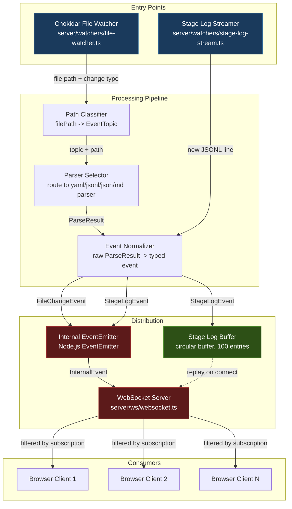
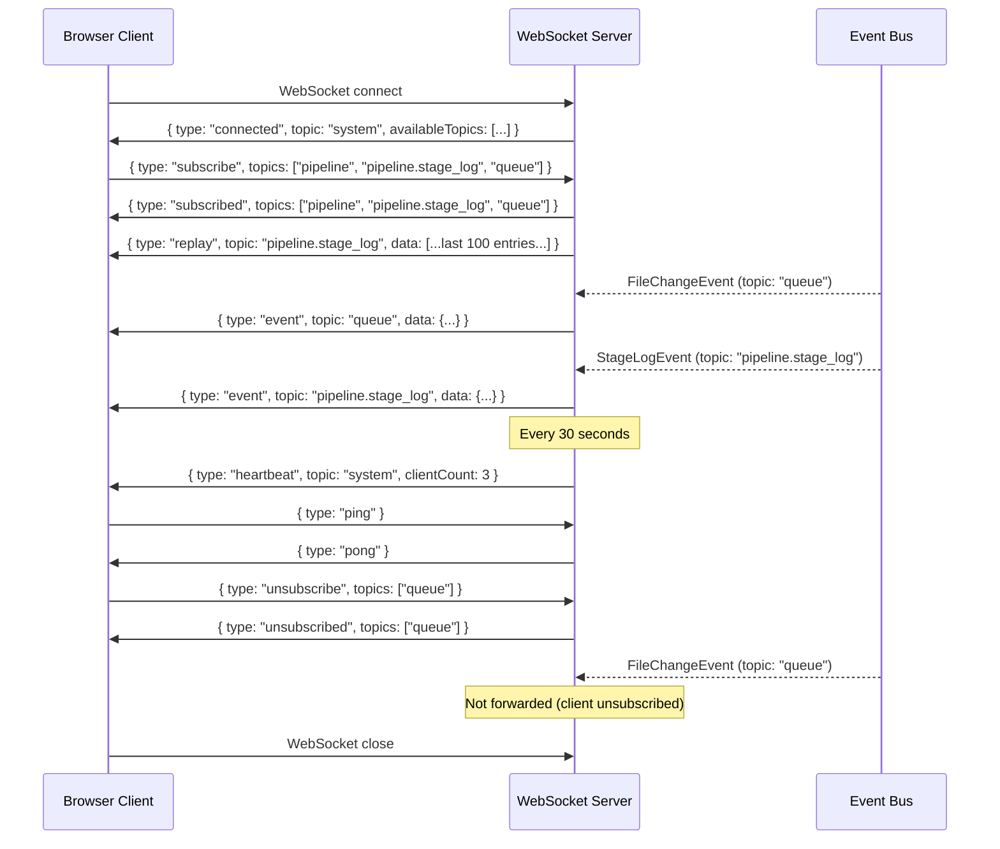
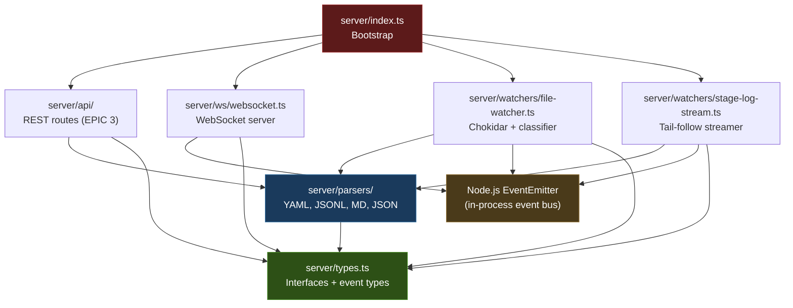

# ADR-002: Event Pipeline Architecture and WebSocket Protocol

**Status:** Accepted
**Date:** 2026-02-25
**EPIC:** E-005-2_4-gui-realtime
**Authors:** Architect agent (Step 1)
**Supersedes:** None
**Related:** ADR-001 (Monorepo and Server Directory Structure)

---

## Context

EPIC E-005-1_4 (Foundation) established the server-side codebase at
`packages/aid-gui/server/` with typed interfaces in `types.ts`, stateless parsers
in `parsers/`, and an Express bootstrap in `index.ts`. The parsers can read every
`.aid-o/` file format (YAML, JSONL, Markdown with frontmatter, JSON) and return
typed `ParseResult<T>` objects with warnings.

The GUI currently has no way to know when `.aid-o/` files change on disk. To
display live pipeline state, stage log entries, queue updates, and evidence file
changes, the server must:

1. **Watch** the `.aid-o/` directory tree for filesystem events.
2. **Parse** changed files using the existing parsers.
3. **Classify** each file change into a semantic topic.
4. **Normalize** the raw parser output into typed internal events.
5. **Emit** those events to an internal event bus.
6. **Broadcast** events to connected WebSocket clients that have subscribed to
   the relevant topics.

Additionally, `stage_log.jsonl` requires special handling: it is an append-only
file that grows as the pipeline executes, and the GUI needs to display new
entries in real-time (tail-follow behavior) rather than re-parsing the entire
file on every change.

This ADR defines the architecture for the full watcher-to-client pipeline, the
internal event type system, the WebSocket protocol, the topic hierarchy, and the
buffer/replay strategy for stage log entries.

## Decision

Implement a five-stage event pipeline: **Watch -> Classify -> Parse -> Normalize
-> Emit**, backed by Node.js `EventEmitter` as the internal event bus and the
`ws` library for WebSocket broadcasting. Use Chokidar for filesystem watching
with a 50ms debounce. Implement a dedicated stage log tail-follow streamer that
operates independently from the general file watcher.

### 1. Internal Event Types

All internal events are TypeScript discriminated unions, keyed on the `type`
field. These types are defined in `server/types.ts` (extending the existing type
file from EPIC 1).

#### FileChangeEvent

Represents a file change detected by the Chokidar watcher, after classification
and parsing.

```typescript
interface FileChangeEvent {
  /** Discriminant for the event union. */
  type: 'file_change';
  /** Semantic topic this event belongs to (e.g., "queue", "config", "pipeline"). */
  topic: EventTopic;
  /** Absolute path of the changed file. */
  filePath: string;
  /** Kind of filesystem change that occurred. */
  changeType: 'add' | 'change' | 'unlink';
  /** Parsed data from the file, or null if parsing failed or file was deleted. */
  parsedData: unknown | null;
  /** ISO 8601 timestamp when the event was created. */
  timestamp: string;
}
```

#### StageLogEvent

Represents a single new entry appended to a `stage_log.jsonl` file, detected by
the tail-follow streamer.

```typescript
interface StageLogEvent {
  /** Discriminant for the event union. */
  type: 'stage_log';
  /** Always "pipeline.stage_log" for stage log entries. */
  topic: 'pipeline.stage_log';
  /** The parsed stage log entry (using the existing StageLogEntry interface). */
  entry: StageLogEntry;
  /** The EPIC ID this entry belongs to (extracted from the file path). */
  epicId: string;
  /** The run ID this entry belongs to (extracted from the file path). */
  runId: string;
  /** ISO 8601 timestamp when the event was created. */
  timestamp: string;
}
```

#### HeartbeatEvent

Sent by the WebSocket server to all connected clients at a regular interval to
keep connections alive and allow clients to detect stale connections.

```typescript
interface HeartbeatEvent {
  /** Discriminant for the event union. */
  type: 'heartbeat';
  /** Always "system" for heartbeat events. */
  topic: 'system';
  /** ISO 8601 timestamp of the heartbeat. */
  timestamp: string;
  /** Number of clients currently connected. */
  clientCount: number;
}
```

#### ConnectionEvent

Sent to a client immediately after a successful WebSocket connection, providing
initial state.

```typescript
interface ConnectionEvent {
  /** Discriminant for the event union. */
  type: 'connected';
  /** Always "system" for connection events. */
  topic: 'system';
  /** ISO 8601 timestamp of the connection. */
  timestamp: string;
  /** Available topics the client can subscribe to. */
  availableTopics: EventTopic[];
}
```

#### Discriminated Union

```typescript
type InternalEvent =
  | FileChangeEvent
  | StageLogEvent
  | HeartbeatEvent
  | ConnectionEvent;
```

#### EventTopic Type

```typescript
type EventTopic =
  | 'pipeline'
  | 'pipeline.stage_log'
  | 'evidence'
  | 'decisions'
  | 'config'
  | 'queue'
  | 'audit'
  | 'usage'
  | 'system';
```

The `system` topic is reserved for heartbeat and connection events. It is always
implicitly subscribed to and cannot be unsubscribed from.

### 2. Watcher -> Parser -> Normalizer -> Emit Flow

The data flow is a linear pipeline with two entry points (file watcher and stage
log streamer) converging on a shared internal event bus.

#### Flow Diagram



#### Stage-by-Stage Description

**Stage 1: Watch (Chokidar)**
- Chokidar watches the `.aid-o/` root directory recursively.
- Debounce: 50ms (`awaitWriteFinish: { stabilityThreshold: 50 }`).
- Emits raw events: `add`, `change`, `unlink` with the file's absolute path.
- Ignore patterns (configurable): `node_modules`, `.git`, `**/*.tmp`,
  `**/*.swp`, `**/*.log` (except `stage_log.jsonl`), binary extensions
  (`*.png`, `*.jpg`, `*.gif`, `*.zip`, `*.tar`, `*.gz`).
- Only watches the active evidence directory. The watcher resolves the current
  EPIC/run from `auto-mode-state.yaml` or `plan_progress.json` and restricts
  evidence watching to that path. Archived evidence directories are excluded.
- `stage_log.jsonl` files are excluded from the general watcher because they
  are handled by the dedicated stage log streamer (Stage 1b).

**Stage 1b: Watch (Stage Log Streamer)**
- Dedicated watcher for `stage_log.jsonl` files.
- Uses `fs.watch` + `readline` to tail-follow the file.
- Tracks file position (byte offset) to read only new lines.
- On file rotation (new run detected by the file watcher observing a new
  `stage_log.jsonl` path): close the old stream, clear the buffer, open the
  new file from the beginning.

**Stage 2: Classify**
- The path classifier maps a file's relative path (within `.aid-o/`) to an
  `EventTopic` using pattern matching rules (see Section 5 below).
- If no pattern matches, the event is classified as `evidence` (safe default
  for unknown files in the evidence tree) or ignored if outside the known
  directory structure.

**Stage 3: Parse**
- Based on file extension and topic, the appropriate parser is selected:
  - `.yaml` / `.yml` -> `parseYaml()`
  - `.jsonl` -> skipped (handled by stage log streamer)
  - `.json` -> `parseJson()`
  - `.md` -> `parseMarkdownWithFrontmatter()` or `parseEpicSpec()`
- For `unlink` (delete) events, parsing is skipped; `parsedData` is set to
  `null`.
- Parser errors are captured in warnings, not thrown. The event is still emitted
  with `parsedData: null` and a warning log.

**Stage 4: Normalize**
- The normalizer constructs a typed `FileChangeEvent` or `StageLogEvent` from
  the classifier output and parser result.
- Adds `timestamp` (ISO 8601, `new Date().toISOString()`).
- For stage log entries: wraps the `StageLogEntry` from the parser into a
  `StageLogEvent`, extracting `epicId` and `runId` from the file path.

**Stage 5: Emit**
- Events are emitted to a Node.js `EventEmitter` instance (the internal event
  bus).
- Event name on the bus: the `topic` string (e.g., `'queue'`,
  `'pipeline.stage_log'`).
- The WebSocket server listens on all topic event names and broadcasts to
  subscribed clients.
- A wildcard listener also fires on every event, used for logging and debugging.

### 3. WebSocket Protocol

The WebSocket server uses the `ws` library, attached to the same HTTP server as
Express. All messages are JSON-encoded strings.

#### Client -> Server Messages

| Type | Purpose | Payload |
|------|---------|---------|
| `subscribe` | Subscribe to one or more topics | `{ type: "subscribe", topics: EventTopic[] }` |
| `unsubscribe` | Unsubscribe from one or more topics | `{ type: "unsubscribe", topics: EventTopic[] }` |
| `ping` | Application-level keepalive | `{ type: "ping" }` |

**Topic wildcard:** Sending `{ type: "subscribe", topics: ["*"] }` subscribes
the client to all topics. The `*` wildcard is expanded server-side to the full
list of `EventTopic` values.

**Default subscriptions:** On connect, a client has no topic subscriptions
except the implicit `system` topic (which always delivers heartbeat and
connection events). The client must explicitly subscribe to desired topics.

#### Server -> Client Messages

| Type | Purpose | Payload |
|------|---------|---------|
| `connected` | Initial connection acknowledgement | `{ type: "connected", topic: "system", timestamp: string, availableTopics: EventTopic[] }` |
| `subscribed` | Subscription confirmation | `{ type: "subscribed", topics: EventTopic[], timestamp: string }` |
| `unsubscribed` | Unsubscription confirmation | `{ type: "unsubscribed", topics: EventTopic[], timestamp: string }` |
| `event` | A real-time event | `{ type: "event", topic: EventTopic, data: FileChangeEvent \| StageLogEvent, timestamp: string }` |
| `replay` | Buffered stage log entries sent on subscribe | `{ type: "replay", topic: "pipeline.stage_log", data: StageLogEvent[], timestamp: string }` |
| `heartbeat` | Periodic keepalive | `{ type: "heartbeat", topic: "system", timestamp: string, clientCount: number }` |
| `pong` | Response to client ping | `{ type: "pong", timestamp: string }` |
| `error` | Protocol or validation error | `{ type: "error", message: string, timestamp: string }` |

#### Wire Format

Every message over the WebSocket is a JSON string. There is no binary framing.
The outer envelope for all server-to-client messages:

```typescript
interface WsMessage {
  /** Message type discriminant. */
  type: 'connected' | 'subscribed' | 'unsubscribed' | 'event'
       | 'replay' | 'heartbeat' | 'pong' | 'error';
  /** Topic this message relates to. Absent for pong and error. */
  topic?: EventTopic | 'system';
  /** Payload data. Shape depends on message type. */
  data?: unknown;
  /** Error description. Present only for error messages. */
  message?: string;
  /** ISO 8601 timestamp of message creation. */
  timestamp: string;
}
```

The outer envelope for all client-to-server messages:

```typescript
interface WsClientMessage {
  /** Message type discriminant. */
  type: 'subscribe' | 'unsubscribe' | 'ping';
  /** Topics to subscribe/unsubscribe. Absent for ping. */
  topics?: (EventTopic | '*')[];
}
```

#### Error Handling

- Invalid JSON from client: server sends `{ type: "error", message: "Invalid JSON", timestamp: "..." }`.
- Unknown message type: server sends `{ type: "error", message: "Unknown message type: <type>", timestamp: "..." }`.
- Unknown topic in subscribe/unsubscribe: server sends `{ type: "error", message: "Unknown topic: <topic>", timestamp: "..." }`.
- Client message validation failures do not close the connection.

#### Heartbeat

- The server sends a `heartbeat` message to all connected clients every 30
  seconds, regardless of their topic subscriptions (heartbeat goes over the
  implicit `system` topic).
- If a client has not sent any message (including `ping`) for 90 seconds, the
  server considers the connection stale and closes it with WebSocket close code
  `4001` and reason `"Idle timeout"`.
- Clients should send `ping` messages if they have no other traffic, to prevent
  idle timeout.

#### Connection Lifecycle



### 4. Topic Hierarchy

Topics form a flat namespace with one level of nesting (dot-separated). The
current set of topics is:

| Topic | Description | Source Files | Change Frequency |
|-------|-------------|-------------|-----------------|
| `pipeline` | Pipeline state changes (FSM transitions, current EPIC/step) | `auto-mode-state.yaml`, `plan_progress.json` | Medium (seconds during active run) |
| `pipeline.stage_log` | Individual stage log entries (tail-follow) | `stage_log.jsonl` | High (sub-second during active run) |
| `evidence` | File changes in evidence directories (step outputs, diffs, reports) | `evidence/{epic}/{run}/steps/**`, `evidence/{epic}/{run}/*.md` | Medium |
| `decisions` | PM decision records (plan approvals, merge approvals) | `pm_decision.json`, `pm_plan_approval.json`, `pm_merge_approval.json` | Low |
| `config` | Configuration file changes (policies, templates, playbooks) | `03-config/**` | Low |
| `queue` | EPIC queue changes (add, reorder, status updates) | `epic-queue.yaml` | Low-Medium |
| `audit` | Audit report changes | `audit-report.md`, `audit-report.yaml` | Low |
| `usage` | Usage tracking updates (derived from stage log aggregation) | Computed from `stage_log.jsonl` | Low (emitted on run completion) |
| `system` | Heartbeat, connection events (implicit, always subscribed) | Server-generated | Every 30s |

**Nesting convention:** A subscription to `pipeline` does NOT automatically
include `pipeline.stage_log`. These are independent subscriptions. This avoids
flooding clients that want pipeline state changes but not every individual log
line. A client that wants both must subscribe to both topics explicitly (or use
the `*` wildcard).

**Future extensibility:** New topics can be added by extending the `EventTopic`
type and adding a path classification rule. No protocol changes are required.

### 5. Path Classification Rules

The path classifier maps a file's relative path (within `.aid-o/`) to an
`EventTopic`. Rules are evaluated top-to-bottom; the first match wins.

| Priority | Path Pattern | Topic | Parser | Notes |
|----------|-------------|-------|--------|-------|
| 1 | `04-engine/evidence/*/*/stage_log.jsonl` | (excluded) | — | Handled by stage log streamer, not file watcher |
| 2 | `04-engine/auto-mode-state.yaml` | `pipeline` | `parseYaml` | FSM state, current EPIC/step |
| 3 | `04-engine/evidence/*/*/plan_progress.json` | `pipeline` | `parseJson` | Per-run progress tracking |
| 4 | `04-engine/evidence/*/*/plan.json` | `pipeline` | `parseJson` | Execution plan (initial load) |
| 5 | `04-engine/epic-queue.yaml` | `queue` | `parseYaml` | Queue state and ordering |
| 6 | `04-engine/evidence/*/*/pm_decision.json` | `decisions` | `parseJson` | Merge/escalation decisions |
| 7 | `04-engine/evidence/*/*/pm_plan_approval.json` | `decisions` | `parseJson` | Plan approval decisions |
| 8 | `04-engine/evidence/*/*/pm_merge_approval.json` | `decisions` | `parseJson` | Merge approval decisions |
| 9 | `04-engine/evidence/*/*/gates_report.json` | `pipeline` | `parseJson` | Gate results |
| 10 | `04-engine/evidence/*/*/gates/gates_report.json` | `pipeline` | `parseJson` | Gate results (alt path) |
| 11 | `04-engine/evidence/*/audit-report.yaml` | `audit` | `parseYaml` | EPIC-level audit |
| 12 | `04-engine/evidence/*/*/audit-report.md` | `audit` | `parseMarkdownWithFrontmatter` | Run-level audit (Markdown) |
| 13 | `04-engine/evidence/*/*/audit-report.yaml` | `audit` | `parseYaml` | Run-level audit (YAML) |
| 14 | `04-engine/evidence/*/*/final_report.md` | `evidence` | `parseMarkdownWithFrontmatter` | Run completion report |
| 15 | `04-engine/evidence/*/*/steps/**` | `evidence` | varies | Step output files |
| 16 | `04-engine/evidence/**` | `evidence` | varies | Catch-all for evidence files |
| 17 | `03-config/**` | `config` | varies | All configuration files |
| 18 | `02-epics/*.md` | `pipeline` | `parseEpicSpec` | EPIC spec changes |
| 19 | `01-plans/*.md` | `config` | `parseMarkdownWithFrontmatter` | Plan document changes |
| 20 | `01-plans/IDEAS.md` | `config` | `parseMarkdownWithFrontmatter` | Ideas file |
| 21 | `04-engine/memory/**` | `config` | varies | Memory/knowledge base |
| 22 | `04-engine/runs/**` | `pipeline` | varies | Run specification files |

**Implementation:** The classifier is implemented as an array of
`{ pattern: RegExp, topic: EventTopic, parser: string }` objects. The file
watcher iterates the array and returns the first match. The pattern operates on
the relative path from the `.aid-o/` root.

```typescript
interface PathClassification {
  /** Topic this file belongs to. */
  topic: EventTopic;
  /** Which parser function to use. Null means skip parsing. */
  parser: 'yaml' | 'json' | 'jsonl' | 'markdown' | 'epicSpec' | null;
  /** Whether this file should be excluded from the general watcher. */
  excluded: boolean;
}

/**
 * Classification rules, evaluated in order. First match wins.
 */
const PATH_RULES: Array<{
  pattern: RegExp;
  classification: PathClassification;
}> = [
  // Stage log — excluded from file watcher (handled by streamer)
  {
    pattern: /^04-engine\/evidence\/[^/]+\/[^/]+\/stage_log\.jsonl$/,
    classification: { topic: 'pipeline.stage_log', parser: 'jsonl', excluded: true },
  },
  // Pipeline state
  {
    pattern: /^04-engine\/auto-mode-state\.yaml$/,
    classification: { topic: 'pipeline', parser: 'yaml', excluded: false },
  },
  // Per-run progress
  {
    pattern: /^04-engine\/evidence\/[^/]+\/[^/]+\/plan_progress\.json$/,
    classification: { topic: 'pipeline', parser: 'json', excluded: false },
  },
  // Execution plan
  {
    pattern: /^04-engine\/evidence\/[^/]+\/[^/]+\/plan\.json$/,
    classification: { topic: 'pipeline', parser: 'json', excluded: false },
  },
  // Queue
  {
    pattern: /^04-engine\/epic-queue\.yaml$/,
    classification: { topic: 'queue', parser: 'yaml', excluded: false },
  },
  // Decisions
  {
    pattern: /^04-engine\/evidence\/[^/]+\/[^/]+\/pm_(decision|plan_approval|merge_approval)\.json$/,
    classification: { topic: 'decisions', parser: 'json', excluded: false },
  },
  // Gate reports
  {
    pattern: /^04-engine\/evidence\/[^/]+\/[^/]+\/(gates\/)?gates_report\.json$/,
    classification: { topic: 'pipeline', parser: 'json', excluded: false },
  },
  // Audit reports
  {
    pattern: /^04-engine\/evidence(\/[^/]+){1,2}\/audit-report\.(yaml|md)$/,
    classification: { topic: 'audit', parser: null, excluded: false },
    // parser determined at runtime based on extension
  },
  // Evidence catch-all
  {
    pattern: /^04-engine\/evidence\//,
    classification: { topic: 'evidence', parser: null, excluded: false },
  },
  // Config
  {
    pattern: /^03-config\//,
    classification: { topic: 'config', parser: null, excluded: false },
  },
  // EPICs
  {
    pattern: /^02-epics\/.*\.md$/,
    classification: { topic: 'pipeline', parser: 'epicSpec', excluded: false },
  },
  // Plans and Ideas
  {
    pattern: /^01-plans\//,
    classification: { topic: 'config', parser: 'markdown', excluded: false },
  },
  // Engine memory
  {
    pattern: /^04-engine\/memory\//,
    classification: { topic: 'config', parser: null, excluded: false },
  },
  // Engine runs
  {
    pattern: /^04-engine\/runs\//,
    classification: { topic: 'pipeline', parser: null, excluded: false },
  },
];
```

### 6. Buffer and Replay Strategy

#### Stage Log Circular Buffer

- The stage log streamer maintains a circular buffer of the last 100
  `StageLogEvent` entries.
- Buffer is implemented as a fixed-size array with a head pointer, providing
  O(1) insertion and O(n) retrieval for replay.
- When a new entry arrives and the buffer is full, the oldest entry is
  overwritten.

#### Replay on Client Connect

When a client subscribes to `pipeline.stage_log`:

1. The server immediately sends a `replay` message containing all buffered
   entries (up to 100), ordered from oldest to newest.
2. After the replay, new events are sent individually as `event` messages.
3. Each replayed entry includes its original `timestamp` from the stage log, so
   the client can distinguish historical entries from live ones.

```typescript
// Replay message shape
{
  type: "replay",
  topic: "pipeline.stage_log",
  data: StageLogEvent[], // Up to 100 entries, oldest first
  timestamp: string      // Time of the replay (not of the entries)
}
```

#### File Rotation Handling

When the file watcher detects a new `stage_log.jsonl` file (indicating a new
EPIC run has started):

1. The stage log streamer receives a notification from the file watcher.
2. The streamer closes the file handle on the old `stage_log.jsonl`.
3. The circular buffer is cleared.
4. The streamer opens the new file and begins tailing from the beginning.
5. A `FileChangeEvent` is emitted on the `pipeline` topic to notify clients
   that the active run has changed.

**Detection mechanism:** The file watcher observes `add` events for paths
matching `04-engine/evidence/*/*/stage_log.jsonl`. When a new one appears, it
compares the path to the currently-tailed file. If different, it triggers
rotation.

#### Active Evidence Directory Tracking

The watcher needs to know which evidence directory is "active" to avoid watching
archived runs. The strategy:

1. On startup, read `auto-mode-state.yaml` to determine the current EPIC ID and
   derive the active evidence path.
2. If no auto-mode session is active, read `epic-queue.yaml` to find the
   currently-running EPIC (status: `running`).
3. If neither yields a result, watch all of `04-engine/evidence/` but only
   for top-level changes (not recursively into archived runs).
4. When `auto-mode-state.yaml` or `epic-queue.yaml` changes, re-evaluate which
   evidence directory is active and adjust the watcher scope.

## Alternatives Considered

### Alternative A: Server-Sent Events (SSE) Instead of WebSocket

Use HTTP Server-Sent Events for the server-to-client push channel, with regular
HTTP POST requests for client-to-server messages (subscribe/unsubscribe).

**Pros:**
- Simpler protocol -- SSE is built into browsers, no library needed client-side.
- Works through HTTP proxies and load balancers without special configuration.
- Automatic reconnection built into the `EventSource` API.
- Each SSE stream is a standard HTTP response, making debugging with `curl`
  trivial.

**Cons:**
- Unidirectional -- client-to-server messages require separate HTTP endpoints,
  adding API surface.
- No binary frame support (not needed currently, but limits future extension).
- Maximum of 6 concurrent SSE connections per domain in HTTP/1.1 browsers
  (though HTTP/2 removes this limit).
- Topic filtering must be done server-side per-connection (same as WebSocket),
  but SSE has no built-in subscription mechanism, so we would need to encode it
  in query parameters or a separate REST endpoint.
- The GUI already plans for bidirectional communication (future: client-triggered
  pipeline commands), making WebSocket the better long-term fit.

**Rejected because:** WebSocket provides bidirectional communication on a single
connection, which aligns with the planned interactive features in EPIC 4 (GUI
Features & CLI). SSE would require a second channel for client-to-server
messages, increasing complexity.

### Alternative B: Polling Instead of Push

The client polls REST endpoints at regular intervals (e.g., every 2 seconds) to
check for changes.

**Pros:**
- Simplest implementation -- no WebSocket or SSE infrastructure needed.
- Stateless server -- no connection tracking, no subscription management.
- Works everywhere, including restrictive network environments.

**Cons:**
- Latency: changes are detected only at the poll interval (2 seconds vs.
  sub-100ms with push).
- Wasted bandwidth: most polls return "no change" during idle periods.
- Cannot stream `stage_log.jsonl` entries in real-time -- would need to track
  cursors and implement pagination.
- Poor user experience for a live dashboard: visible lag between pipeline action
  and UI update.

**Rejected because:** The core requirement is sub-100ms latency from file change
to UI update. Polling cannot meet this without unacceptable server load and
bandwidth waste.

### Alternative C: Redis Pub/Sub as the Internal Event Bus

Use a Redis instance as the event bus instead of Node.js `EventEmitter`.

**Pros:**
- Decouples producers and consumers across processes (enables horizontal
  scaling).
- Built-in pub/sub with pattern matching.
- Persistence options (Redis Streams) for replay.
- Industry-standard, battle-tested at scale.

**Cons:**
- External dependency -- requires a Redis server, adding operational complexity
  for what is currently a single-process application.
- Overkill for a single-server GUI that monitors local filesystem changes.
- Adds network latency between the watcher and the broadcaster (localhost, but
  still nonzero).
- The AID GUI is designed to run on a developer's machine, not in a distributed
  cluster. Adding Redis contradicts the "single `npm run dev` to start" goal.

**Rejected because:** The AID GUI is a single-process, single-machine
application. Node.js `EventEmitter` provides in-process pub/sub with zero
latency and zero external dependencies. Redis can be introduced later if the GUI
needs to scale horizontally (very unlikely for a developer tool).

## Consequences

### Positive

- **Low latency:** File change to client notification in under 100ms (Chokidar
  50ms debounce + EventEmitter + WebSocket, all in-process).
- **Typed events:** The discriminated union (`InternalEvent`) ensures type safety
  from watcher to client. Frontend can switch on `type` and get narrowed types.
- **Separation of concerns:** The file watcher, stage log streamer, path
  classifier, parsers, and WebSocket server are independent modules that
  communicate only through typed events on the event bus.
- **Replay capability:** New clients immediately receive the last 100 stage log
  entries, providing context without waiting for new events.
- **Extensible topics:** Adding a new topic requires only a new
  `EventTopic` value and a path classification rule. No protocol changes.
- **Reuses EPIC 1 parsers:** The processing pipeline calls the same
  `parseYaml`, `parseJson`, `parseJsonl`, `parseMarkdownWithFrontmatter`
  functions, avoiding code duplication.

### Negative

- **Single-process limitation:** The `EventEmitter`-based bus does not support
  multi-process or multi-server deployments. If horizontal scaling is ever
  needed, the bus must be replaced with an external system (Redis, NATS).
  Mitigation: this is a developer tool, not a production service.
- **Memory usage:** The 100-entry stage log buffer consumes memory proportional
  to entry size. For typical stage log entries (~200 bytes each), this is
  approximately 20 KB -- negligible. Mitigation: the buffer size is
  configurable.
- **Chokidar dependency:** Chokidar is a large dependency with native bindings
  on some platforms. It may have compatibility issues with certain OS/Node
  versions. Mitigation: Chokidar 4.x is pure JavaScript (no native deps since
  v4).
- **No message persistence:** If the server restarts, all buffered events are
  lost. Clients must re-subscribe and will only receive the replayed buffer
  (which is also lost). Mitigation: the source of truth is the `.aid-o/` files
  on disk; the server can re-read them on startup.

### Risks

- **Watch limit exhaustion:** On Linux, the default `fs.inotify.max_user_watches`
  is 8192. A large `.aid-o/` directory tree could approach this limit.
  Mitigation: the watcher is scoped to the active evidence directory, not the
  entire tree, and ignore patterns exclude irrelevant files. Document the
  `sysctl` command for increasing the limit if needed.
- **Race condition on file rotation:** If the pipeline writes a new
  `stage_log.jsonl` and the first entry simultaneously, the streamer might miss
  the first entry if it opens the file after the write. Mitigation: on
  rotation, the streamer reads the new file from byte 0, catching any entries
  written before the streamer attached.

---

## Module Responsibility Map

This section refines the module map from ADR-001 with the new modules introduced
by this EPIC.

| Module | Responsibility | Depends On |
|--------|---------------|------------|
| `server/types.ts` | TypeScript interfaces including event types | None |
| `server/parsers/` | Stateless file parsing | `types.ts` |
| `server/watchers/file-watcher.ts` | Chokidar watcher + path classifier + event normalizer | `parsers/`, `types.ts` |
| `server/watchers/stage-log-stream.ts` | Tail-follow streamer + circular buffer | `parsers/jsonl.ts`, `types.ts` |
| `server/ws/websocket.ts` | WebSocket server + subscription manager + heartbeat | `types.ts` |
| `server/api/` | Express REST routes (EPIC 3) | `parsers/`, `types.ts` |
| `server/index.ts` | Bootstrap -- wires Express, Vite, watchers, ws | All modules |

### Updated Dependency Graph



### Dependency Direction

```
index.ts
  |
  +---> api/ ---------> parsers/ ---------> types.ts
  |                        ^
  +---> ws/ -----+         |
  |              |         |
  +---> file-watcher ------+
  |         |
  +---> stage-log-stream --+
            |
            +---> EventEmitter <--- ws/
```

All arrows point inward toward `types.ts`. The `EventEmitter` sits between the
watchers (producers) and the WebSocket server (consumer). No module depends on
`index.ts`. The parsers remain pure, stateless functions with no knowledge of
watchers, events, or WebSocket.
