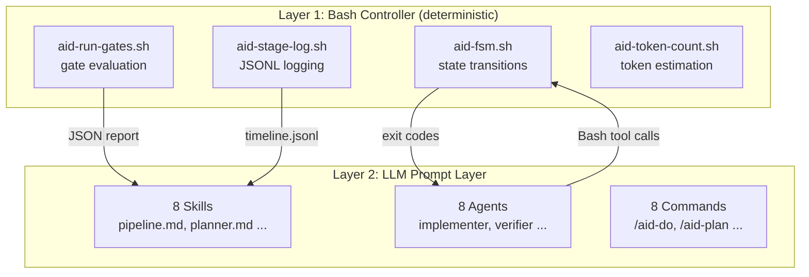
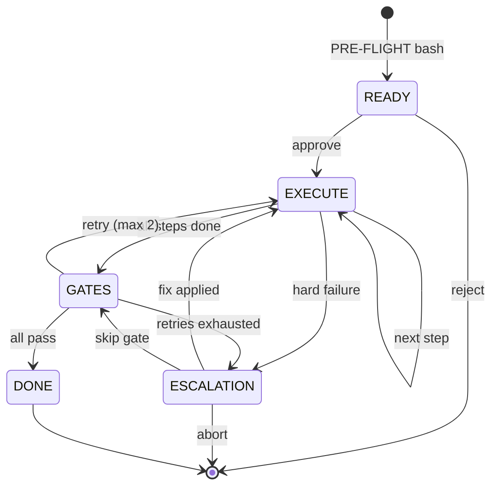
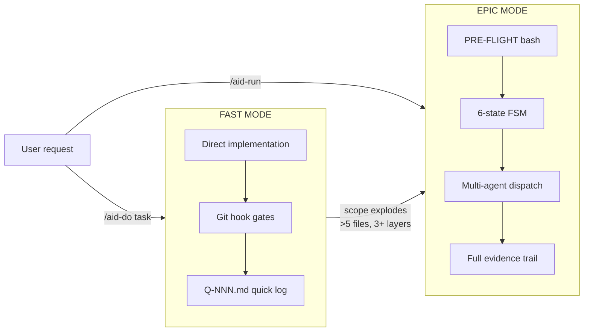
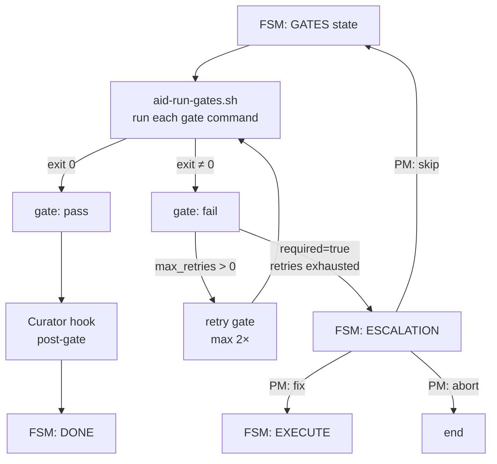
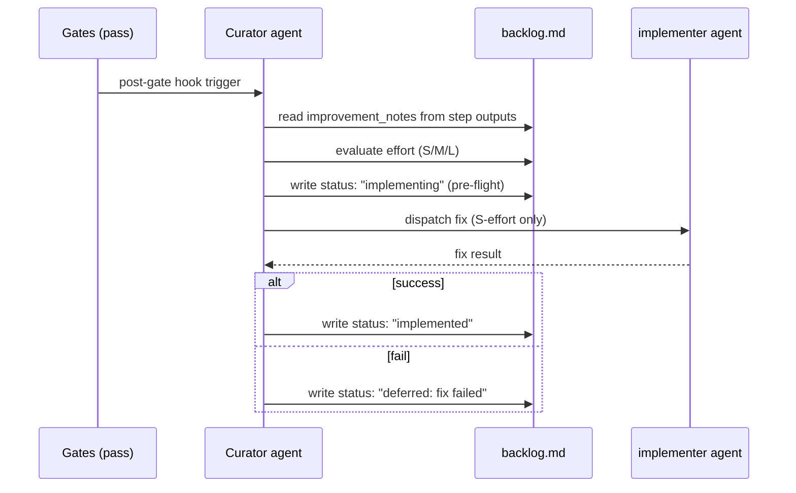
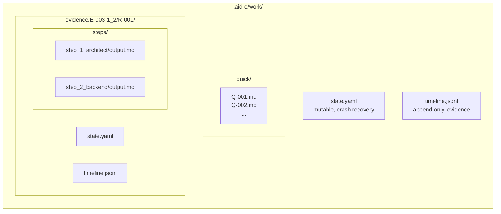
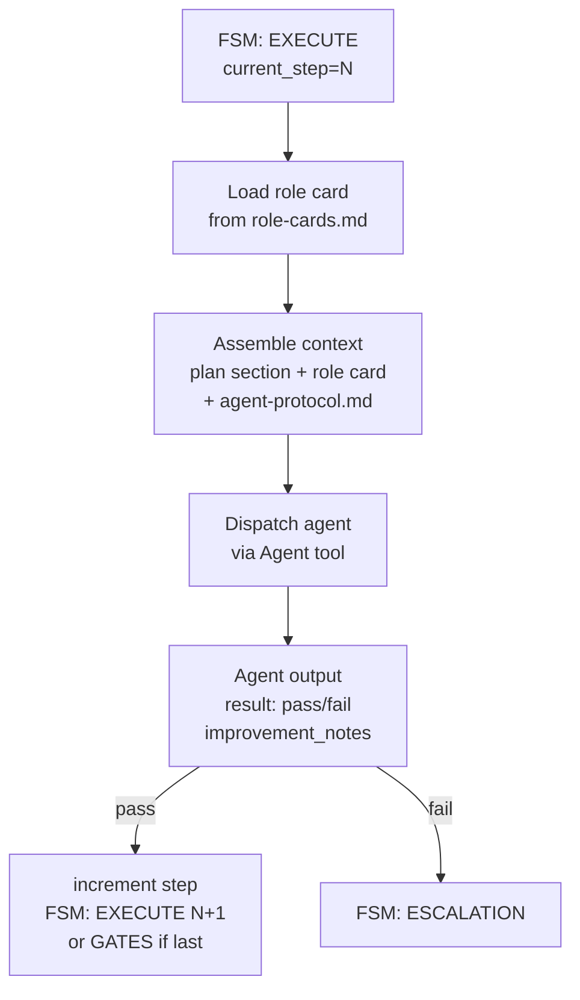

# Architecture Diagrams

All 8 architecture diagrams for AID Orchestrator v2.0. Updated throughout Phases 1–7 as implementation progresses.

---

## Diagram 1: Dual-Layer Architecture

*(Phase 1, Step 6)* — Two-layer separation: deterministic bash controller (Layer 1) and LLM prompt layer (Layer 2). Agents call bash scripts via Bash tool; bash scripts report back via exit codes and JSON.

---

## Diagram 2: 6-State FSM

*(Phase 1, Step 6)* — Deterministic state machine implemented in bash. All state transitions are code, not LLM instructions. See [fsm.md](./fsm.md) for full reference.

---

## Diagram 3: Dual Execution Modes

*(Phase 4, Step 22)* — FAST MODE for small tasks (< 2 min overhead), EPIC MODE for multi-step work. See [execution-modes.md](./execution-modes.md) for comparison table.

---

## Diagram 4: PRE-FLIGHT Pipeline

*(Phase 4, Step 26)* — Three bash scripts convert a Plan file into a structured Run file. FSM enters READY state after PRE-FLIGHT completes; PM approval triggers EXECUTE.

---

## Diagram 5: Gate Evaluation Flow

*(Phase 1, Step 7)* — `aid-run-gates.sh` evaluates each gate command. Required gates that fail after retries trigger ESCALATION; PM decides fix / skip / abort.

---

## Diagram 6: Curator Flow

*(Phase 3, Step 20)* — After gates pass, Curator agent reads improvement notes from step outputs, evaluates effort, and auto-dispatches S-effort fixes. Results written to backlog.md.

---

## Diagram 7: Evidence Trail Structure

*(Phase 1, Step 4)* — Two evidence paths: FAST MODE uses `quick/Q-NNN.md`, EPIC MODE uses full `evidence/{epic_id}/{run_id}/` directory with JSONL timeline and per-step outputs.

---

## Diagram 8: Agent Dispatch Pattern

*(Phase 3, Step 18)* — Controller loads role card, assembles context (plan section + role card + agent-protocol.md), dispatches agent. Agent result determines next FSM transition.

---

*Last Updated: 2026-03-03 (Phase 0 baseline — diagrams 1–8 created as living document)*
