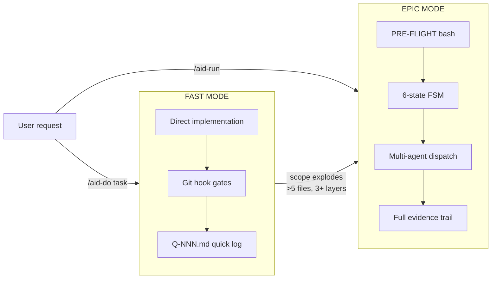

# Dual Execution Modes

AID v2.0 supports two execution modes to minimize overhead for small tasks while preserving full evidence trail for complex work.

## Mode Comparison

| Feature | FAST MODE (/aid-do) | EPIC MODE (/aid-run) |
|---------|--------------------|--------------------|
| Overhead | < 2 min | 5–30 min (planning) |
| Evidence | Q-NNN.md quick log | Full timeline.jsonl |
| Gates | git pre-commit hooks | aid-run-gates.sh |
| Best for | 1-file fixes, small features | Multi-step, multi-role work |

## Escalation Rule

FAST MODE automatically escalates to EPIC MODE when scope expands beyond:
- More than 5 files changed
- Changes spanning 3+ architectural layers
- Task requires multi-agent coordination

---

*Last Updated: 2026-03-03 (Phase 0 baseline — execution modes diagram created as living document)*
