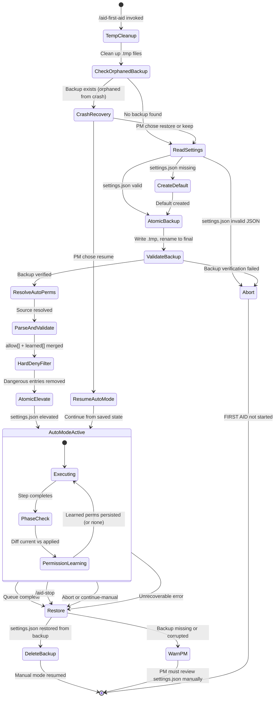

# FIRST AID Mode

FIRST AID mode is the autonomous execution mode of AID Orchestrator. The PM approves the EPIC queue once, then the Controller runs all queued EPICs end-to-end without stopping at each decision point. Agent-driven quality checks replace manual approval gates, and a structured escalation protocol handles the 16 defined conditions that require human judgment.

FIRST AID mode is started with `/aid-first-aid` and stopped with `/aid-stop`.

## State Machine

The mode has three values, stored in `.aid-o/04-engine/auto-mode-state.yaml`:

| Mode | Meaning |
|------|---------|
| `manual` | Default. All PM decision points behave normally. |
| `auto` | Autonomous execution. PM decision points use auto-mode logic. |
| `paused` | An escalation triggered a pause. PM must resolve before resuming. |

At every PM decision point (PLAN_REVIEW, PHASE_CHECK, PM_APPROVAL, DONE), the Controller reads the mode file and routes accordingly. If the file is missing or unreadable, the Controller defaults to `manual` — fail-safe behavior.

## Permission Sandwich

Before autonomous execution begins, the Controller elevates Claude Code's permissions to allow the commands needed to run an EPIC end-to-end without prompting. When execution ends (for any reason), permissions are restored to their original state. This backup-elevate-execute-restore cycle is called the **permission sandwich**.



### Files Involved

| File | Location | Purpose |
|------|----------|---------|
| `settings.json` | `.claude/settings.json` | Claude Code permission file. Single source of truth for auto-allowed commands. |
| `permissions-backup.json` | `.aid-o/03-config/permissions-backup.json` | Backup of original `settings.json`. Its presence signals an active or crashed auto-mode session. |
| `permissions-auto.yaml` | `.aid-o/03-config/permissions-auto.yaml` | Auto-mode permission template. Project-specific overrides plugin defaults. |
| `auto-mode-state.yaml` | `.aid-o/04-engine/auto-mode-state.yaml` | Tracks session state, applied permissions, and learned permissions. |

### Step 1: Backup

Before any EPIC processing begins:

1. Read `.claude/settings.json`. If missing, create a minimal default. If invalid JSON, abort — the PM must fix it manually.
2. Check for an orphaned backup (a previous session that crashed). If found, execute crash recovery (see below).
3. Atomic backup write: write `settings.json` content to a `.tmp` file, validate it is valid JSON, then rename to `permissions-backup.json`. Verify the final file matches the original.

The temp-file-then-rename pattern ensures the backup is never in a partial state. If the process crashes before the rename, only the `.tmp` file exists and it is cleaned up on the next session start.

### Step 2: Elevate

1. Resolve the auto-mode permission template from one of three sources (in priority order): project-specific `permissions-auto.yaml`, plugin default `permissions-auto.yaml`, or a generated template.
2. Parse the allow list: `allow[]` + `learned[]` (permissions learned from PM grants in prior sessions).
3. Validate against the hard-deny list. Any dangerous patterns are removed unconditionally.
4. Write the elevated `settings.json` atomically (temp file, validate, rename).
5. Record the applied permissions in `auto-mode-state.yaml`.

### Step 3: Execute

The Controller runs the EPIC queue autonomously. At each PHASE_CHECK, it runs **permission learning**: it compares the current `settings.json` against what was applied at elevation. If the PM granted new permissions through the Claude Code prompt during a step, those new entries are detected and persisted to `permissions-auto.yaml` for future sessions. Hard-deny list is enforced during learning — PM-granted dangerous permissions are never persisted.

### Step 4: Restore

On any exit event (queue complete, `/aid-stop`, abort, error):

1. Read `permissions-backup.json`. If missing or corrupted, warn the PM — do not block other completion actions.
2. Write backup content back to `settings.json` atomically.
3. Delete `permissions-backup.json`.

Restore is intentionally non-blocking. A failed restore is a PM-visible warning, not a pipeline stopper. The PM can always manually edit `.claude/settings.json` to fix permissions.

### Hard Deny List

These permissions are never allowed in auto-mode, regardless of configuration, PM grants, or permission learning. The list is enforced at elevation time and at permission learning time:

**Always-blocked commands:**
- `rm -rf /` and `rm -rf /*` — catastrophic filesystem destruction
- `git push --force` and `git push -f` — irreversible remote history rewrite
- `git reset --hard` — discards uncommitted work silently
- `sudo` and `su` — privilege escalation beyond project scope
- `chmod 777` — opens files to all users
- `chown` — changes file ownership

**Always-blocked paths:**
- `/etc/*`, `/usr/*` — system configuration
- `~/.ssh/*`, `~/.aws/*` — credentials and keys
- `~/.gnupg/*` — GPG keys
- `~/.config/claude/*` — Claude's own configuration

### Crash Recovery

If Claude Code crashes during auto-mode, `permissions-backup.json` is left behind. The backup file doubles as a crash indicator: its presence outside an active session means something went wrong.

On the next session start (or when `/aid-first-aid` is invoked again), the Controller detects the orphaned backup and presents three options to the PM:

- **A) Restore** (recommended) — restore original permissions from backup.
- **B) Keep current** — keep the elevated permissions and delete the backup.
- **C) Resume auto-mode** — restore from saved progress in `auto-mode-state.yaml` and continue executing from where the session was interrupted.

## 16 Escalation Triggers

Auto-mode runs silently until it encounters a situation that requires human judgment. These 16 triggers are the exhaustive list of conditions that pause auto-mode and notify the PM.

### CRITICAL Triggers (Immediate Halt)

No further work of any kind until the PM responds.

| ID | Trigger | Detection |
|----|---------|-----------|
| **E1** | Step fails twice plus fresh approach fails | Step has 2 failed dispatches AND gate-fixer re-dispatch also failed |
| **E2** | Security finding CRITICAL severity | Security agent or `bandit` output contains `Severity: CRITICAL` |
| **E4** | Gate fails after maximum retries | Gate has exhausted all configured retry attempts |

### HIGH Triggers (Pause After Current Atomic Operation)

Complete the current commit or file write, then pause.

| ID | Trigger | Detection |
|----|---------|-----------|
| **E3** | Security finding HIGH severity | Security agent output contains `Severity: HIGH` |
| **E5** | Agent produces no output or errors | Agent dispatch returns empty response, timeout, or exception |
| **E6** | Merge conflict between parallel agents | Dry-run merge fails between parallel execution branches |
| **E7** | Agent explicitly flags "cannot resolve" | Agent output contains `status: "blocked"` or `status: "unable"` |
| **E8** | Budget exceeded | Total cost exceeds configured budget limit |

### MEDIUM Triggers (Pause at Phase Boundary)

Complete the current step, then pause before starting the next one.

| ID | Trigger | Detection |
|----|---------|-----------|
| **E9** | Scope violation persists after re-dispatch | Agent modifies `forbidden_paths` on second attempt |
| **E10** | Conflicting outputs from parallel agents | Two agents produce contradictory decisions (detected during analysis merge) |
| **E11** | Plan validation fails in auto PLAN_REVIEW | Generated plan JSON fails schema validation or run file quality check |
| **E12** | Session escalation budget exceeded | Session escalation count reaches `max_escalations_per_session` (default: 3) |
| **E13** | Architecture decision with multiple valid options | Architect agent outputs `decision_type: "requires_pm"` with two or more options |
| **E14** | Test suite still failing after fix attempts | Test failures persist after 3 gate-fixer cycles (promoted to E1) |
| **E15** | Version detection failure in release sub-phase | Release agent cannot determine current version from `version_files[]` |
| **E16** | EPIC acceptance criteria are ambiguous | Planner or agent flags acceptance criteria as unparseable or contradictory |

### Non-Escalation (Agent-Handled Automatically)

These issues are resolved autonomously without notifying the PM:

| Condition | Action |
|-----------|--------|
| Low-severity security findings | Logged to `improvement_notes` |
| Style/formatting lint failures | Auto-fixed by gate retry (`ruff check --fix`) |
| Minor test failures (first or second attempt) | Agent re-dispatched with failure feedback |
| Discovered issues of MEDIUM or INFO severity | Added to Curator backlog |
| Conditional gate failure (non-required) | Logged as warning, execution continues |
| Agent produces valid output with minor gaps | Output accepted, gaps logged in `improvement_notes` |
| Flaky test (passes on re-run) | Pass result accepted, flakiness logged |

### Escalation Notification Format

When a trigger fires, the PM receives a structured notification (via Slack if configured, otherwise in chat):

```
AUTO-MODE ESCALATION — {trigger name}
Auto-mode paused

Trigger: {E1-E16} — {trigger name}
Severity: CRITICAL | HIGH | MEDIUM
EPIC: {epic_id} — {title}
Progress: {N}/{M} steps ({percent}%)
State: {state} → paused

What happened:
{description}

What was tried:
• Attempt 1: {action} → {result}
• Attempt 2: {action} → {result}

Options:
A) Fix — {context-specific description}
B) Skip — continue to next step/gate
C) Abort — stop this EPIC, pause queue
D) Continue manual — finish this EPIC in manual mode

Recommendation: {auto-generated}
Session: Escalation {count}/{max}
```

### PM Decision Options

| Option | What happens |
|--------|-------------|
| **A) Fix** | PM provides guidance. Retry counter resets. Controller re-dispatches with PM guidance prepended to the prompt. Auto-mode resumes. |
| **B) Skip** | Triggering item marked as `skipped_by_pm`. Execution advances to the next step or gate. Auto-mode resumes. |
| **C) Abort** | Current EPIC transitions to DONE with status `aborted`. Queue is paused. Curator and Lessons-Extractor still run on the partial evidence. |
| **D) Continue manual** | Current EPIC switches to manual orchestration mode. PM drives the remaining steps. The remaining queue stays paused until the PM resumes it explicitly. |

### Escalation Budget

Auto-mode tracks escalation frequency per session to prevent runaway escalation loops. The default maximum is 3 escalations per session. When the count reaches the maximum, trigger E12 fires at the next EPIC boundary and the PM must review before the next EPIC starts.

The PM can tune the limit during any escalation by including `"set max escalations to N"` in their response.

The budget resets when a new auto-mode session starts, not when an individual EPIC completes. This means escalations accumulate across all EPICs in a single queue run.

## Auto-Mode vs Manual Mode

| Aspect | Manual (default) | FIRST AID (auto) |
|--------|-----------------|-------------------|
| Plan approval | PM reviews every plan | Auto-validated by Controller |
| Step execution | PM sees each state transition | Silent, PM not notified |
| PM_APPROVAL | Always requires PM | Always requires PM |
| Failures | Escalate per existing protocol | 16 triggers; non-trigger issues handled silently |
| Permissions | Not elevated | Elevated for duration, restored on exit |
| Queue processing | One EPIC at a time | All queued EPICs run end-to-end |
| Stopping | Natural at each state boundary | `/aid-stop` or escalation trigger |
