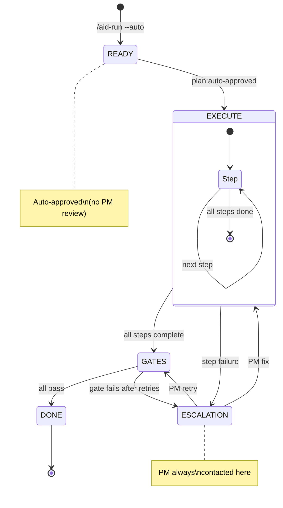

# Autonomous Mode

Autonomous mode enables unattended pipeline execution. The same 6-state FSM runs, but plan approval at READY is auto-approved. Escalations still reach the PM.

Autonomous mode is activated with `/aid-run --auto` and stopped with `/aid-stop`.

:::warning Use at Your Own Risk

Autonomous mode allows Claude Code to execute commands, edit files, and run the full pipeline without asking for confirmation at each step. The PM is only contacted when an escalation trigger fires.

Review your plan and `execution.yaml` gates before enabling autonomous mode. `/aid-stop` is available at any time.

:::

## How It Works



## Normal Mode vs Autonomous Mode

| Aspect | Normal (`/aid-run`) | Autonomous (`/aid-run --auto`) |
|--------|--------------------|---------------------------------|
| Plan approval | PM reviews and approves | Auto-approved after validation |
| Step execution | PM sees each state transition | Silent execution |
| Gate failures (retryable) | Gate-fixer auto-retries | Gate-fixer auto-retries |
| Gate failures (exhausted) | Escalation to PM | Escalation to PM |
| Escalations | PM contacted | PM contacted |
| Completion | Summary presented | Summary presented |

The key difference is plan approval. In normal mode, the PM reviews the plan at READY before execution begins. In autonomous mode, the plan is validated programmatically (schema check, dependency cycle check) and auto-approved if valid. If validation fails, it escalates to the PM.

## Escalation Triggers

Autonomous mode runs silently until it encounters a condition that requires human judgment. These triggers pause execution and notify the PM:

### Critical (Immediate Halt)

| Trigger | Detection |
|---------|-----------|
| Gate fails after max retries | Gate retry budget exhausted |
| Security finding CRITICAL | Security scan output contains critical severity |
| Agent error or no output | Agent dispatch returns empty or throws |

### High (Pause After Current Operation)

| Trigger | Detection |
|---------|-----------|
| Security finding HIGH | Security scan output |
| Merge conflict | Dry-run merge fails between parallel branches |
| Agent blocked | Agent output contains blocked status |
| Budget exceeded | LLM cost exceeds configured limit |

### Medium (Pause at Next State Boundary)

| Trigger | Detection |
|---------|-----------|
| Scope violation persists | Agent modifies forbidden_paths after re-dispatch |
| Plan validation fails | Generated plan fails schema validation |
| Escalation budget exceeded | Session reaches max escalations |

### Auto-Resolved (No PM Notification)

| Condition | Action |
|-----------|--------|
| Low-severity security findings | Logged to improvement notes |
| Style/formatting lint failures | Auto-fixed by gate-fixer |
| Minor test failures (first attempt) | Agent re-dispatched with failure context |
| Conditional gate failure | Warning logged, execution continues |

## Escalation Format

When a trigger fires, the PM receives a structured notification:

```text
AUTONOMOUS MODE — Escalation
Pipeline paused

Trigger: gate fails after max retries
Severity: CRITICAL
EPIC: E-20260303-a1b2 — add pagination to users API
Progress: 4/5 steps (80%)
State: GATES → paused

What happened:
  tests_pass gate failed 3 times. Last error: 2 tests failed (test_cursor_pagination, test_empty_page)

What was tried:
  - Attempt 1: gate-fixer patched cursor logic → still fails
  - Attempt 2: gate-fixer added missing fixture → still fails
  - Attempt 3: gate-fixer rewrote test setup → still fails

Options:
  A) Fix — provide guidance for another attempt
  B) Skip — skip this gate, proceed to DONE
  C) Abort — stop pipeline

Recommendation: A — the test failures look like a data setup issue
```

## PM Options

| Option | Effect |
|--------|--------|
| **Fix** | PM provides guidance. Retry counter resets. Transition to EXECUTE with guidance. |
| **Skip** | Mark gate as `skipped_by_pm`. Proceed to DONE. |
| **Abort** | Pipeline stops. Curator runs on partial evidence. |

## Escalation Budget

Autonomous mode tracks escalation frequency per session. Default maximum: 3 per session (configured in `orchestration.yaml` under `escalation.max_per_session`).

When the count reaches the maximum, the PM must review before execution continues. The budget resets when a new autonomous session starts.

## Enabling Autonomous Mode

```bash
# Start autonomous run
/aid-run --auto

# Check status during execution
/aid-status

# Stop at any time
/aid-stop
```

`/aid-stop` saves progress to `state.yaml` and logs the stop event to `timeline.jsonl`. The pipeline can be resumed with `/aid-run` (normal mode) from the last recorded state.
