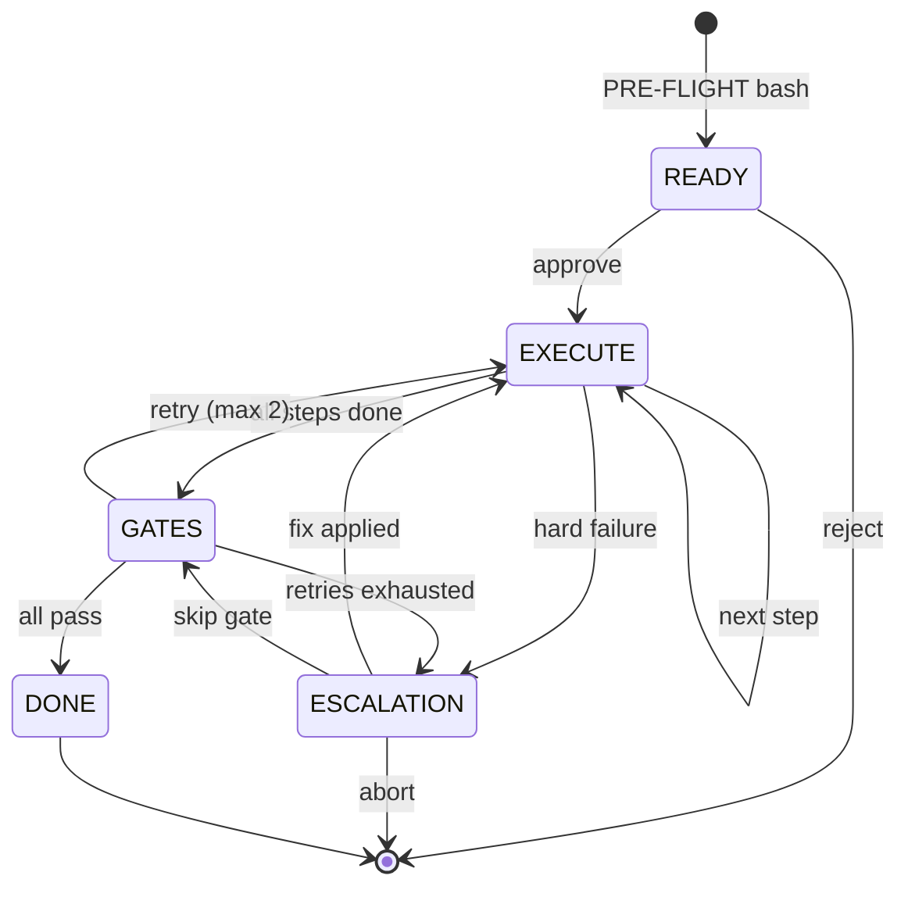

# 6-State FSM

AID v2.0 uses a deterministic bash FSM with 6 states.

## State Reference

| State | Entered when | Exits when |
|-------|--------------|------------|
| READY | PRE-FLIGHT bash completes | PM approves |
| EXECUTE | PM approves | All steps done OR hard failure |
| GATES | All steps done | All gates pass OR retries exhausted |
| ESCALATION | Gate fails OR hard failure | PM decides: fix / skip / abort |
| DONE | All gates pass | (terminal) |
| ERROR | Unrecoverable error | Manual intervention needed |

Bash implementation: `scripts/aid-fsm.sh`

---

*Last Updated: 2026-03-03 (Phase 0 baseline — FSM diagram created as living document)*
