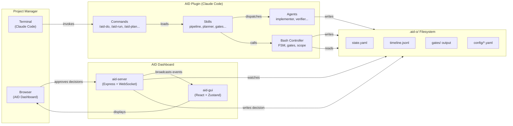
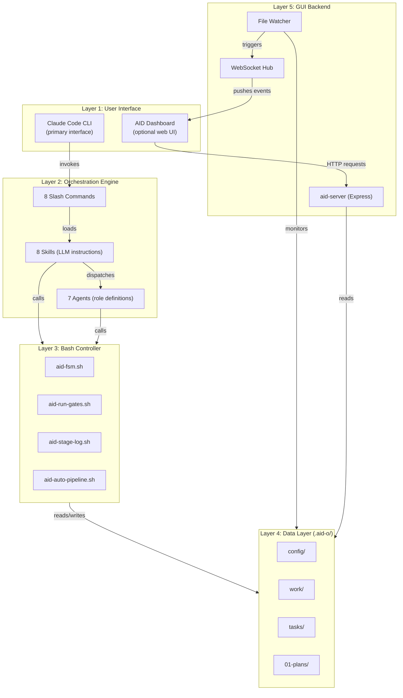
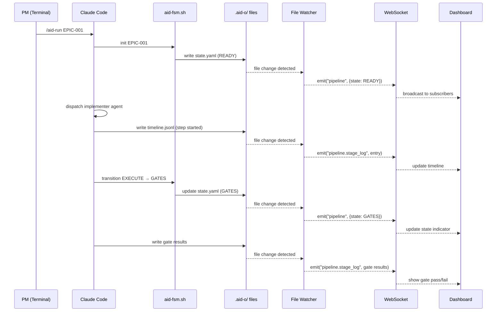
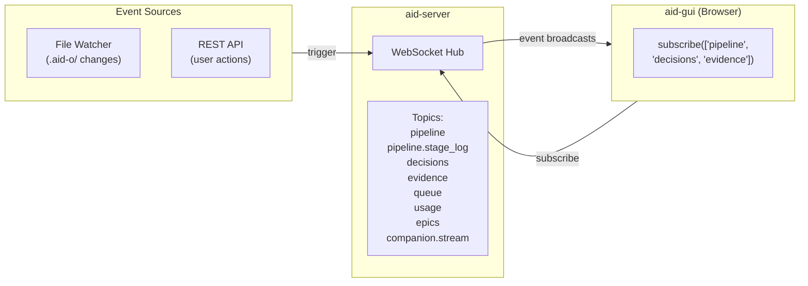
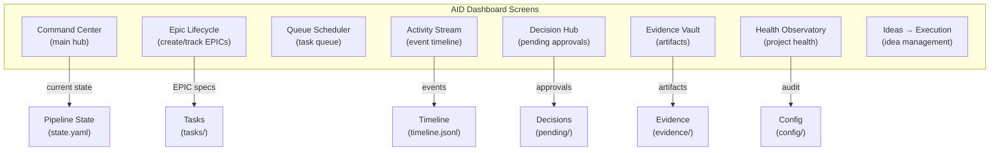
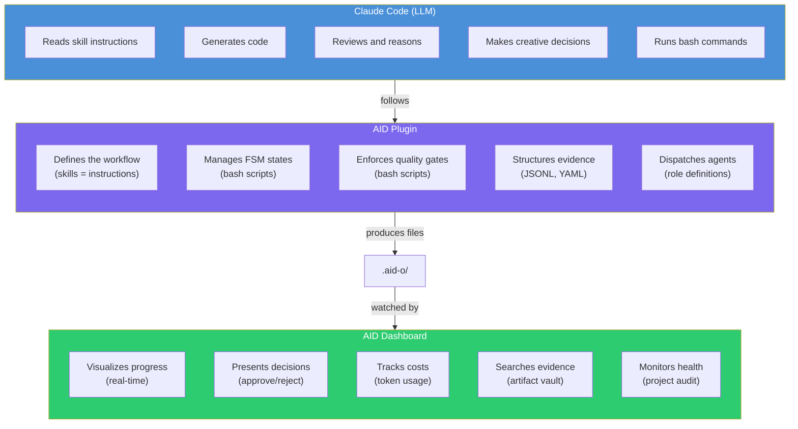

# GUI Integration

AID includes an optional web dashboard that provides real-time visibility into orchestration. The GUI is a **read + approve** layer — it observes what Claude Code and the bash controller are doing, and lets the PM make decisions without switching to the terminal.

## Who Does What



### Responsibility Matrix

| Responsibility | Claude Code + AID | AID Dashboard (GUI) |
|---|---|---|
| **Execute commands** (`/aid-run`, `/aid-do`) | Yes — sole executor | No — read-only view |
| **Generate code** | Yes — via agents | No |
| **Run quality gates** | Yes — `aid-run-gates.sh` | No — displays results |
| **FSM state transitions** | Yes — `aid-fsm.sh` | No — displays state |
| **Plan approval** | Yes — terminal prompt | Yes — decision UI |
| **Escalation decisions** | Yes — terminal prompt | Yes — decision UI |
| **View pipeline progress** | Limited (text logs) | Yes — real-time timeline |
| **Browse evidence** | Yes — file system | Yes — searchable vault |
| **Token/cost tracking** | No | Yes — usage charts |
| **Project health overview** | Yes — `/aid-audit` | Yes — health dashboard |

## Architecture Layers



## Data Flow: Real-Time Updates

When Claude Code executes a pipeline, the GUI receives updates in real-time through file watching:



## WebSocket Protocol

The GUI connects to `ws://localhost:{port}/ws` and uses topic-based pub/sub:



### Topics

| Topic | Source | Content |
|-------|--------|---------|
| `pipeline` | File watch on `state.yaml` | FSM state changes |
| `pipeline.stage_log` | File watch on `timeline.jsonl` | Step start/complete, gate results |
| `decisions` | REST API + file watch | Pending approvals, PM responses |
| `evidence` | File watch on `evidence/` | New artifacts |
| `queue` | File watch on queue files | Queue additions, completions |
| `usage` | Computed from timeline | Token counts, cost estimates |
| `epics` | File watch on `tasks/` | EPIC lifecycle events |

## GUI Screens



## Claude vs AID vs GUI: Complete Picture



**In summary:**
- **Claude Code** is the brain — it reads, thinks, writes code, and makes decisions
- **AID Plugin** is the process — it defines what to do, in what order, with what checks
- **AID Dashboard** is the window — it shows what is happening and collects PM input

## Running the Dashboard

```bash
# Start the server (watches .aid-o/ in your project)
cd packages/aid-server && npm run dev

# Start the GUI (opens in browser)
cd packages/aid-gui && npm run dev

# Or use Docker Compose (both services)
docker-compose up
```

The dashboard is optional. All orchestration works fully through Claude Code CLI commands. The GUI adds visibility and a PM-friendly approval interface.
