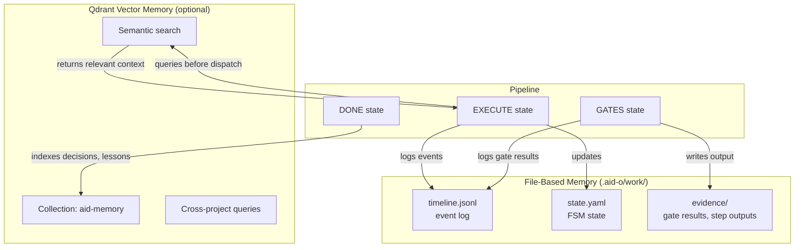
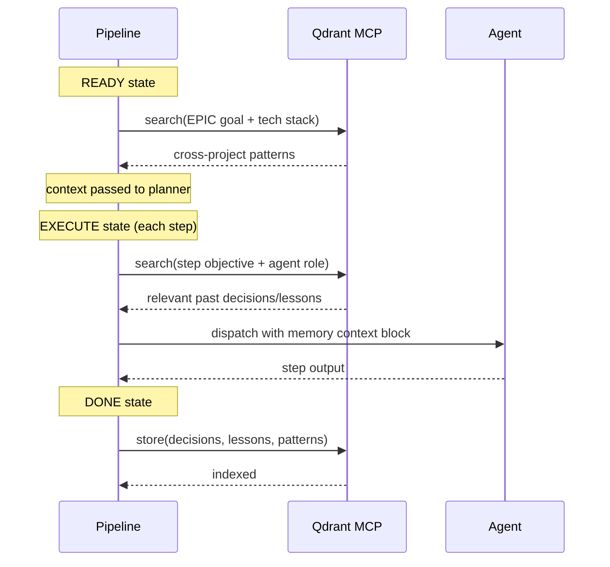

# Memory System

AID has a two-layer memory system. File-based memory is the primary store and works without any configuration. Qdrant vector memory is an optional supplementary layer that adds semantic search and cross-project knowledge sharing.

**Core principle:** File-based memory is authoritative. Qdrant is supplementary. AID works identically without Qdrant.

## Architecture



## File-Based Memory

All runtime state lives in `.aid-o/work/`:

```text
.aid-o/work/
  evidence/{epic_id}/{run_id}/
    state.yaml                FSM state (current state, step counter, mode)
    timeline.jsonl            Append-only event log (transitions, gates, steps)
    gates/                    Raw gate command output
  lessons-learned.md          Accumulated lessons from all runs
  decisions.yaml              Architectural and process decisions
```

### state.yaml

The FSM state file. Written by `aid-fsm.sh`, read by all pipeline components.

```yaml
epic_id: E-20260303-a1b2
run_id: R-20260303-001
state: EXECUTE
current_step: 3
total_steps: 5
mode: epic
branch: epic/E-20260303-a1b2
base_commit: abc123
gate_retries: 0
escalation_count: 0
started_at: "2026-03-03T10:00:00Z"
```

### timeline.jsonl

Append-only structured event log. Written by `aid-stage-log.sh`. Every state transition, gate result, and step completion is recorded.

```jsonl
{"ts":"2026-03-03T10:00:00Z","event":"fsm_init","state":"READY","epic_id":"E-20260303-a1b2"}
{"ts":"2026-03-03T10:00:05Z","event":"fsm_transition","from":"READY","to":"EXECUTE"}
{"ts":"2026-03-03T10:01:30Z","event":"step_complete","step":1,"agent":"implementer","duration_ms":85000}
{"ts":"2026-03-03T10:03:05Z","event":"gate_result","gate":"tests_pass","result":"pass","exit_code":0,"duration_ms":3200}
```

### lessons-learned.md

Written by the curator agent at run end. Contains lessons from debugging sessions, implementation challenges, and process improvements. Accumulates across runs.

### decisions.yaml

Architectural, technical, and process decisions recorded during runs. Structured YAML with decision text, context, and alternatives considered.

## Qdrant Vector Memory

Optional. Enabled in `.aid-o/config/integrations.yaml`:

```yaml
memory:
  enabled: true
  collection_name: "aid-memory"
  search:
    top_k: 3
    timeout_seconds: 5
    min_score: 0.4
    pre_step_search: true
```

Requires the Qdrant MCP server configured in `.mcp.json`. Embedding is handled server-side using FastEmbed — no external API calls needed.

### When Memory Is Searched



**At READY:** Qdrant is searched with the EPIC goal and tech stack. Cross-project results are included in the planner's context.

**At EXECUTE (before each dispatch):** If `pre_step_search: true`, Qdrant is searched with the step objective and agent role. Top results are injected as a `## MEMORY CONTEXT (from past runs)` block in the agent's prompt.

**At DONE:** Decisions, lessons, and patterns from the run are indexed for future retrieval.

### Document Types

AID indexes these types of knowledge:

| Type | Source | When Indexed |
|------|--------|-------------|
| `decision` | Architectural/technical choices | Run end, EPIC completion |
| `lesson` | Debugging/implementation insights | Run end |
| `pattern` | Code/architecture patterns | EPIC completion |
| `command` | Working build/test/deploy commands | Run end |
| `audit_finding` | Code quality/security findings | EPIC completion |
| `documentation` | Framework/library docs (via Context7) | On-demand |
| `proposal` | Agent-generated proposals | Explicit generation |
| `example_epic` | Complete EPIC templates from successes | EPIC DONE with PM approval |

### Cross-Project Knowledge

Every Qdrant entry is tagged with `project_name`. When a new EPIC starts, the search includes results from other projects. Entries from the current project are excluded (those are already in local files).

Documentation entries use `project_name: "global"` because framework docs are universal.

### Fallback Protocol

**Qdrant not configured (`memory.enabled: false`):**
- All memory operations are no-ops. No MCP calls.
- File-based memory works normally.

**Qdrant unavailable (connection failure):**
- `store` silently skips, logs warning to `timeline.jsonl`.
- `search` returns empty results, logs warning.
- Execution continues with file-based memory only.
- One warning per run: `"Qdrant MCP unavailable — file-based memory only"`.

**Search returns no results:**
- Agent is dispatched without memory context. Normal for new projects.

### Evidence Logging

Memory operations are logged to `timeline.jsonl` alongside all other events:

```jsonl
{"ts":"2026-03-03T10:00:00Z","event":"memory_search","query":"pagination patterns","results":3,"status":"success"}
{"ts":"2026-03-03T10:05:00Z","event":"memory_store","type":"decision","status":"success"}
{"ts":"2026-03-03T10:05:01Z","event":"memory_store","type":"lesson","status":"failed","error":"Qdrant MCP unavailable"}
```
