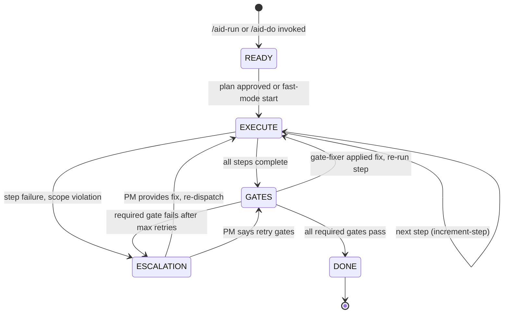
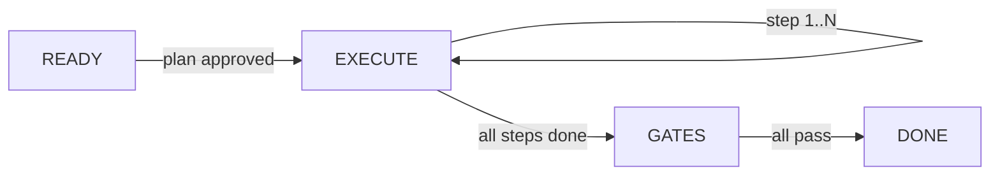

# Orchestration Flow

AID v2 uses a 6-state finite state machine implemented in `aid-fsm.sh`. Every transition is validated in bash — invalid transitions are rejected with an error. State is persisted to `state.yaml` and every event is logged to `timeline.jsonl`.

## State Diagram



## Valid Transitions

The FSM enforces a strict transition table. Any transition not in this list is rejected:

| From | To | Trigger |
|------|----|---------|
| `READY` | `EXECUTE` | Plan approved (or fast-mode auto-approve) |
| `EXECUTE` | `EXECUTE` | Next step in plan (self-transition via increment-step) |
| `EXECUTE` | `GATES` | All plan steps complete |
| `EXECUTE` | `ESCALATION` | Step fails, scope violation, or agent error |
| `GATES` | `DONE` | All required gates pass |
| `GATES` | `EXECUTE` | Gate-fixer modified code, need to re-run affected step |
| `GATES` | `ESCALATION` | Required gate fails after max retries |
| `ESCALATION` | `EXECUTE` | PM provides guidance, re-dispatch |
| `ESCALATION` | `GATES` | PM says retry gates |

There is no `ERROR` terminal state in the FSM itself. Unrecoverable errors are handled by the LLM layer (pipeline skill) which logs the error and presents options to the user. The FSM stays in its last valid state.

## States

### READY

**Entry:** `/aid-run` or `/aid-do` is invoked.

**What happens:**
1. `aid-fsm.sh init` creates `state.yaml` with epic_id, run_id, total_steps, mode, branch, and base_commit.
2. The pipeline skill reads config files (`execution.yaml`, `orchestration.yaml`).
3. For Epic Mode: the plan is presented for review (or auto-approved in autonomous mode).
4. For Fast Mode: plan review is skipped.

**Bash script:** `aid-fsm.sh init`

**LLM skill:** `pipeline` (reads plan, prepares dispatch context)

**State file after init:**
```yaml
epic_id: E-20260303-a1b2
run_id: R-20260303-001
state: READY
current_step: 0
total_steps: 5
mode: epic
branch: epic/E-20260303-a1b2
base_commit: abc123
gate_retries: 0
escalation_count: 0
started_at: "2026-03-03T10:00:00Z"
```

**Exit:** Transition to EXECUTE.

---

### EXECUTE

**Entry:** Plan approved, or returning from ESCALATION/GATES with fixes.

**What happens:**
1. `aid-fsm.sh get-field current_step` determines which step to run.
2. The pipeline skill dispatches the appropriate agent (implementer, verifier, etc.) with the step specification from `plan.json`.
3. The agent writes code, runs tests, produces output.
4. `aid-fsm.sh increment-step` advances the step counter.
5. `aid-stage-log.sh` logs the step completion to `timeline.jsonl`.
6. If more steps remain: self-transition (EXECUTE to EXECUTE).
7. If all steps complete: transition to GATES.

**Bash scripts:** `aid-fsm.sh transition EXECUTE EXECUTE`, `aid-fsm.sh increment-step`, `aid-stage-log.sh`

**LLM skill:** `pipeline` (dispatches agents via `agent-protocol`), `role-cards` (agent selection)

**Evidence:** Step outputs in `.aid-o/work/evidence/<epic_id>/<run_id>/`

**Exit:** EXECUTE (next step), GATES (all done), or ESCALATION (failure).

---

### GATES

**Entry:** All plan steps complete.

**What happens:**
1. `aid-run-gates.sh run-all` reads gate definitions from `execution.yaml`.
2. For each gate with a `command`: execute the command, capture exit code and output.
3. For each gate with a `rule`: the LLM evaluates the rule (e.g., "docs updated if API changed").
4. Results are logged to `timeline.jsonl` with gate name, result, exit code, and duration.
5. If all required gates pass: transition to DONE.
6. If a required gate fails and retries remain: dispatch `gate-fixer` agent, then retry.
7. If a required gate fails and retries exhausted: transition to ESCALATION.

**Bash script:** `aid-run-gates.sh run-all`

**LLM skill:** `quality-gates` (for rule-based gates), `agent-protocol` (dispatches gate-fixer)

**Gate output format (JSON per gate):**
```json
{
  "gate": "tests_pass",
  "result": "pass",
  "exit_code": 0,
  "duration_ms": 3200,
  "output": "45 passed in 3.2s"
}
```

**Exit:** DONE (all pass), EXECUTE (fix applied, re-run), or ESCALATION (retries exhausted).

---

### ESCALATION

**Entry:** A failure that requires human judgment.

**What happens:**
1. `aid-fsm.sh get-field escalation_count` is incremented.
2. The pipeline skill builds a structured escalation message with: trigger, severity, progress, failure history, and a recommendation.
3. The message is presented to the PM (inline or via Slack if configured).
4. PM chooses: fix (provide guidance), skip, or abort.

**Escalation triggers (from `execution.yaml`):**
- Gate fails after max retry attempts
- LLM cost exceeds budget
- Agent produces no output or errors
- Conflicting outputs from parallel agents
- Security finding classified as CRITICAL

**Bash script:** `aid-fsm.sh transition ... ESCALATION`

**LLM skill:** `pipeline` (formats escalation, processes PM response)

**PM options:**
| Option | Effect |
|--------|--------|
| Fix | PM provides guidance. Transition to EXECUTE with guidance prepended to agent prompt. |
| Skip | Mark failing item as skipped. Transition to GATES (retry remaining gates). |
| Abort | Pipeline stops. Curator still runs on partial evidence. |

**Exit:** EXECUTE (PM fix), GATES (PM retry).

---

### DONE

**Entry:** All required gates pass.

**What happens:**
1. `aid-fsm.sh transition GATES DONE` records the terminal state.
2. `aid-stage-log.sh` logs the completion event to `timeline.jsonl`.
3. The pipeline skill dispatches the curator agent (evaluates improvement proposals, extracts lessons).
4. The auditor agent runs a project health check.
5. Evidence directory is finalized.
6. In autonomous mode: checks the queue for the next pending run.

**Bash script:** `aid-fsm.sh transition GATES DONE`

**LLM skill:** `pipeline` (post-run cleanup), agents: `curator`, `auditor`

**Exit:** Terminal state. Pipeline complete.

---

## Happy Path

The most common flow through the FSM:



## Gate Failure Path

When a gate fails but is recoverable:


Or with auto-retry (within retry budget):


## Timeline Events

Every state transition and significant event is logged to `timeline.jsonl`:

```jsonl
{"ts":"2026-03-03T10:00:00Z","event":"fsm_init","state":"READY","epic_id":"E-20260303-a1b2"}
{"ts":"2026-03-03T10:00:05Z","event":"fsm_transition","from":"READY","to":"EXECUTE"}
{"ts":"2026-03-03T10:01:30Z","event":"step_complete","step":1,"agent":"implementer"}
{"ts":"2026-03-03T10:03:00Z","event":"fsm_transition","from":"EXECUTE","to":"GATES"}
{"ts":"2026-03-03T10:03:05Z","event":"gate_result","gate":"tests_pass","result":"pass","duration_ms":3200}
{"ts":"2026-03-03T10:03:10Z","event":"gate_result","gate":"scope_check","result":"pass","duration_ms":150}
{"ts":"2026-03-03T10:03:15Z","event":"fsm_transition","from":"GATES","to":"DONE"}
```

## State Persistence

FSM state is persisted to `.aid-o/work/evidence/<epic_id>/<run_id>/state.yaml`. This file is the single source of truth for the current pipeline state. The `aid-fsm.sh` script reads and writes this file atomically — it validates the current state before allowing any transition.

If Claude Code crashes mid-run, the state file preserves exactly where the pipeline was. On restart, `/aid-status` reads the state file and shows the current position. `/aid-run` can resume from the last recorded state.
