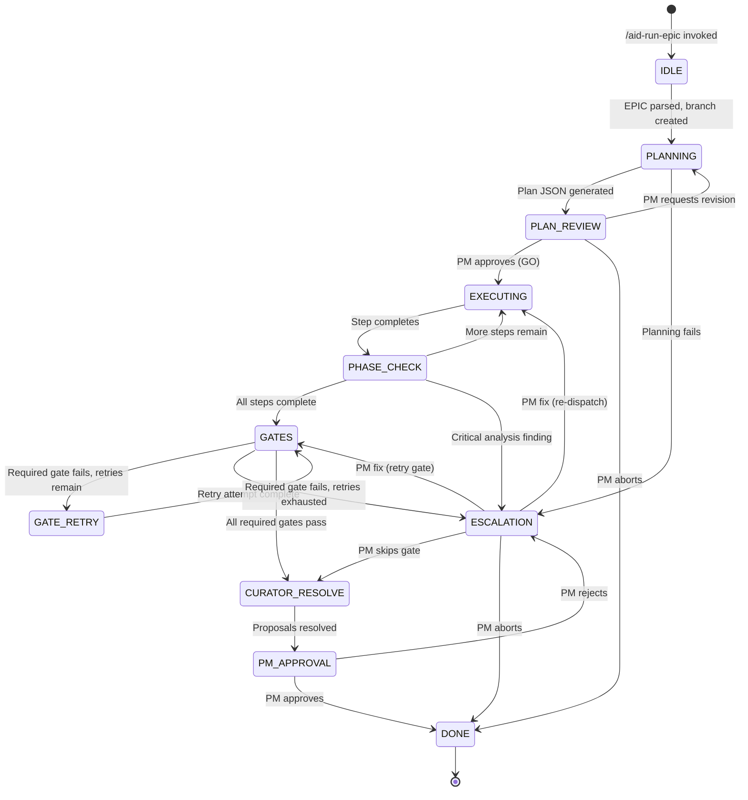

# Orchestration Flow

The Controller is implemented as a state machine in `skills/epic-orchestration.md`. Every transition between states is logged to `stage_log.jsonl` and produces evidence files. The machine has 11 states, with 3 additional internal transitions (NEXT_PHASE, ESCALATION, and GATE_RETRY).

## State Diagram



## States

### IDLE

**Entry:** `/aid-run-epic <epic-file>` is invoked.

**Actions:**
1. Read and validate the EPIC file (must have Goal, Scope, Constraints, DoD, Acceptance Criteria sections).
2. Read `decision-policies.yaml`, `gates.yaml`, and relevant playbooks.
3. Probe memory availability: check `memory-config.yaml` and test Qdrant MCP connectivity if memory is enabled. Failures are warnings only — they never block execution.
4. Search Qdrant for cross-project knowledge relevant to the EPIC goal (if memory is enabled). Top 3 results are passed to the Planner as context.
5. Create a git branch: `epic/{epic_id}`. If the repository is not initialized, branch management is skipped and a warning is logged.

**Evidence:** `epic_input.md` copied to evidence directory.

**Exit:** EPIC structure is valid — transition to PLANNING.

---

### PLANNING

**Entry:** IDLE completes successfully.

**Actions:**
1. Analyze the EPIC to identify required agent roles and their natural sequence.
2. Build a dependency graph: which steps depend on prior steps.
3. Identify parallel execution groups (steps that can run in the same wave because they have no mutual dependency).
4. Generate Plan JSON conforming to `plan.schema.json`.
5. Validate the Plan JSON against the schema.
6. Generate a run file with objective, scope, phases, and quality gates.
7. Run a run file quality check: objective must be 3+ sentences, scope must list IN and OUT items, each phase must have Goal/Agent/Inputs/Outputs/Constraints/Acceptance.

**Plan generation ordering rules:**
- Architect always runs first (API contracts before implementation).
- Domain runs after Architect.
- Backend and Frontend can run in parallel (both depend on Architect contracts only).
- QA, Security, and Observability can run in parallel after implementation steps.
- Docs runs after implementation.
- Release runs last.

**Evidence:** `plan.json` and run file saved to evidence directory.

**Exit:** Valid Plan JSON produced — transition to PLAN_REVIEW. Planning failure — transition to ESCALATION.

---

### PLAN_REVIEW

**Entry:** Plan JSON generated.

**Actions (manual mode):**
1. Format a rich plan summary showing waves, roles, file counts, dependencies, parallel groups, and optimization metrics.
2. Send to PM via Slack (if configured) or present in chat.
3. Wait for PM response: GO, REVISE, or ABORT.

**Actions (FIRST AID auto-mode):**
1. Run automated validations: schema check, completeness check, dependency graph cycle check, run file quality check.
2. If all pass: auto-approve and transition to EXECUTING.
3. If any fail: escalate to PM (E11 trigger — cannot proceed with invalid plan).

**PM responses:**
- **GO** — Transition to EXECUTING.
- **REVISE** — Return to PLANNING with PM feedback.
- **ABORT** — Transition to DONE with status `aborted`.

**Evidence:** `pm_plan_approval.json` saved.

---

### EXECUTING

**Entry:** Plan approved, or PHASE_CHECK advances to next step.

**Actions:**
1. Read the next step from `plan_progress.json`.
2. Retrieve relevant memory context from Qdrant (if enabled) for the step objective and agent role.
3. Dispatch the agent for this step's role with: the step spec, allowed/forbidden paths, memory context, and git branch context.
4. After the step agent returns: dispatch analysis agents (security, code-reviewer) in parallel if configured for this step.
5. Wait for all dispatches to complete.

**Agent dispatch includes:**
- Role playbook from `.aid-o/03-config/playbooks/`
- Step specification (objective, inputs, outputs, acceptance criteria, allowed_paths, forbidden_paths)
- Memory context block (from Qdrant search, if enabled)
- Git context (branch name, commit conventions)

**Evidence:** `stage_log.jsonl` entry per dispatch, step output in `steps/step_N_role/`.

**Exit:** Step completes with expected outputs — transition to PHASE_CHECK.

---

### PHASE_CHECK

**Entry:** EXECUTING step completes.

**Actions:**
1. Validate step outputs against acceptance criteria.
2. Merge analysis agent results (if applicable): check for conflicts between parallel agent outputs.
3. Check for critical findings from analysis agents.
4. In FIRST AID auto-mode: run permission learning (detect PM-granted permissions and persist them).
5. Apply `decision-policies.yaml` rules to determine next action.

**Decision outcomes:**
- More steps remain and no critical issues: update `plan_progress.json`, transition back to EXECUTING.
- All steps complete and no critical issues: transition to GATES.
- Critical analysis finding: transition to ESCALATION.

**Evidence:** Phase check result appended to `stage_log.jsonl`.

---

### GATES

**Entry:** All EPIC steps complete.

**Actions:**
1. Read `gates.yaml` from `.aid-o/03-config/policies/`.
2. Execute gates in order. For each gate:
   - **Command gates:** run the command via Bash, capture exit code and output.
   - **Rule gates:** evaluate the logical rule (e.g., check if docs were updated when API changed).
   - **Conditional gates:** evaluate the `when` condition first; skip if condition is false.
3. Store raw output for each gate in `evidence/{epic_id}/{run_id}/gates/{gate_name}.txt`.
4. Generate `gates_report.json` with per-gate results, retry history, and overall pass/fail status.
5. Determine next action based on results and retry configuration.

**Gate outcome routing:**
- All required gates pass: transition to CURATOR_RESOLVE.
- Required gate fails, retries remain: transition to GATE_RETRY.
- Required gate fails, retries exhausted: transition to ESCALATION.

**Evidence:** `gates_report.json`, individual gate output files.

---

### GATE_RETRY

**Entry:** A required gate failed and the retry budget has not been exhausted.

**Actions:**
1. Generate fix instructions from the gate failure output (delegated to the gate-fixer agent role).
2. Apply the fix (gate-fixer agent modifies code or config).
3. Re-execute the failed gate command.
4. Append the retry attempt to `gates_report.json`.

**Exit:** Return to GATES to evaluate the full gate set again.

---

### ESCALATION

**Entry:** A failure that requires human judgment occurs.

**Actions:**
1. Save progress snapshot to `plan_progress.json`.
2. Stash uncommitted work: `git stash save "auto-escalation-{trigger_id}"`.
3. Mark EPIC status as `paused` in `epic-queue.yaml`.
4. Build structured escalation context with trigger ID, severity, EPIC progress, failure history, and a recommendation.
5. Send notification to PM via Slack or chat with four options: Fix (A), Skip (B), Abort (C), Continue Manual (D).
6. Wait for PM response.

**PM options in FIRST AID auto-mode:**
- **A (Fix):** PM provides guidance; Controller re-dispatches with the guidance prepended to the prompt and resets the retry counter.
- **B (Skip):** Mark the triggering item as `skipped_by_pm` and advance.
- **C (Abort):** Transition current EPIC to DONE with status `aborted`, pause the queue.
- **D (Continue Manual):** Switch the current EPIC to manual orchestration mode; the PM drives the remaining steps.

**Evidence:** `escalations/escalation_{trigger_id}_{timestamp}.json`, `pm_decision.json`.

---

### CURATOR_RESOLVE

**Entry:** All required quality gates pass.

**Actions (parallel dispatch):**
1. **Curator agent:** Reviews `improvement_notes` from all step outputs, evaluates proposals against `decision-policies.yaml` rules and Qdrant history, approves or rejects each proposal, dispatches fix agents for approved proposals.
2. **Lessons-Extractor agent:** Extracts lessons learned and working commands from the run, writes them to `lessons-learned.md` and `command-history.md`.

**Curator proposal evaluation:**
- Proposals are evaluated against `decision-policies.yaml` rules automatically.
- Proposals requiring PM judgment that are not covered by policy rules are added to `backlog.md` for future runs.
- Fix agents are dispatched for approved proposals within the current EPIC scope.

**Evidence:** `curator_resolve_report.json`, updated `backlog.md`, updated `lessons-learned.md`.

**Exit:** All proposals resolved (approved, rejected, or backlisted) and fixes applied — transition to PM_APPROVAL.

---

### PM_APPROVAL

**Entry:** Curator phase complete.

**Actions:**
1. Compile a final summary: all steps completed, gate results, Curator report, lessons extracted.
2. Send to PM via Slack or chat.
3. Wait for PM approval or rejection.

**In FIRST AID auto-mode:** The Controller presents the summary and waits. PM_APPROVAL is always a PM touchpoint — it is not auto-approved.

**PM responses:**
- **Approved:** Transition to DONE.
- **Rejected:** Transition to ESCALATION for PM to specify what needs to change.

**Evidence:** `pm_decision.json` updated.

---

### DONE

**Entry:** PM approves the final result.

**Actions:**
1. Merge the EPIC branch into the base branch.
2. Archive evidence directory.
3. Dispatch the Auditor agent (produces `audit-report.md` with a 0-100 quality score).
4. Extract an example EPIC pattern for Qdrant storage if the EPIC is eligible (completed successfully, PM approval obtained).
5. Send summary notifications via Slack.
6. Index EPIC knowledge to Qdrant (decisions, patterns, audit findings).
7. Check the EPIC queue for the next pending EPIC (auto-pickup if in FIRST AID mode).

**Evidence:** `final_report.md`, `audit-report.md`, `slack_log.jsonl`.

## PM Decision Points

There are three mandatory PM touchpoints in manual mode:

| State | PM Action | Can Be Auto? |
|-------|-----------|--------------|
| PLAN_REVIEW | Approve, revise, or abort the generated plan | Yes (auto-mode validates and auto-approves) |
| ESCALATION | Choose fix, skip, abort, or continue-manual | Never (always requires PM) |
| PM_APPROVAL | Approve or reject final results before merge | Never (always requires PM) |

In FIRST AID auto-mode, PLAN_REVIEW is automated but ESCALATION and PM_APPROVAL always pause and wait for the PM.

## Evidence Directory Structure

Every EPIC run produces a self-contained evidence directory:

```
.aid-o/04-engine/evidence/{epic_id}/{run_id}/
  epic_input.md           # Copy of the original EPIC file
  plan.json               # Generated execution plan
  plan_progress.json      # Live step completion tracking
  pm_plan_approval.json   # PM plan approval record
  pm_decision.json        # Latest PM decision (escalation or final)
  gates_report.json       # Gate execution results and retry history
  curator_resolve_report.json
  final_report.md
  audit-report.md
  stage_log.jsonl         # Append-only log of every state transition
  memory_log.jsonl        # Memory store/find operation log
  slack_log.jsonl         # Slack message history
  steps/
    step_1_architect/     # Per-step outputs
    step_2_backend/
    ...
  gates/
    tests_pass.txt        # Raw gate command output
    lint_pass.txt
    ...
  escalations/
    escalation_E1_{timestamp}.json
```
