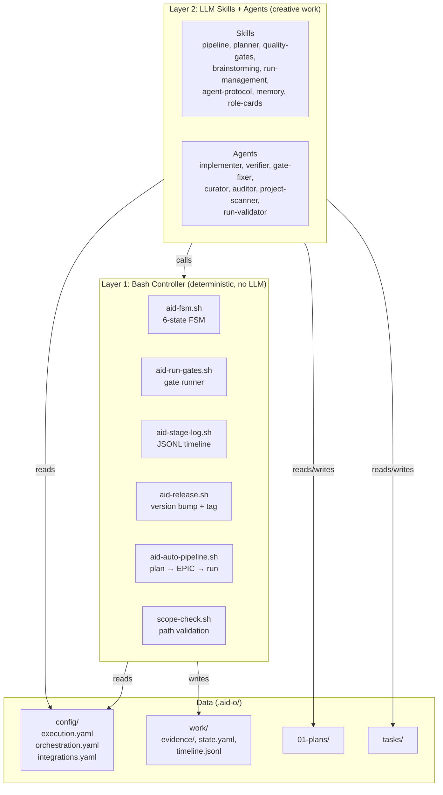
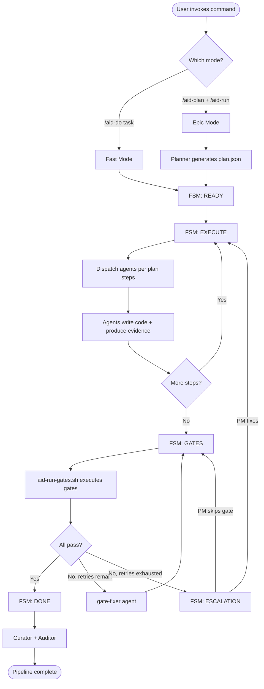

# Architecture Overview

AID v2 uses a **dual-layer architecture** that separates deterministic operations from creative work. Bash scripts handle state transitions, gate execution, and scope checking. The LLM handles planning, code generation, reviews, and decision-making.

## What AID Is

AID is a Claude Code plugin — a set of slash commands, skill files (Markdown instructions), agent definitions, and bash scripts. It does not run outside Claude Code. When you invoke `/aid-run`, Claude Code reads the pipeline skill, which tells it how to orchestrate the FSM and dispatch agents. The bash scripts handle the parts that do not need an LLM.

## Dual-Layer Design



### Layer 1: Bash Controller

Handles operations that are deterministic and should never involve LLM reasoning:

| Script | Purpose |
|--------|---------|
| `aid-fsm.sh` | 6-state FSM — init, transition, get-state, increment-step |
| `aid-run-gates.sh` | Execute gate commands, capture exit codes, log results |
| `aid-stage-log.sh` | Append structured JSONL events to timeline |
| `aid-release.sh` | Version bump across registered files, git tag |
| `aid-auto-pipeline.sh` | Orchestrate the full pipeline: plan.md to EPIC to plan.json to run |
| `scope-check.sh` | Validate that changes stay within allowed paths |

These scripts have no LLM dependency. They read YAML config, execute shell commands, and write structured output. They can be tested independently (173 tests across 13 suites).

### Layer 2: LLM Skills + Agents

Handles operations that require reasoning, code generation, or natural language understanding:

**8 Skills** (instruction sets the model reads):

| Skill | Purpose |
|-------|---------|
| `agent-protocol` | How to dispatch and communicate with agents |
| `pipeline` | The full orchestration protocol (FSM + agents + gates) |
| `planner` | How to generate plan.json from requirements |
| `brainstorming` | Structured exploration dialog with the user |
| `quality-gates` | Pre-commit gate protocol (6 checks before every commit) |
| `run-management` | Run lifecycle, status tracking, stop/resume |
| `memory` | Qdrant integration protocol |
| `role-cards` | Agent role definitions and dispatch rules |

**7 Agents** (role-specific behavior definitions):

| Agent | Role |
|-------|------|
| `implementer` | Write code, create files, implement features |
| `verifier` | Review code, check acceptance criteria |
| `gate-fixer` | Analyze gate failures, apply targeted fixes |
| `curator` | Evaluate improvement proposals, extract lessons |
| `auditor` | Post-run project health audit |
| `project-scanner` | Detect tech stack, generate project.yaml |
| `run-validator` | Validate plan.json structure and run files |

## Pipeline Flow



## Key Design Principles

### Bash for Determinism, LLM for Creativity

State transitions, gate execution, and scope validation run in bash. They produce the same result every time given the same input. The LLM handles code generation, reviews, and planning — tasks where reasoning is required.

### Evidence-Driven

Every action produces a file. Plans become `plan.json`. Gate results are written to `timeline.jsonl`. State lives in `state.yaml`. Nothing is kept only in conversation context. The `.aid-o/work/evidence/` directory is the audit trail.

### PM-in-the-Loop

The PM approves plans and reviews escalations. In normal mode, the PM can inspect at every state boundary. In autonomous mode (`/aid-run --auto`), plan approval is automated but escalations still reach the PM.

### Optional GUI Dashboard

AID includes an optional web dashboard (`packages/aid-gui` + `packages/aid-server`) that watches `.aid-o/` files and provides real-time pipeline visualization, decision approval UI, and evidence browsing. The GUI is read-only — all orchestration runs through Claude Code. See [GUI Integration](./gui-integration.md) for the full architecture.

### ~50K Token Budget

v2 reduced prompt overhead from ~400K tokens (v1) to ~50K by moving deterministic logic to bash scripts. Skills and agents are loaded on-demand rather than all at once.

## Directory Structure

```text
.aid-o/
  01-plans/              Plan documents (archive/ for completed)
  tasks/                 Task tracking, plan.json, EPIC specs
  config/                PM-customizable configuration
    execution.yaml       Gates, retry, budget, quality thresholds
    orchestration.yaml   Language, dispatch, FSM, release
    integrations.yaml    Slack, memory, knowledge
    project.yaml         Auto-detected stack
  work/                  Runtime state (AI-managed)
    evidence/            Per-run evidence directories
      {epic_id}/{run_id}/
        state.yaml       FSM state
        timeline.jsonl   Event log
        gates/           Gate output files
```
