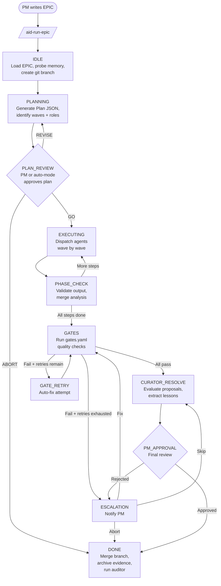

# Architecture Overview

AID Orchestrator is a Claude Code plugin that implements a **Controller + Workers** architecture for AI-driven software development. It takes an EPIC specification written by the PM, generates a structured execution plan, dispatches specialized role-based agents for each step, enforces quality gates after all steps complete, and maintains a complete evidence trail throughout.

## What AID Is

AID is not a standalone application. It runs entirely inside Claude Code as a plugin — a set of slash commands, skill files (Markdown instructions for the Claude model), and configuration templates. When you run `/aid-run-epic`, Claude Code itself becomes the Controller, reading the EPIC specification and orchestrating agents step by step according to the protocol defined in `skills/epic-orchestration.md`.

Agents are also Claude Code instances. Each agent receives a role-specific playbook, the step specification from the EPIC plan, and memory context from previous runs. Agents write files, run commands, and produce structured output. The Controller reads that output, checks it against acceptance criteria, and decides what to do next.

## Component Map

```
Plugin (Claude Code)
  |
  |-- Commands (/aid-run-epic, /aid-plan-epic, /aid-init, ...)
  |
  |-- Controller (epic-orchestration skill)
  |     |
  |     |-- Planner            Reads EPIC → generates Plan JSON
  |     |-- Agent Dispatcher   Dispatches role agents per step
  |     |-- Phase Checker      Validates step outputs, merges analysis
  |     |-- Gates Engine       Runs quality gates after all steps
  |     |-- Curator            Resolves improvement proposals
  |     `-- PM Gateway         Slack or chat for approvals/escalations
  |
  |-- Agents (18 specialized roles)
  |     architect, backend, frontend, domain, QA, security,
  |     docs-writer, release, curator, auditor, gate-fixer, ...
  |
  |-- Quality Gates
  |     6 pre-commit gates (quality-gates skill)
  |     N configurable post-EPIC gates (gates-engine skill, gates.yaml)
  |
  |-- Memory System
  |     File-based (lessons-learned.md, command-history.md, decisions.yaml)
  |     Qdrant vector store via MCP (optional, semantic search)
  |
  `-- Evidence Store
        .aid-o/04-engine/evidence/{epic_id}/{run_id}/
        stage_log.jsonl, plan.json, gates_report.json, step outputs
```

## Pipeline Diagram

The following diagram shows the full EPIC pipeline from start to finish:



## Key Design Principles

### Evidence-Driven

Every action the Controller takes produces a file. Plans become `plan.json`. Gate results become `gates_report.json`. PM decisions become `pm_decision.json`. Agent outputs go into `steps/step_N_role/`. Nothing is kept only in memory or conversation context. You can always audit what happened and why by reading the evidence directory.

### PM-in-the-Loop

AID is not a black-box autonomous system. The PM approves the plan before execution begins and approves the final result before the branch merges. Failures escalate to the PM with structured options and a recommendation — they never silently disappear. In manual mode (the default), the PM can inspect and intervene at every state boundary.

FIRST AID mode (`/aid-first-aid`) enables autonomous queue execution where the PM approves the queue once and the Controller runs all EPICs end-to-end. Even in this mode, 16 defined escalation triggers pause execution and notify the PM when human judgment is required.

### Fail-Safe

AID prefers caution over convenience. If `settings.json` is missing when entering auto-mode, a minimal default is created rather than proceeding blindly. If Qdrant is unavailable, memory operations degrade gracefully to file-based storage without blocking execution. If a gate fails, it retries up to the configured maximum before escalating — it never silently skips. If a permission backup cannot be found on auto-mode exit, the PM is warned rather than leaving the system in an elevated state silently.

### Role-Based Agents with Strict Scope

Each agent has a defined role, a playbook, and an `allowed_paths`/`forbidden_paths` scope for each step. Agents cannot modify files outside their scope. This prevents cross-domain contamination where, for example, a backend agent rewrites frontend components.

### Separation of Config and Engine

User-editable configuration lives in `.aid-o/03-config/` (policies, templates, playbooks). The engine's runtime state lives in `.aid-o/04-engine/` (memory, evidence, run history). Users customize behavior by editing config files; the engine reads those files at runtime. This means PM can change gate definitions, decision policies, or playbooks between EPIC runs without modifying the plugin itself.
