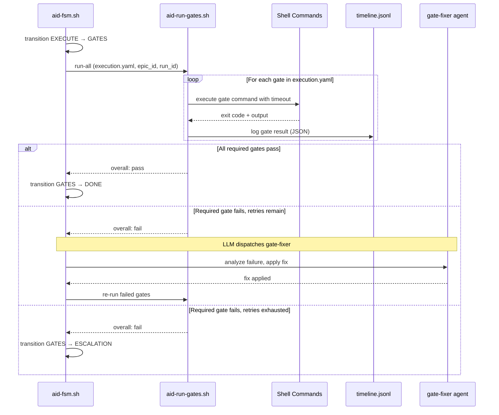

# Quality Gates

Quality gates in AID v2 are executed by `aid-run-gates.sh`, a bash script that reads gate definitions from `execution.yaml`, runs each command, and logs results to `timeline.jsonl`. The LLM is not involved in gate execution — only in fixing failures (via the gate-fixer agent).

## Gate Execution Flow



## Default Gates

AID ships with 6 default gates in `execution.yaml`. The project-scanner agent customizes the commands during `/aid-init` to match your stack.

| Gate | Required | Type | Purpose |
|------|----------|------|---------|
| `tests_pass` | Yes | command | Run project test suite |
| `security_scan_pass` | Yes | command | Check for high/critical security findings |
| `docs_updated` | Yes | rule | Verify docs are current with code changes |
| `scope_check` | Yes | deterministic | Verify changes stay within allowed paths |
| `lint_pass` | No | conditional | Run linter (when configured) |
| `build_pass` | No | conditional | Run build (when frontend files changed) |

## Gate Types

### Command Gates

Execute a shell command and evaluate the exit code:

```yaml
tests_pass:
  description: "All tests pass via project test runner"
  required: true
  command: "npm test"
  timeout_seconds: 300
  pass_criteria: "exit code 0"
```

`aid-run-gates.sh` runs the command with `timeout`, captures stdout+stderr (truncated to 2000 chars), and records the result as JSON.

### Rule Gates

Evaluated by the LLM rather than a shell command:

```yaml
docs_updated:
  description: "Documentation updated for changed APIs/models"
  required: true
  rule: "docs or CHANGELOG updated if code changes affect public API"
  pass_criteria: "manual or automated check"
```

The pipeline skill reads the rule text and evaluates whether it holds based on the git diff. This is the only gate type that involves the LLM.

### Deterministic Gates

Executed by a dedicated bash script with `max_retries: 0` — no auto-fix allowed:

```yaml
scope_check:
  description: "Verify changes are within EPIC scope"
  command: "plugins/aid-orchestrator/scripts/gates/scope-check.sh ..."
  required: true
  type: deterministic
  max_retries: 0
```

If a deterministic gate fails, it escalates immediately. The gate-fixer agent is not dispatched.

### Conditional Gates

Only execute when a `when` condition is met. If the condition is false, the gate is skipped (not failed):

```yaml
build_pass:
  description: "Project builds without errors"
  required: false
  command: "npm run build"
  timeout_seconds: 180
  when: "frontend files changed"
```

Conditional gates have `required: false`. A failure produces a warning but does not block the pipeline.

## Gate Result Format

Each gate produces a JSON result logged to `timeline.jsonl`:

```json
{
  "gate": "tests_pass",
  "result": "pass",
  "exit_code": 0,
  "duration_ms": 3200,
  "output": "45 passed in 3.2s"
}
```

### Result Values

| Result | Meaning |
|--------|---------|
| `pass` | Gate command exited 0 (or rule evaluated true) |
| `fail` | Gate command exited non-zero (required gate — blocks pipeline) |
| `skip` | Conditional gate where `when` condition was false |
| `error` | Execution error (timeout, command not found, permission denied) |

### Overall Result

```
IF any required gate has result "fail" or "error":
  overall = "fail"
ELSE:
  overall = "pass"

Conditional gates (required: false) do NOT affect the overall result.
```

## Retry Logic

When a required gate fails and the retry budget (from `execution.yaml` `retry.max_attempts`) is not exhausted:

1. The pipeline skill dispatches the `gate-fixer` agent with the failure output as context.
2. The gate-fixer analyzes the failure and applies a targeted fix.
3. `aid-run-gates.sh` re-runs the failed gate.
4. The retry attempt is logged to `timeline.jsonl`.

Common auto-fix patterns:

| Failure | Auto-fix |
|---------|----------|
| Lint/formatting violations | Run auto-formatter (`ruff check --fix`, `prettier --write`) |
| Minor type errors | Fix type annotations in affected files |
| Missing test imports | Add missing imports |

Failures that require logic changes or security remediation are not auto-fixed. They escalate to the PM.

## Customizing Gates

Edit `.aid-o/config/execution.yaml` to customize gates:

```yaml
gates:
  # Replace with your test runner
  tests_pass:
    command: "pytest -q --tb=short"
    required: true
    timeout_seconds: 300

  # Add a custom gate
  e2e_tests:
    description: "End-to-end tests pass"
    command: "npx playwright test"
    required: true
    timeout_seconds: 600

  # Disable a gate
  security_scan_pass:
    required: false
```

Any entry with a `command` field is executed by `aid-run-gates.sh`. You can add as many custom gates as needed.

## Evidence

Gate results are stored in the run's evidence directory:

```text
.aid-o/work/evidence/{epic_id}/{run_id}/
  timeline.jsonl          Gate results as JSONL events
  gates/
    tests_pass.txt        Raw command output
    lint_pass.txt
    scope_check.txt
```

Every retry attempt is preserved in the timeline. Gate output files are overwritten on re-run (only the latest output is kept as a file; the history lives in `timeline.jsonl`).

## Error Handling

| Error | Response |
|-------|----------|
| `execution.yaml` not found | Pipeline fails: "Config not found. Run `/aid-init` first." |
| Command not found (e.g., pytest not installed) | Result: `error`. Output includes the missing tool name. |
| Timeout exceeded | Result: `error`. Output includes the configured timeout. |
| Permission denied | Result: `error`. Output notes the permission issue. |

`aid-run-gates.sh` never modifies `execution.yaml`. That file is PM-owned configuration.
