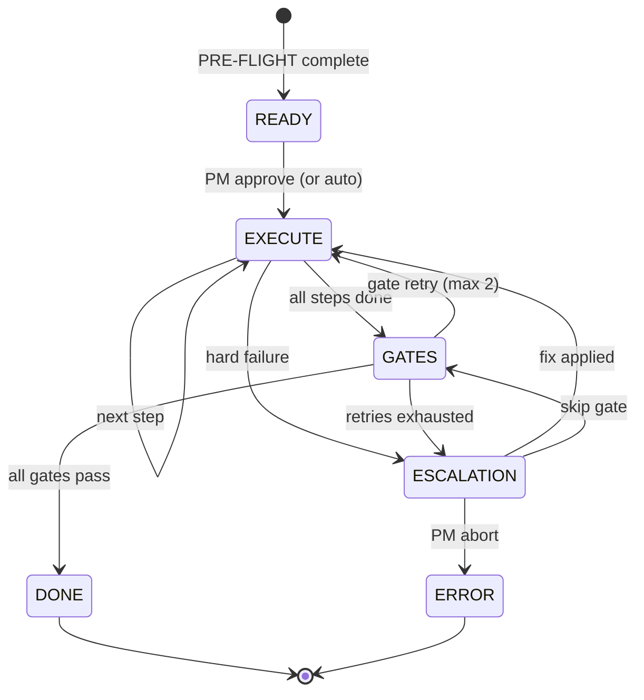

# /aid-run

Run the 6-state FSM controller to orchestrate a task through its full lifecycle. Replaces the v1 `/aid-run-epic` and `/aid-first-aid` commands.

## Usage

```bash
/aid-run                        # Manual mode — auto-detect active task
/aid-run <task-id>              # Manual mode — run specific task
/aid-run --auto                 # Autonomous mode — auto-approve S-effort fixes
/aid-run --auto --task <id>     # Autonomous mode for specific task
/aid-run --resume               # Resume interrupted run from state.yaml
```

### Examples

```bash
# Start the only active task
/aid-run

# Run a specific task
/aid-run E-003-1_2

# Autonomous execution (replaces /aid-first-aid)
/aid-run --auto

# Resume after crash or /aid-stop
/aid-run --resume
```

If no task ID is provided and multiple tasks exist, AID lists them for selection.

## Flags

| Flag | Behavior |
|------|----------|
| _(none)_ | Manual mode -- asks PM approval at each escalation |
| `--auto` | Autonomous mode (replaces `/aid-first-aid`) |
| `--resume` | Resume from last known state in `state.yaml` |
| `--task <id>` | Specify task ID (otherwise auto-detect) |

### Autonomous Mode (`--auto`)

Escalation rules:

| Effort | Auto-Mode Behavior |
|--------|-------------------|
| **S-effort** fixes | Auto-approve, apply fix, continue |
| **M-effort** decisions | Use default from `config/permissions.yaml` |
| **L-effort** and security | **Always** escalate to PM (never auto-approve) |
| Gate retries | Auto-retry up to configured max (default: 2) |
| Version bump on intermediate phase | Auto-defer (bump only on final phase) |

Requires `autonomous_mode: true` in `.aid-o/config/permissions.yaml`. If not set, `--auto` prints a warning and falls back to manual mode.

## What It Does

### PRE-FLIGHT (before FSM starts)

The bash pipeline prepares execution artifacts. No LLM involvement -- exit non-zero aborts with error.

```text
PRE-FLIGHT Pipeline
====================================
  [1] aid-plan-to-epic.sh   → task file     ✓
  [2] aid-epic-to-json.sh   → plan.json     ✓
  [3] aid-json-to-run.sh    → state.yaml    ✓

FSM initialized: READY
```

### 6-State FSM



### State Details

#### READY

- Loads `execution.yaml` (gate definitions) and `config/permissions.yaml` (mode)
- Displays task summary: ID, title, step count, parallel groups, mode
- Manual mode: asks PM "Start execution? (Y/N)"
- Auto mode: proceeds immediately

#### EXECUTE

- Reads `state.yaml`, finds `current_step`
- Checks dependency graph, dispatches steps with all deps satisfied
- Sequential steps: creates branch `task/{task_id}/step_{N}_{role}`, dispatches agent
- Parallel groups: dispatches all agents in single message
- Verifies outputs: present, scope respected, acceptance criteria met
- Logs events to `timeline.jsonl`

#### GATES

- Runs gate commands from `config/execution.yaml`:
  - `test_cmd`, `lint_cmd`, `build_cmd` from `config/project.yaml`
  - Custom gates from `execution.yaml`
- Generates `gates_report.json`
- All pass --> DONE; fail + retries remaining --> EXECUTE (gate-fixer); fail + exhausted --> ESCALATION

#### ESCALATION

- Builds escalation context (reason, attempts, options)
- Manual mode: presents options -- (A) Fix, (B) Skip, (C) Abort
- Auto mode: S-effort auto-fix, M-effort uses default, L-effort/security always escalates to PM

#### DONE

- Updates `state.yaml`: `state: DONE`
- Merges step branches --> task branch --> main (or creates PR)
- Archives run, updates `work/active.md`
- Generates `final_report.md`
- Dispatches Curator agent (backlog proposals, lessons)
- Checks queue --> auto-starts next task if queue not paused

#### ERROR

- Logs error to `timeline.jsonl`
- Preserves all evidence for debugging
- Reports to PM with error context

## Evidence Structure

All artifacts stored at `.aid-o/work/evidence/{task_id}/{run_id}/`:

| File | Description |
|------|-------------|
| `state.yaml` | FSM state (current state, step, retries) |
| `timeline.jsonl` | Event log (all state transitions) |
| `gates_report.json` | Gate results with retry history |
| `final_report.md` | Post-run summary |
| `steps/step_{N}_{role}/` | Per-step prompt, output, diff, review |

## Key Behaviors

- **6 states only** -- READY, EXECUTE, GATES, ESCALATION, DONE, ERROR
- **PRE-FLIGHT is bash** -- runs before FSM starts, not an FSM state
- **`--auto` replaces `/aid-first-aid`** -- same autonomous behavior, integrated flag
- **`--resume` reads state.yaml** -- picks up from last known state after crash/interrupt

## Related Commands

- [`/aid-plan`](./aid-plan) -- create plans and EPICs before running
- [`/aid-status`](./aid-status) -- monitor running tasks and FSM state
- [`/aid-stop`](./aid-stop) -- emergency stop during execution
- [`/aid-audit`](./aid-audit) -- post-run project health check
