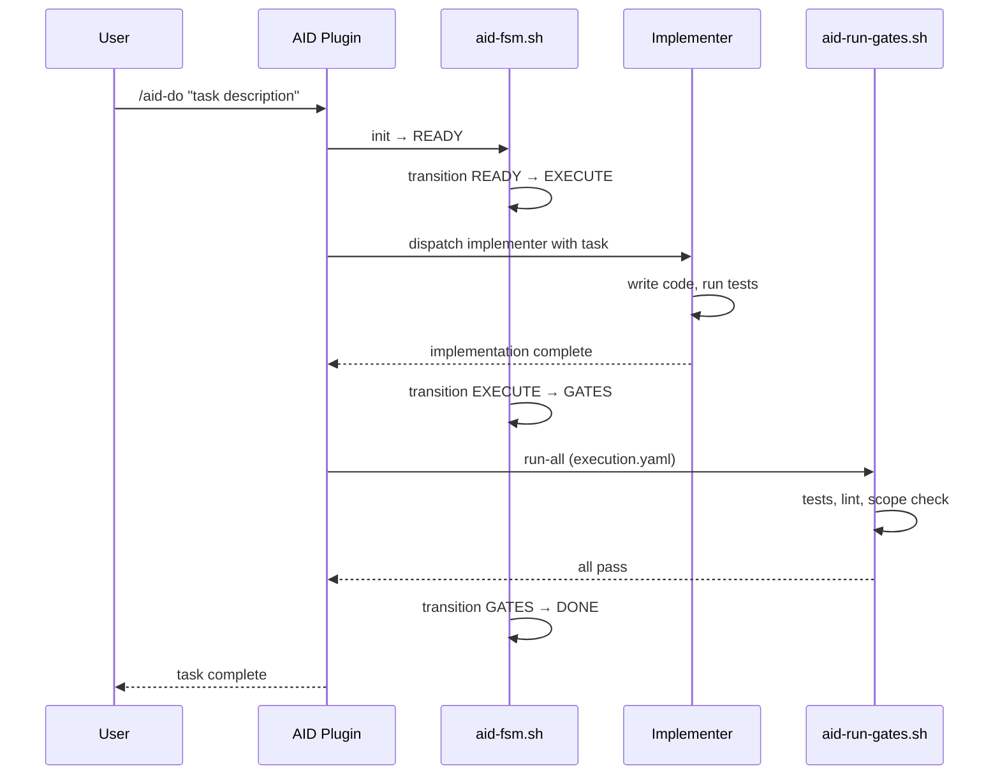
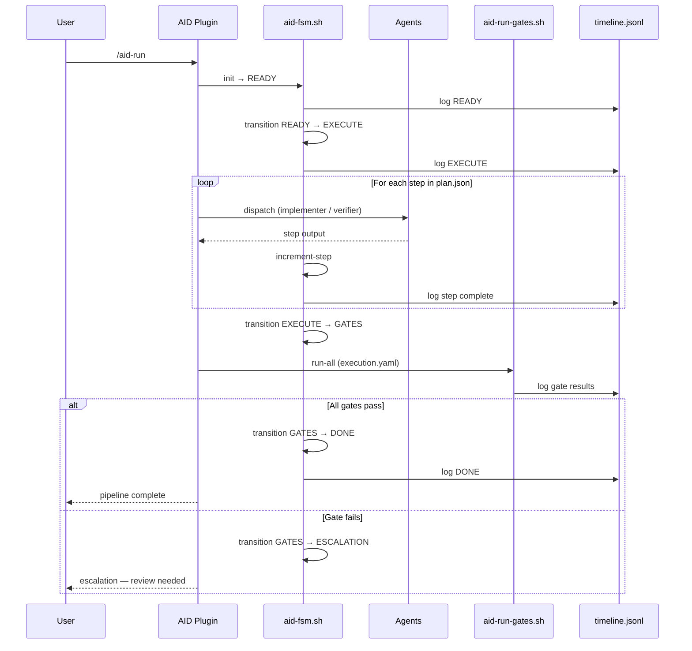

# Quick Start

AID has two execution paths. Choose based on task complexity:

| Path | Commands | When to use | Overhead |
|------|----------|-------------|----------|
| **Fast** | `/aid-init` then `/aid-do "task"` | Small, well-defined tasks | < 2 min |
| **Full** | `/aid-init` then `/aid-plan "topic"` then `/aid-run` | Complex features, multi-step work | 5-15 min |

## Prerequisites

- AID plugin installed (see [Installation](./installation))
- Claude Code open in a project with a git repository

---

## Path 1: Fast Mode

For tasks that are clear enough to implement directly without a planning phase.

### Step 1 — Initialize

```text
/aid-init
```

Creates the `.aid-o/` workspace with config files and directory structure:

```text
.aid-o/
  01-plans/           # Plan documents
  tasks/              # Task tracking
  config/             # execution.yaml, orchestration.yaml, integrations.yaml
  work/               # evidence, state, timeline
```

### Step 2 — Execute

```text
/aid-do "add rate limiting to /api/users — max 100 req/min per API key"
```

AID dispatches the implementer agent, runs quality gates, and delivers the result.



---

## Path 2: Epic Mode (Full Pipeline)

For complex features that benefit from structured planning, multiple agent roles, and detailed evidence trails.

### Step 1 — Initialize

```text
/aid-init
```

Same as Fast Mode. Only needs to run once per project.

### Step 2 — Plan

```text
/aid-plan "add pagination to the users API"
```

AID runs a structured brainstorming session, explores approaches with you, then generates a plan document and `plan.json` execution spec.

```text
Brainstorming: add pagination to the users API
====================================
Stack: Python, FastAPI, PostgreSQL

Question 1: What pagination style?
  (A) Offset-based — page=1&per_page=20
  (B) Cursor-based — cursor=<token>
  (C) No preference
```

After brainstorming, AID produces:

- `Plan: .aid-o/01-plans/P001-add-pagination.md`
- `Execution spec: .aid-o/tasks/plan.json`

### Step 3 — Execute

```text
/aid-run
```

The 6-state bash FSM takes over. It dispatches agents step by step, runs quality gates, and only pauses for escalations.



### Step 4 — Check Status (optional)

At any point during execution:

```text
/aid-status
```

Shows the current FSM state, step progress, and gate results.

---

## What's Next

- **[Configuration](./configuration)** — customize gates, dispatch strategy, and integrations
- **[Architecture Overview](../architecture/overview)** — understand the dual-layer design
- **[Autonomous Mode](../architecture/first-aid-mode)** — run pipelines without manual approval
- **[Quality Gates](../architecture/quality-gates)** — how gates are defined and executed
