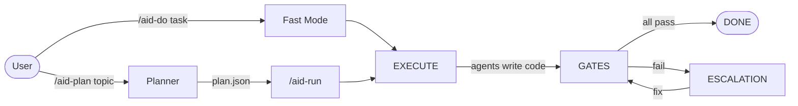

# AID Orchestrator v2.0.0

**Structured multi-agent development orchestration for Claude Code.**

AID is a Claude Code plugin that gives the AI model structured workflows for software development. It provides commands, skills, agents, and bash scripts that turn Claude Code into a disciplined engineering pipeline — from planning through implementation to quality-gated delivery.

| Metric | Value |
|--------|-------|
| Commands | 8 slash commands |
| Agents | 7 specialized roles |
| Skills | 8 core instruction sets |
| FSM | 6-state bash state machine |
| Prompt budget | ~50K tokens (down from ~400K in v1) |
| Tests | 173 across 13 suites |
| Config files | 3 YAMLs |

## How It Works



## Two Execution Modes

### Fast Mode — `/aid-do "task"`

For small, well-defined tasks. Under 2 minutes of orchestration overhead. Skips planning, goes straight to implementation + gates.

```bash
/aid-do "add rate limiting to the /api/users endpoint"
```

### Epic Mode — `/aid-plan` + `/aid-run`

For complex features requiring planning, multiple agents, and full quality gates.

```bash
/aid-plan "add pagination to the users API"
# Review the generated plan, then:
/aid-run
```

## What AID Is (and Is Not)

AID is a **plugin** that runs inside Claude Code. It does not replace Claude — it structures what Claude does.

| Component | What it is | Who/what executes it |
|-----------|-----------|---------------------|
| **Claude Code** | The AI model running in CLI | Anthropic's Claude model |
| **Commands** | Slash commands the user types (`/aid-do`, `/aid-run`) | Claude Code reads the command definition |
| **Skills** | Markdown instructions for HOW to orchestrate | Claude reads these to know the protocol |
| **Agents** | Role definitions for WHAT to do (implementer, verifier, etc.) | Claude reads these to adopt a role |
| **Scripts** | Bash programs for deterministic operations | Bash executes these — no LLM involved |

In v2, all deterministic operations — state transitions, gate execution, scope checking, token counting — run in **bash scripts**, not LLM instructions. The LLM handles creative work: code generation, reviews, planning.

## Quick Start

```bash
# Install the plugin
/plugin marketplace add marekstancl/claude-aid-o
/plugin install aid-orchestrator@claude-aid-o

# Initialize workspace in your project
/aid-init

# Fast mode (small tasks)
/aid-do "add input validation to signup form"

# Full pipeline (complex features)
/aid-plan "implement OAuth2 with refresh tokens"
/aid-run
```

## Documentation

| Section | Content |
|---------|---------|
| [Getting Started](getting-started/quick-start) | Quick start, installation, configuration |
| [Architecture](architecture/overview) | Dual-layer design, FSM, quality gates, memory |
| [Commands](commands/aid-init) | Reference for all 8 slash commands |
| [Agents](agents/overview) | Reference for all 7 agents |
| [Skills](skills/overview) | Reference for all 8 core skills |
| [Troubleshooting](troubleshooting/common-issues) | Common issues and FAQ |
