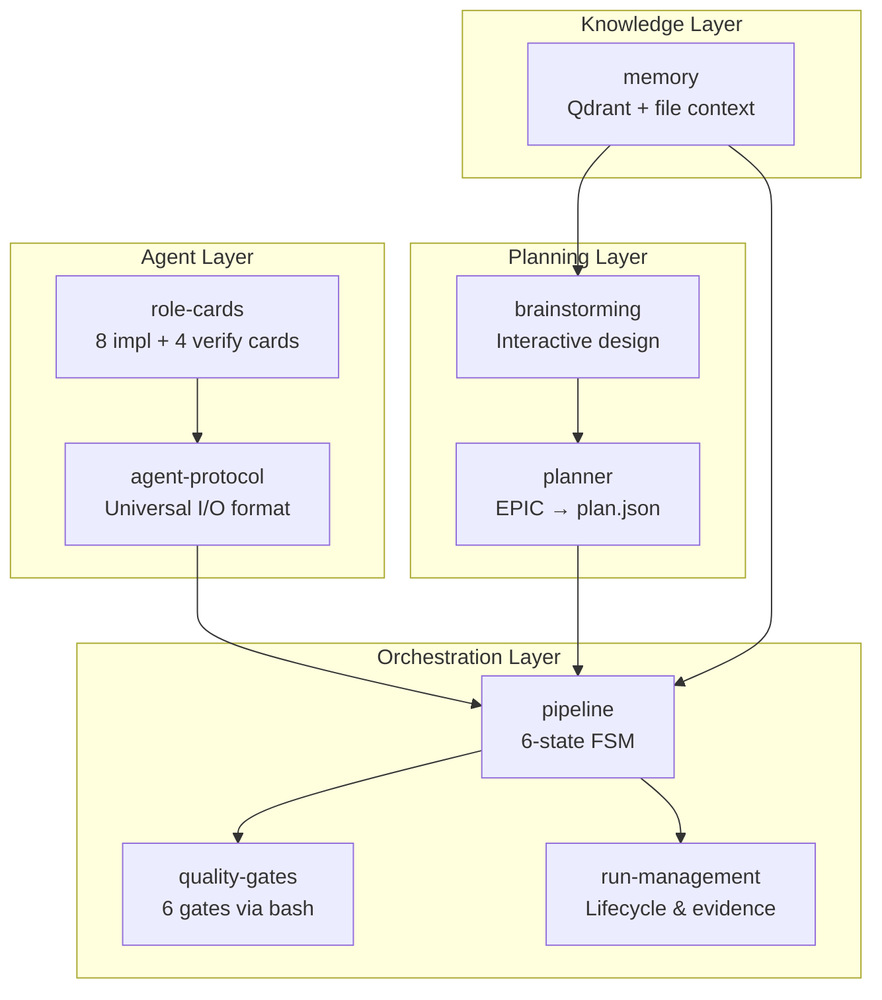

# Skills Reference Overview

Skills are the behavioral modules that define how AID agents think, plan, execute, and coordinate. In v2, skills were consolidated from 21 down to **8 focused modules** that cover the entire pipeline lifecycle.

The key design change: the **pipeline** skill replaces 14 separate v1 skills (epic-orchestration, dispatch-protocol, gates-engine, retry-engine, auto-escalation, and others) as a single FSM reference. Bash scripts handle state transitions and gate execution; the LLM acts within states but never implements transitions.

## Skill Architecture



## The 8 Skills

### Core Pipeline

| Skill | Purpose |
|-------|---------|
| [Agent Protocol](./agent-protocol) | Universal boilerplate: input/output format, evidence writing, error handling, git discipline |
| [Pipeline](./pipeline) | Central orchestration: 6-state FSM (PRE-FLIGHT, READY, EXECUTE, GATES, ESCALATION, DONE), fast mode, autonomous mode, queue management |
| [Quality Gates](./quality-gates) | Bash-integrated gate reference: 6 gates, `aid-run-gates.sh`, per-project `execution.yaml` configuration |
| [Run Management](./run-management) | Run lifecycle, ID generation, document hierarchy (Plan/Task/Quick), evidence structure, workspace files |

### Planning

| Skill | Purpose |
|-------|---------|
| [Brainstorming](./brainstorming) | Interactive design exploration: 8-step flow, questioning protocol, approach alternatives, plan document generation |
| [Planner](./planner) | Script contract for `aid-epic-to-json.sh`: EPIC to plan.json conversion, dependency graph, wave assembly, run splitting |

### Agent Configuration

| Skill | Purpose |
|-------|---------|
| [Role Cards](./role-cards) | 8 implementer role cards (architect, backend, frontend, domain, observability, docs-writer, release, security) + 4 verifier focus cards (qa, security-review, code-review, docs-review) + specialty cards |

### Knowledge

| Skill | Purpose |
|-------|---------|
| [Memory](./memory) | Qdrant/file-based memory access: project profile, active work, timeline queries, backlog, shared brain |

## What Changed from v1

| v1 Skill | v2 Equivalent |
|----------|--------------|
| epic-orchestration | [pipeline](./pipeline) |
| dispatch-protocol | [pipeline](./pipeline) |
| gates-engine | [pipeline](./pipeline) + [quality-gates](./quality-gates) |
| retry-engine | [pipeline](./pipeline) |
| auto-escalation | [pipeline](./pipeline) |
| auto-done-state | [pipeline](./pipeline) |
| parallel-dispatch | [pipeline](./pipeline) |
| epic-queue | [pipeline](./pipeline) |
| analysis-merge | [pipeline](./pipeline) |
| cost-optimization | [pipeline](./pipeline) |
| agent-core | [agent-protocol](./agent-protocol) |
| memory-mcp | [memory](./memory) |
| knowledge-acquisition | [memory](./memory) |
| improvement-proposals | [Curator agent](../agents/curator) |
| slack-mcp | Removed |
| permission-sandwich | Removed |
| workflow-intelligence | Removed |

## Skill Loading

Skills are loaded on demand. The agent-protocol skill is loaded for every agent dispatch. Other skills are loaded only when the pipeline or agent needs them:

```text
Agent dispatch           → agent-protocol + role-cards
Pipeline orchestration   → pipeline
Gate execution           → quality-gates
Run lifecycle            → run-management
Design session           → brainstorming
Plan generation          → planner
Context loading          → memory
```

## Related

- [Agent System Overview](../agents/overview)
- [Pipeline Skill](./pipeline) (central reference)
