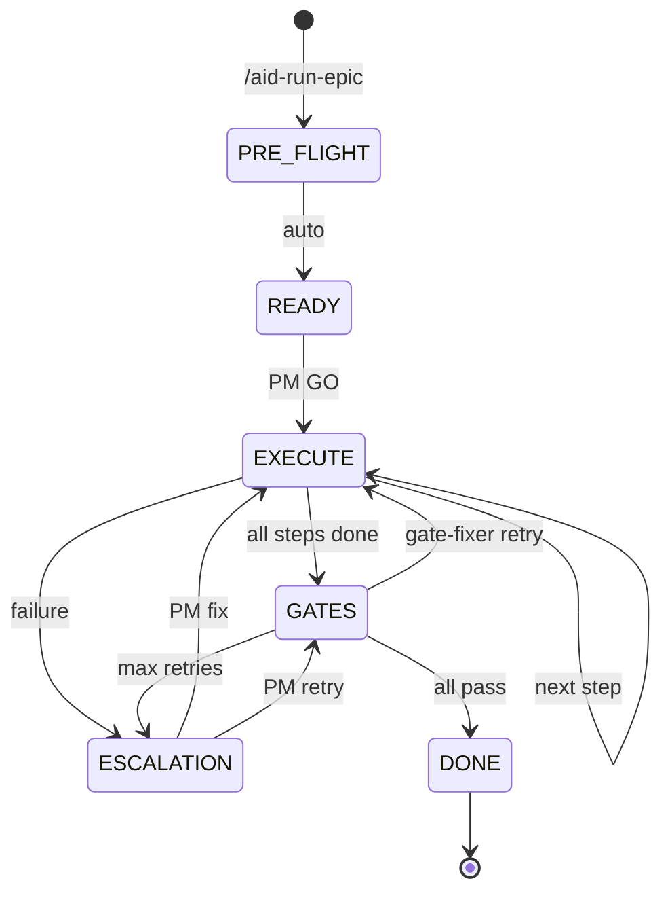

# Pipeline

The pipeline skill is the central orchestration reference for AID v2. It documents the 6-state finite state machine (FSM) that drives every EPIC run, what happens in each state, and how bash scripts handle transitions while the LLM acts within states.

**Critical design rule:** This skill describes WHAT happens in each state and what the LLM must do. HOW (bash execution, transitions, file writes) is handled by scripts (`aid-fsm.sh`, `aid-run-gates.sh`, etc.). The LLM never implements state transitions.

## Purpose

The pipeline replaces 14 separate v1 skills (epic-orchestration, dispatch-protocol, gates-engine, retry-engine, auto-escalation, auto-done-state, parallel-dispatch, epic-queue, analysis-merge, cost-optimization, and others) with a single, comprehensive FSM reference.

## FSM States

Six states. Scripts handle transitions. LLM acts within a state.



| State | Entry Trigger | LLM Role | Exit Via |
|-------|--------------|----------|---------|
| **PRE-FLIGHT** | `/aid-run-epic` invoked | None (bash only) | READY (auto) |
| **READY** | PRE-FLIGHT complete | Review plan, ask PM for GO | `aid-fsm.sh transition READY EXECUTE` |
| **EXECUTE** | GO received or gate-fixer retry | Dispatch agent, verify output | `aid-fsm.sh transition EXECUTE GATES\|ESCALATION\|EXECUTE` |
| **GATES** | All steps done | None (scripts run gates) | `aid-fsm.sh transition GATES DONE\|ESCALATION\|EXECUTE` |
| **ESCALATION** | Failure in EXECUTE or GATES | Present options A/B/C to PM | `aid-fsm.sh transition ESCALATION EXECUTE\|GATES` |
| **DONE** | All gates pass | Archive, merge, update queue | Terminal |

## PRE-FLIGHT

No LLM involvement. Scripts run sequentially:

```bash
aid-epic-to-json.sh  <epic_file> <run_dir>     # EPIC -> plan.json
aid-json-to-run.sh   <run_dir>                  # plan.json -> run.md
aid-fsm.sh init      <epic_id> <run_id> ...     # Create state.yaml (state: READY)
```

## EXECUTE State

The LLM dispatches one step at a time:

1. Read current step from `plan.json`
2. Load role playbook from `.aid-o/03-config/playbooks/`
3. Assemble dispatch prompt (playbook + EPIC context + task + previous outputs)
4. Dispatch via Agent tool with model from role card
5. Save output to `evidence/{epic_id}/{run_id}/steps/step_{N}_{role}/output.md`
6. Verify output (exists, matches expected outputs, respects allowed paths)

**Parallel groups:** Steps with the same `wave` in `plan.json` execute concurrently. After all complete, dry-run merge check; conflicts trigger ESCALATION.

## GATES State

No LLM during gate execution:

```bash
aid-run-gates.sh run-all <execution.yaml> <epic_id> <run_id>
```

- **All pass:** Curator hook, then DONE
- **Failure (retries remaining):** Dispatch [gate-fixer](../agents/gate-fixer), re-enter EXECUTE for fix
- **Failure (max retries):** ESCALATION

## ESCALATION State

Present failure to PM with structured options:
- **A) Fix** -- provide guidance, retry
- **B) Skip** -- mark skipped, continue
- **C) Abort** -- stop EPIC, mark failed

Six escalation triggers: E1 (step fails 2x), E2 (security CRITICAL), E3 (security HIGH), E4 (gate max retries), E5 (no agent output), E6 (merge conflict).

## DONE State

1. Update run file status
2. Call `aid-release.sh` for version bump
3. Merge branch (`--no-ff`)
4. Archive run file
5. Dispatch [Auditor](../agents/auditor)
6. Store metrics to Qdrant or JSONL
7. Check queue for next EPIC

## FAST MODE

`/aid-do <task>` -- single-step EXECUTE without PRE-FLIGHT, plan.json, or gate suite. Quick log only. If complexity grows (3+ files), suggest `/aid-plan-epic`.

## Autonomous Mode (FIRST AID)

`/aid-first-aid` activates auto-mode. LLM reads mode at every decision point:
- READY: auto-GO after JSON schema validation
- EXECUTE: fresh-approach cycle before ESCALATION
- PM_APPROVAL: guardrail check (all gates pass + no CRITICAL + escalation count < 3)
- DONE: auto-defer intermediate version bumps, auto-pickup next queued EPIC

**Stop:** `/aid-stop` returns to manual mode.

## Queue Management

Queue file: `.aid-o/04-engine/epic-queue.yaml`

```bash
aid-queue-add.sh <epic_file> [--priority high|medium|low] [--depends-on E-xxx]
```

Priority order: critical > high > medium > low. Within same priority: FIFO. Max 1 concurrent EPIC. Failed EPIC auto-pauses queue.

## Crash Recovery

If `state.yaml` exists with `state != DONE` and no active process:
1. Read state, current step, evidence
2. Report to PM: `Stale state detected. Resume with: /aid-run-epic --resume {run_id}`
3. Do NOT auto-resume

## Related

- [Agent Protocol](./agent-protocol) -- I/O format for dispatched agents
- [Quality Gates](./quality-gates) -- gate configuration reference
- [Run Management](./run-management) -- run lifecycle and evidence
- [Planner](./planner) -- EPIC to plan.json conversion
