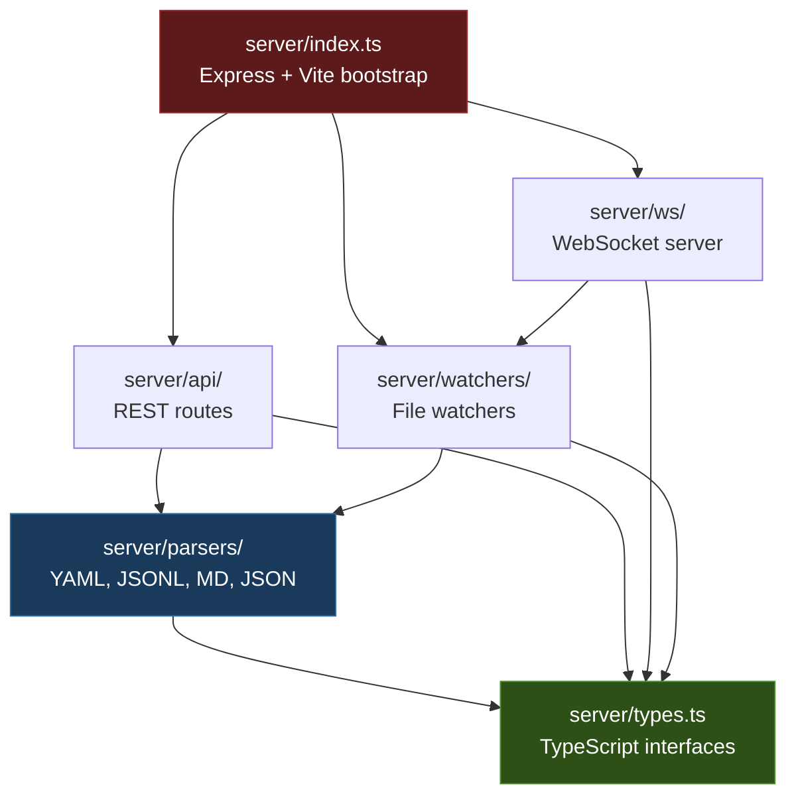

# ADR-001: Monorepo Migration and Server Directory Structure

**Status:** Accepted
**Date:** 2026-02-25
**EPIC:** E-005-1_4-gui-foundation
**Authors:** Architect agent (Step 1)

---

## Context

AID-GUI originated as a Google AI Studio prototype — a React + Express application
with 9 dashboard screens for monitoring AID orchestration pipelines. The prototype
lives in a standalone repository (`/opt/_home/small-personal-projetcs/AID-GUI/`)
and uses mock data hardcoded in `server.ts`. It carries several AI Studio artifacts
that are no longer needed: `@google/genai` dependency, `better-sqlite3`, `dotenv`,
`metadata.json`, and Gemini API key references in `vite.config.ts`.

The AID Orchestrator (`ai-orchestrator/`) is the primary repository containing the
Claude Code plugin (`plugins/aid-orchestrator/`) and all orchestration configuration
(`.aid-o/`). The GUI needs to read `.aid-o/` files — plans, EPICs, stage logs,
evidence, queue state — to replace mock data with real orchestration data.

We need to decide where the GUI codebase lives and how to structure the server-side
code that will parse `.aid-o/` files and serve them to the React frontend.

## Decision

**Move AID-GUI into the ai-orchestrator monorepo as `packages/aid-gui/`** using npm
workspaces. Structure the server code under `packages/aid-gui/server/` with
dedicated subdirectories for parsers, file watchers, WebSocket handlers, and REST
API routes.

### Directory Layout

```
ai-orchestrator/
  package.json                  # Root: { "workspaces": ["packages/*"] }
  packages/
    aid-gui/
      package.json              # name: "aid-gui"
      tsconfig.json
      vite.config.ts
      index.html
      .env.example
      server/
        index.ts                # Express + Vite bootstrap (refactored from server.ts)
        types.ts                # All TypeScript interfaces for .aid-o/ entities
        parsers/
          yaml.ts               # js-yaml wrapper — parses YAML files (epic-queue, auto-mode-state, policies)
          jsonl.ts              # Line-by-line JSON parser (stage_log.jsonl)
          markdown.ts           # gray-matter wrapper — extracts YAML frontmatter from .md (EPICs, plans, IDEAS)
          json.ts               # JSON.parse + structural validation (plan.json, plan_progress.json, gates_report.json)
        watchers/               # (EPIC 2 — E-005-2_4) chokidar file watchers for .aid-o/ changes
        ws/                     # (EPIC 2 — E-005-2_4) WebSocket event broadcasting
        api/                    # (EPIC 3 — E-005-3_4) Express REST route handlers
      bin/                      # (EPIC 4 — E-005-4_4) CLI entry points
      src/                      # React frontend (untouched in this EPIC)
      tests/
        server/
          parsers/              # Unit tests per parser
        fixtures/               # Real .aid-o/ file samples for testing
      docs/
        adr/                    # Architecture Decision Records
        type-contracts.md       # Interface specifications
        cleanup-checklist.md    # AI Studio artifact removal guide
```

## Alternatives Considered

### Alternative A: Keep AID-GUI as a Standalone Repository

Keep the GUI in its own `AID-GUI` repository and have it read `.aid-o/` files from
a configurable path (environment variable pointing to the orchestrator project).

**Pros:**
- Independent release cycle
- Smaller repository scope for frontend developers
- No coupling to plugin repository structure

**Cons:**
- Type definitions would need to be duplicated or published as a shared package
- Two repositories to maintain, two CI pipelines, two sets of issues
- `.aid-o/` file format knowledge split across repositories — format changes require
  coordinated updates
- Git history loses connection between backend format changes and GUI parser updates

**Rejected because:** The GUI is tightly coupled to `.aid-o/` file formats defined by
the orchestrator plugin. Collocating them ensures a single source of truth for types,
format changes are atomic, and one `git log` shows the full history.

### Alternative B: Embed GUI Inside the Plugin Directory

Place the GUI under `plugins/aid-orchestrator/gui/` as part of the plugin itself.

**Pros:**
- Maximum colocation — plugin and GUI in the same subtree
- Plugin manifest could reference the GUI directly

**Cons:**
- The plugin is distributed via Claude Code marketplace (git clone); bundling a full
  React app with node_modules would bloat the plugin distribution
- Plugin code is Markdown-based (skills, agents, commands); mixing in a TypeScript
  project would confuse tooling and linting
- Different build pipelines and dependency trees
- Plugin directory has strict structure expectations from `.claude-plugin/plugin.json`

**Rejected because:** The plugin distribution mechanism and the GUI build/runtime
requirements are fundamentally different. The plugin should stay lean.

### Alternative C: Monorepo with Turborepo/Nx

Use a full monorepo orchestration tool (Turborepo, Nx, or Lerna) instead of plain
npm workspaces.

**Pros:**
- Task caching, dependency graph visualization, better CI optimization
- Scales to many packages

**Cons:**
- Only one package (`aid-gui`) exists currently — overkill
- Additional tooling dependency and configuration overhead
- Learning curve for an orchestrator project that is primarily Markdown/YAML

**Rejected because:** npm workspaces are sufficient for a single package. If more
packages are added later, Turborepo can be layered on top without migration cost.

## Consequences

### Positive

- **Single repository:** One `git log`, one branch strategy, one CI pipeline for
  orchestrator + GUI
- **Shared types:** `server/types.ts` defines interfaces once; future shared
  packages can re-export them
- **Atomic changes:** When `.aid-o/` format changes (e.g., new field in
  `plan_progress.json`), the parser update, type update, and frontend display update
  all land in one commit
- **npm workspaces:** `npm install` from root resolves all dependencies; `npm run dev`
  from `packages/aid-gui/` starts the dev server normally

### Negative

- **Repository size:** The React frontend and its dependencies increase the repo
  footprint (mitigated by `.gitignore` for `node_modules/` and `dist/`)
- **CI scope:** Plugin-only changes still trigger GUI-related CI checks unless
  path-based filtering is configured
- **Plugin developers** who only work on `plugins/aid-orchestrator/` now see
  `packages/` in the tree (low impact — clear separation via directories)

### Risks

- If the GUI grows into multiple packages (e.g., a design system package), the flat
  `packages/` structure may need reorganization. Mitigation: npm workspaces support
  glob patterns, so `packages/*` already handles this.
- The `server/` directory lives inside `packages/aid-gui/` rather than at the
  monorepo root, which means the server must resolve `.aid-o/` paths relative to
  the repository root (two levels up). Mitigation: The server will accept a
  configurable `AID_PROJECT_PATH` environment variable pointing to the target project.

---

## Server Module Responsibilities

| Module | Responsibility | Depends On |
|--------|---------------|------------|
| `server/types.ts` | TypeScript interfaces for all `.aid-o/` entities | None |
| `server/parsers/` | Stateless file parsing — YAML, JSONL, Markdown, JSON | `types.ts` |
| `server/watchers/` | chokidar-based file system watchers for `.aid-o/` changes | `parsers/` |
| `server/ws/` | WebSocket server — broadcasts parsed change events to frontend | `watchers/` |
| `server/api/` | Express REST routes — on-demand data retrieval | `parsers/` |
| `server/index.ts` | Bootstrap — wires Express, Vite, watchers, WebSocket | All modules |

### Dependency Direction

```
index.ts
  |
  +---> api/ ---------> parsers/ ---------> types.ts
  |                        ^
  +---> ws/ --> watchers/ -+
```

All arrows point inward toward `types.ts`. No module depends on `index.ts`.
`parsers/` and `types.ts` have zero dependencies on Express, WebSocket, or chokidar —
they are pure data transformation functions that can be tested in isolation.

### Mermaid: Module Dependency Graph



### Mermaid: EPIC Delivery Sequence

```mermaid
gantt
    title Server Module Delivery Across EPICs
    dateFormat X
    axisFormat %s

    section EPIC 1 (Foundation)
    types.ts           :done, e1t, 0, 1
    parsers/           :done, e1p, 1, 2
    server/index.ts    :done, e1i, 2, 3

    section EPIC 2 (Realtime)
    watchers/          :active, e2w, 3, 4
    ws/                :active, e2ws, 4, 5

    section EPIC 3 (REST API)
    api/               :e3a, 5, 6

    section EPIC 4 (Features + CLI)
    bin/               :e4b, 6, 7
```


