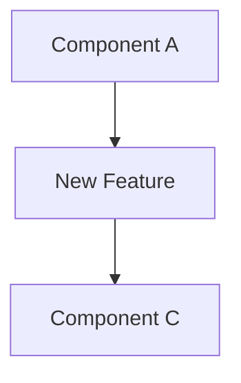

# New Feature: {Title}

> **Multi-Session Work?** If this feature requires 3+ sessions or involves multiple components, consider creating an **Epic Breakdown** first using `.aid-o/03-config/templates/epic.md`.

## Objective
> One-sentence description of the new feature

## Requirements

### Business Requirements
**User Story:**
> As a {user type}, I want {goal} so that {benefit}

**Success Criteria:**
- {Criterion 1}
- {Criterion 2}

### Technical Requirements
- **Must Have:**
  - [ ] {Requirement 1}
  - [ ] {Requirement 2}
- **Should Have:**
  - [ ] {Requirement 3}
- **Nice to Have:**
  - [ ] {Requirement 4}

### Constraints
- **Performance:** {e.g., "Response time < 2s"}
- **Security:** {e.g., "Data encryption at rest"}
- **Compatibility:** {e.g., "DOCX 2007+ format support"}

---

## Design

### Architecture Decision
{High-level approach and why chosen}

**Options Considered:**
1. **Option A:** {Description} - Pros: {list} / Cons: {list}
2. **Option B:** {Description} - Pros: {list} / Cons: {list}

**Chosen:** Option A
**Rationale:** {Why this option is best}

### Component Diagram


### API Contract
**New Endpoints:**
```
POST /api/v1/{resource}
GET /api/v1/{resource}/{id}
```

---

## Implementation

### Changes Made
| File | Lines | Description | Commit |
|------|-------|-------------|--------|
| {path/file.py} | 123-145 | {What changed} | {hash} |

### Code Snippet
```
# Show key implementation here
```

---

## Testing

### Test Plan
- [ ] Unit tests added/updated
- [ ] Integration tests pass
- [ ] Manual QA in dev environment
- [ ] Edge cases covered
- [ ] Performance validated

### Test Results
**Unit Tests:**
```
pytest tests/test_new_feature.py
```

---

## Impact

- **Lines of Code:** {X} added, {Y} modified
- **Test Coverage:** {X}%
- **Performance:** {metrics}

---

## Documentation Updates

- [ ] API docs updated
- [ ] Developer guides updated
- [ ] `CHANGELOG.md` entry added

**See:** `skills/coding-standards.md` for documentation dependency tables

---

## References

**Related Issues:** #{issue_number}
**Related PRs:** #{pr_number}
**Related Sessions:** [Previous session](../archive/{session-id}.md)
**Commits:** `{hash}` - {message}

---

## AI Session Log

**{Timestamp}** - {Action/Decision}

---

## Completion Checklist

### Pre-Completion:
- [ ] Feature implemented and tested
- [ ] Tests written and passing
- [ ] Documentation updated
- [ ] No TODO/FIXME left in code

### Session Closure:
- [ ] Commit messages follow conventions
- [ ] Session file archived to completed/
- [ ] Handoff protocol executed (see `skills/session-management.md`)
- [ ] Session log updated

---

## Next Steps

**For Human Review:**
- Review PR #{pr_number}
- Validate feature in staging

**For AI (if session continues):**
- Monitor for related issues
- Consider optimization opportunities

---

**Status:** {active|blocked|completed}
**Last Updated:** {YYYY-MM-DD HH:MM CET}
**Completion:** {%}
