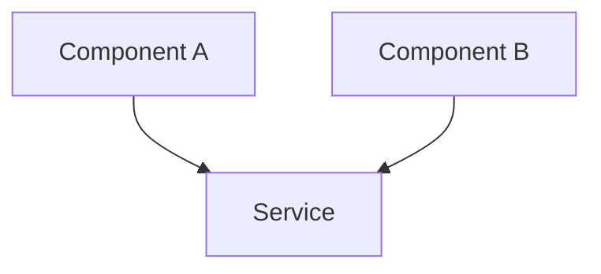
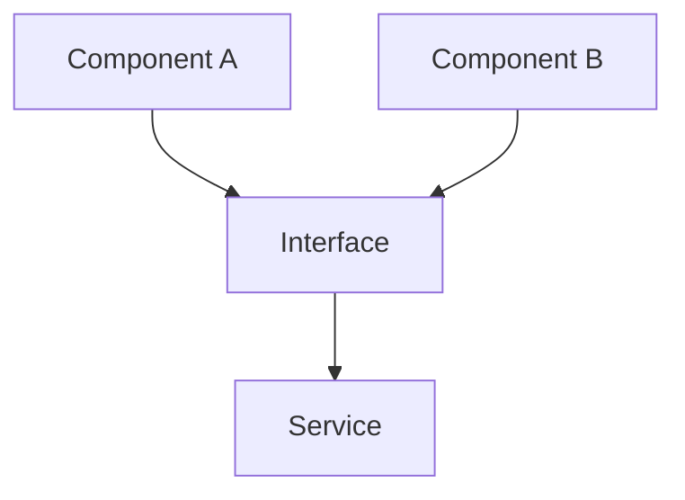

# Refactoring: {Title}

> **Multi-Session Work?** If this refactoring requires 3+ sessions or touches multiple layers, consider creating an **Epic Breakdown** first using `.aid-o/03-config/templates/epic.md`.

## Objective
> One-sentence description of what needs to be refactored and why

## Motivation

### Why Refactor?
**Current Pain Points:**
- {Pain point 1}
- {Pain point 2}

### Expected Benefits
- {Benefit 1}
- {Benefit 2}

### Risk Assessment
| Risk | Level | Mitigation |
|------|-------|------------|
| Breaking existing functionality | HIGH | Comprehensive test suite before refactoring |
| Performance regression | MEDIUM | Before/after benchmarks |
| Increased complexity | LOW | Code review |

---

## Refactoring Strategy

### Scope
**In Scope:**
- [ ] {Component 1}
- [ ] {Component 2}

**Out of Scope:**
- {Component 3} - Will refactor in future session

### Approach
**Strategy:** {e.g., "Extract Interface", "Introduce Factory Pattern"}

**Steps:**
1. {Step 1}
2. {Step 2}

### Design Patterns Used
- **Pattern 1:** {Name} - {Purpose}

---

## Architecture Changes

### Before (Current State)


### After (Target State)


---

## Implementation

### Changes Made
| File | Lines | Description | Commit |
|------|-------|-------------|--------|
| {path/file.py} | 123-145 | {What changed} | {hash} |

### Code Snippet
```
# Show key refactoring here
```

---

## Testing

### Test Plan
- [ ] All existing tests pass
- [ ] New tests for refactored code
- [ ] Performance benchmarks (before/after)
- [ ] No regressions

### Test Results
| Metric | Before | After |
|--------|--------|-------|
| Test coverage | {X}% | {Y}% |
| Performance | {metric} | {metric} |

---

## Impact

- **Lines of Code:** {X} removed, {Y} added
- **Test Coverage:** {before}% -> {after}%
- **Performance:** {before} -> {after}
- **Maintainability:** {improvement}

---

## Documentation Updates

- [ ] Architecture diagrams updated
- [ ] Developer guides updated
- [ ] `CHANGELOG.md` entry added (if user-facing)

**See:** `skills/coding-standards.md` for documentation dependency tables

---

## References

**Related Issues:** #{issue_number}
**Related PRs:** #{pr_number}
**Related Sessions:** [Previous session](../archive/{session-id}.md)
**Commits:** `{hash}` - {message}

---

## AI Session Log

**{Timestamp}** - {Action/Decision}

---

## Completion Checklist

### Pre-Completion:
- [ ] Refactoring complete and tested
- [ ] All tests passing, no regressions
- [ ] Documentation updated
- [ ] Performance maintained or improved

### Session Closure:
- [ ] Commit messages follow conventions
- [ ] Session file archived to completed/
- [ ] Handoff protocol executed (see `skills/session-management.md`)
- [ ] Session log updated

---

## Next Steps

**For Human Review:**
- Review PR #{pr_number}
- Validate refactoring in staging

**For AI (if session continues):**
- Monitor for related issues
- Consider further optimizations

---

**Status:** {active|blocked|completed}
**Last Updated:** {YYYY-MM-DD HH:MM CET}
**Completion:** {%}
