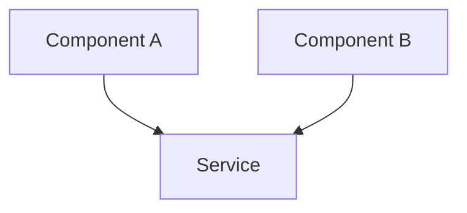
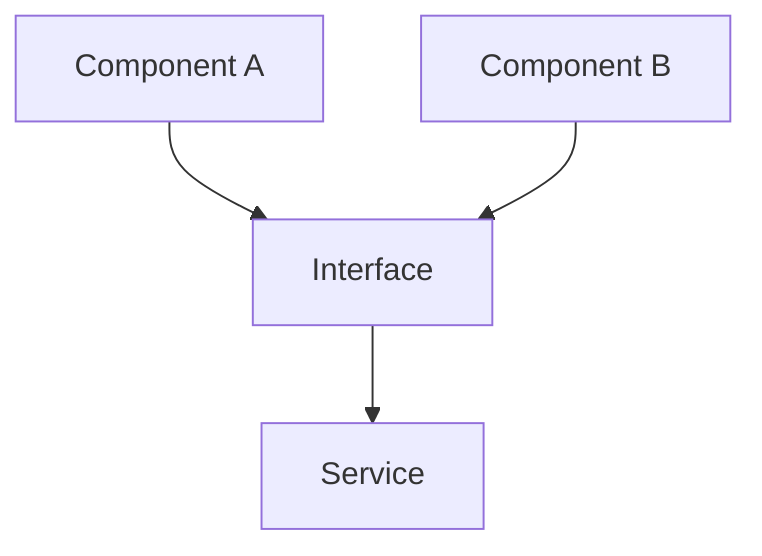

# Refactoring: {Title}

> **Multi-Session Work?** If this refactoring requires 3+ sessions or touches multiple layers, consider creating an **Epic Breakdown** first using `.aid-o/03-config/templates/epic.md`.

## Objective
<!-- MIN: 3-5 sentences. State WHAT you're refactoring, WHY the current design is insufficient, and what SUCCESS looks like.
     Bad:  "Refactor auth module"
     Good: "Refactor authentication module from monolithic middleware into a composable pipeline
            of discrete auth strategies. The current single-function approach (auth.ts, 450 LOC)
            violates SRP, makes testing painful, and blocks adding OAuth2 without touching every
            call site. Success: each strategy is independently testable, new providers can be
            added via config, existing tests stay green, and no public API changes." -->

## Context
<!-- What preceded this work. Reference previous sessions, state of the codebase, dependencies.
     For orchestrated sessions: which EPIC session is this, what was delivered before.
     For non-orchestrated: what's the current project state, any related ongoing work. -->

**Previous work:** {reference prior sessions or "N/A — greenfield"}
**Current state:** {what exists now that this session refactors}
**Dependencies:** {external systems, libraries, or other sessions this depends on}

## Scope
<!-- Explicit IN/OUT lists prevent scope creep. Be specific — name files, modules, layers. -->

**In Scope:**
<!-- MIN: 3 items -->
- {what WILL be refactored}
- {what WILL be refactored}
- {what WILL be refactored}

**Out of Scope:**
<!-- MIN: 2 items -->
- {what will NOT be touched in this session}
- {what will NOT be touched in this session}

---

## Motivation
<!-- Refactoring needs justification. Clearly articulate the pain, the expected gains, and the risks.
     This section is reviewed by humans to decide whether the refactoring is worth the effort. -->

### Why Refactor?
**Current Pain Points:**
- {Pain point 1}
- {Pain point 2}

### Expected Benefits
- {Benefit 1}
- {Benefit 2}

### Risk Assessment
| Risk | Level | Mitigation |
|------|-------|------------|
| Breaking existing functionality | HIGH | Comprehensive test suite before refactoring |
| Performance regression | MEDIUM | Before/after benchmarks |
| Increased complexity | LOW | Code review |

---

## Architecture Changes
<!-- Visualize the structural shift. The Before diagram shows current coupling/flow, the After diagram
     shows the target state. These diagrams are the single source of truth for what the refactoring achieves.
     Keep them focused — show only the components that change. -->

### Before (Current State)

### After (Target State)

---

## Phases

<!-- Each phase = one logical chunk of work. Map from plan.json steps (orchestrated)
     or decompose the task yourself (non-orchestrated).
     Every phase MUST have all 6 subsections below. Do not skip any.
     Typical refactoring phases: extract interfaces, migrate consumers, remove legacy code. -->

### Phase 1: {Phase Title}

**Goal:**
<!-- MIN: 1 full paragraph. What this phase accomplishes and why it matters in the session context. -->
{Describe what this phase solves — not just "extract X" but why, what it enables, what changes.}

**Agent / Role:** {role name — e.g., architect, backend, qa}

**Inputs:**
<!-- Files, context, or outputs from previous phases that this phase needs. -->
- {file path or description}

**Outputs:**
<!-- Files produced, artifacts created. Include expected file paths. -->
- {file path or description}

**Constraints:**
<!-- Boundaries: backward compatibility, zero-downtime migration, performance limits. -->
- {constraint}

**Acceptance:**
<!-- MIN: 3 items. How we verify this phase is done. -->
- [ ] {criterion 1}
- [ ] {criterion 2}
- [ ] {criterion 3}

<!-- Repeat for Phase 2, Phase 3, etc. -->

---

## Dependencies

<!-- Which phases depend on which and why. For single-phase sessions, write "No inter-phase dependencies." -->

| Phase | Depends On | Reason |
|-------|-----------|--------|
| Phase 2 | Phase 1 | {why — e.g., "needs extracted interfaces from Phase 1"} |

---

## Quality Gates

<!-- What automated checks run after this session's work. Reference specific gate names from gates.yaml. -->

- **{gate name}** — {what it verifies}

---

## Testing

### Test Plan
- [ ] All existing tests pass (no regressions)
- [ ] New tests for refactored code
- [ ] Performance benchmarks (before/after)
- [ ] Edge cases covered
- [ ] Manual QA in dev environment

### Test Results
| Metric | Before | After |
|--------|--------|-------|
| Test coverage | {X}% | {Y}% |
| Performance | {metric} | {metric} |

---

## Impact

- **Lines of Code:** {X} removed, {Y} added
- **Test Coverage:** {before}% -> {after}%
- **Performance:** {before} -> {after}
- **Maintainability:** {improvement}

---

## Documentation Updates

- [ ] Architecture diagrams updated
- [ ] Developer guides updated
- [ ] `CHANGELOG.md` entry added (if user-facing)

**See:** `skills/coding-standards.md` for documentation dependency tables

---

## References

**Related Issues:** #{issue_number}
**Related PRs:** #{pr_number}
**Related Sessions:** [Previous session](../archive/{session-id}.md)
**Commits:** `{hash}` - {message}

---

## AI Session Log

**{Timestamp}** - {Action/Decision}

---

## Completion Checklist

### Pre-Completion:
- [ ] Refactoring complete and tested
- [ ] All tests passing, no regressions
- [ ] Documentation updated
- [ ] Performance maintained or improved

### Session Closure:
- [ ] Commit messages follow conventions
- [ ] Session file archived to completed/
- [ ] Handoff protocol executed (see `skills/session-management.md`)
- [ ] Session log updated

---

## Next Steps

**For Human Review:**
- Review PR #{pr_number}
- Validate refactoring in staging

**For AI (if session continues):**
- Monitor for related issues
- Consider further optimizations

---

**Status:** {active|blocked|completed}
**Last Updated:** {YYYY-MM-DD HH:MM CET}
**Completion:** {%}
