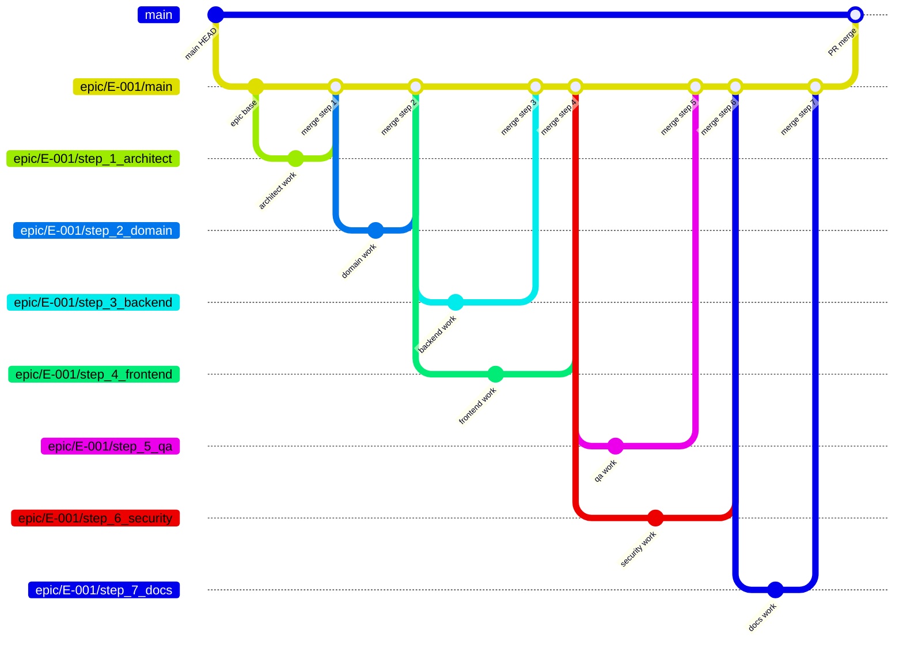

# Parallel Dispatch — Branch Management & Concurrent Agent Execution

**Version:** 0.1.0
**Skill:** parallel-dispatch
**Dependencies:** epic-orchestration, planner

---

## TL;DR

This skill defines HOW to dispatch multiple agents in parallel during EPIC execution.
It covers branch creation, parallel dispatch protocol (code-producing and analysis agents),
conflict detection (git, semantic, scope), and extended PHASE_CHECK rules for parallel groups.

Key principles:
1. **Code-producing parallel groups** each get their own branch, forked from the same base commit
2. **Analysis groups** are read-only — no branches, outputs go to evidence only
3. **Merge order** is deterministic: lower step number merges first
4. **Conflicts escalate** — the orchestrator never auto-resolves merge conflicts
5. **Branching is best-effort** — git failures are logged but never halt the pipeline

---

## 1. Branch Strategy

### Session Branch (created by Controller at IDLE)

The Controller creates a single session branch `epic/{epic_id}` at IDLE state
(see `skills/epic-orchestration.md` Section 1). This is the base for all work
in this EPIC. If the Controller did not create a branch (git not available),
all branching in this skill is skipped — agents work without version control.

### A) Epic Base Branch

```
epic/{epic_id}/main — created at EPIC start from epic/{epic_id}

This is the integration branch for all step work.
All step branches fork from here. All merges return here.
Final merge at DONE state: epic/{epic_id} -> project default branch.
```

### B) Sequential Step

```
1. Create branch: epic/{epic_id}/step_{N}_{role} FROM epic/{epic_id}/main
2. Agent works on this branch
3. After PHASE_CHECK pass: merge step branch -> epic/{epic_id}/main
   (fast-forward if possible, otherwise merge commit)
4. Delete step branch (cleanup)
```

### C) Parallel Group (multiple agents, different work)

```
1. All branches fork FROM epic/{epic_id}/main at the SAME commit (same base)
   - This ensures agents start from identical state
   - Do NOT advance epic/{epic_id}/main between branch creations

2. Each agent works on own branch: epic/{epic_id}/step_{N}_{role}

3. After ALL agents in group complete + PHASE_CHECK for each:
   a. Merge branches one-by-one into epic/{epic_id}/main
   b. Merge order: by step number (lower first) for deterministic results
   c. If merge conflict at any point:
      -> git merge --abort
      -> ESCALATION (include conflict details, both sides, file list)
   d. Continue merging remaining branches only if no conflict

4. Delete step branches after successful merge
```

### D) Analysis Group (read-only, NO branches)

```
1. Analysis agents are READ-ONLY — they produce reports, not code changes
2. No branch needed — agents read current state of epic/{epic_id}/main
3. Outputs go ONLY to evidence (analysis_report), never merged into code branches
4. This is the KEY difference from parallel groups:
   - Parallel group = code changes = branches = merge
   - Analysis group = reports = evidence only = no merge
```

### E) Final Merge

```
epic/{epic_id}/main -> PR to project main branch
Created at end of EPIC run (DONE state, if PM approved)
```

### Branch Flow Diagram



---

## 2. Parallel Dispatch Protocol

### 2.1 Code-Producing Parallel Groups

For steps listed in `plan.parallel_groups`:

```
1. Identify all steps in the parallel group from plan.parallel_groups

2. Record the current HEAD of epic/{epic_id}/main as BASE_COMMIT

3. For each step in the group:
   a. Create branch from epic/{epic_id}/main at BASE_COMMIT:
      git checkout epic/{epic_id}/main
      git checkout -b epic/{epic_id}/step_{N}_{role}

   b. Prepare agent prompt using OPTIMIZED dispatch template (see below):
      - Role SUMMARY (3-5 lines, NOT full playbook)
      - EPIC summary (goal + constraints + step AC only, NOT full EPIC)
      - Plan step spec (objective, inputs, outputs, allowed_paths, forbidden_paths)
      - Dependency outputs ONLY (from direct dependency steps, NOT all prior)
      - File scope: relevant_files list from plan.json
      - Playbook reference: "Read defaults/playbooks/{role}.md for details"

   c. ADD "PARALLEL CONTEXT" block to prompt (see below)

4. Dispatch ALL agents in a SINGLE message with multiple Task tool calls
   - One Task call per agent
   - All dispatched in the same message = true concurrency

5. Wait for ALL to complete (Task tool handles collection)

6. Proceed to PHASE_CHECK for the entire group (Section 4)
```

**Parallel Context block** (appended to each agent's prompt):

```markdown
## Parallel Execution Notice

Other agents working in parallel on this EPIC:
- [{role_1}] {objective_1} — branch: epic/{epic_id}/step_{N1}_{role1}
- [{role_2}] {objective_2} — branch: epic/{epic_id}/step_{N2}_{role2}

IMPORTANT:
- You are on branch: epic/{epic_id}/step_{N}_{role}
- ONLY modify files in your allowed_paths
- Do NOT modify files that other parallel agents may touch
- If you need something from another agent's work, note it in improvement_notes
```

### 2.2 Analysis Groups (read-only)

Analysis groups are triggered AFTER their target step passes PHASE_CHECK, not during execution.

```
1. After a step passes PHASE_CHECK, check plan.analysis_groups for groups
   targeting the just-completed step (target_step_id matches)

2. For each matching analysis_group:
   a. Prepare analysis prompt per agent (see template below)
   b. Dispatch ALL analysis agents in single message (parallel Task calls)
   c. Collect all outputs
   d. Validate each output is well-formed YAML
   e. Pass valid outputs to analysis-merge.md skill for merging
```

**Analysis prompt template** (one per agent in the group):

```markdown
## Analysis Task

You are performing a {mode} analysis of step {target_step_id}.

**Your role:** {agent_role} — analyze from your domain expertise
**Target step:** {target_step_id} ({target_role} — {target_objective})
**Analysis mode:** {mode} (review = findings, audit = scoring, validation = pass/fail)
**Merge strategy:** {merge_strategy} — your findings will be combined with
other perspectives using this strategy.

## Target Step Output

{content of evidence/steps/{target}/output.md}

## Target Step Changes

{content of evidence/steps/{target}/diff.patch}

## Your Playbook

{content of playbooks/{agent_role}.md — relevant analysis sections}

## Output Format

Produce an analysis_output YAML block:

```yaml
analysis_output:
  agent: "{role}"
  target_step: "{target_step_id}"
  mode: "{mode}"
  findings:
    - severity: critical|high|medium|low|info
      category: security|performance|architecture|correctness|style
      location: "path/to/file:line"
      finding: "Description of what was found"
      recommendation: "What should be done"
      confidence: high|medium|low
  summary: "One-paragraph analysis summary"
  improvement_notes: [...]
```
```

---

## 3. Conflict Detection

Three types of conflict are checked during parallel execution.

### A) Git Merge Conflict

**Detection:**

```bash
# Attempt a non-committing merge to test for conflicts
git checkout epic/{epic_id}/main
git merge --no-commit --no-ff epic/{epic_id}/step_{N}_{role}

# Check exit code:
#   0       = clean merge (no conflicts)
#   non-zero = conflict detected
```

**If conflict detected:**

```
1. Abort the merge immediately:
   git merge --abort

2. Collect conflict details:
   - Files in conflict: git diff --name-only --diff-filter=U
   - Both sides of conflict for each file
   - Which agents produced the conflicting changes

3. ESCALATION with:
   - Full list of conflicting files
   - Diff of both sides for each conflicting file
   - Agent names and step numbers involved
   - Recommendation (one of the resolution options below)
```

**Resolution options (presented to PM):**

| Option | Description |
|--------|-------------|
| A) Manual merge | PM resolves conflicts directly in the code |
| B) Re-dispatch | Re-dispatch one agent with tighter scope constraints |
| C) Sequential re-execution | Remove from parallel group, run one after the other |

### B) Semantic Conflict (no git conflict but incompatible changes)

**Detection (heuristic — checked during PHASE_CHECK):**

```
1. Collect all modified files across all agents in the group:
   For each agent:
     git diff --name-only epic/{epic_id}/main..epic/{epic_id}/step_{N}_{role}

2. If agents produced files that reference each other, check for:
   - Contradictory type definitions (same type, different shapes)
   - Incompatible API definitions (different signatures for the same endpoint)
   - Circular dependency introduction (A imports B, B imports A — new)

3. This is BEST-EFFORT — not all semantic conflicts are automatically detectable.
   The heuristic catches obvious cases; subtle conflicts may surface at GATES.
```

**If detected:**

```
-> ESCALATION with:
   - Both outputs (full diff for each agent)
   - Explanation of the incompatibility found
   - Affected files and the nature of the conflict
```

### C) Scope Violation in Parallel

**Detection:**

```
For each agent in parallel group:
  1. Get list of modified files:
     git diff --name-only epic/{epic_id}/main..epic/{epic_id}/step_{N}_{role}

  2. Compare each modified file against step.allowed_paths

  3. If ANY file is NOT covered by allowed_paths -> scope violation
```

**If detected:**

```
1. Auto-reject the violating agent's work (do not merge that branch)
2. Re-dispatch with explicit warning (max 1 retry):
   "SCOPE VIOLATION: You modified {files} which are outside your allowed_paths.
    Your allowed_paths are: {allowed_paths}.
    Re-do your work. ONLY touch files within allowed_paths."
3. If second violation -> ESCALATION (do not retry again)
```

---

## 4. Parallel PHASE_CHECK Extensions

In addition to normal per-agent PHASE_CHECK (from `skills/epic-orchestration.md`):

### 4.1 Individual Agent Checks

```
For each agent in the parallel group, run normal PHASE_CHECK:
  1. Outputs present? (expected artifacts exist)
  2. Scope respected? (only allowed_paths modified)
  3. No errors? (agent did not report failure)

If any agent fails:
  -> Handle per normal PHASE_CHECK rules from epic-orchestration.md
  -> Other agents' work is PRESERVED (do not discard passing agents)
  -> Only the failing agent is retried or escalated
```

### 4.2 Cross-Agent Conflict Check

```
1. Collect all modified files across all agents:
   For each agent:
     git diff --name-only epic/{epic_id}/main..epic/{epic_id}/step_{N}_{role}
     -> file_list_{N}

2. Check for file overlap:
   If any file appears in 2+ agents' file lists:
     -> Flag as "potential conflict — proceeding to merge check"

3. Dry-run merge (in deterministic order — lowest step number first):
   git checkout epic/{epic_id}/main
   For each step branch (ordered by step number ascending):
     git merge --no-commit --no-ff epic/{epic_id}/step_{N}_{role}
     If exit code != 0:
       -> git merge --abort
       -> ESCALATION with conflict details (Section 3.A)
       -> STOP — do not attempt remaining merges
     If exit code == 0:
       -> git merge --abort  # was just a test
       -> Continue to next branch

4. Record "clean merge verified" in evidence (merge_log.json)
```

### 4.3 Actual Merge (after all checks pass)

```
If all individual checks pass AND cross-agent conflict check passes:
  1. Merge branches into epic/{epic_id}/main (same order as dry-run):
     git checkout epic/{epic_id}/main
     For each step branch (ordered by step number ascending):
       git merge --no-ff epic/{epic_id}/step_{N}_{role} \
         -m "Merge step {N} ({role}) into epic main"

  2. Record each merge commit SHA in evidence (merge_log.json)

  3. Delete step branches:
     git branch -d epic/{epic_id}/step_{N}_{role}

  4. Proceed to NEXT_PHASE
```

### 4.4 Analysis Group Checks

```
Analysis groups require NO merge check (read-only).

For each analysis agent output:
  1. Validate the analysis_output YAML block is well-formed:
     - Required fields present: agent, target_step, mode, findings, summary
     - Each finding has: severity, category, location, finding, recommendation
  2. If YAML is valid -> pass to analysis-merge.md skill
  3. If YAML is malformed -> skip this agent's analysis, log warning
```

---

## 5. Evidence Structure

```
.aid-o/04-engine/evidence/{epic_id}/{run_id}/
  parallel_groups/
    group_{N}/                          # N = parallel group index (from plan)
      dispatch_log.json                 # When each agent was dispatched, prompts used
      merge_log.json                    # Merge order, conflict check results, merge commits
      branch_status.json                # Branch names, base commit, creation/deletion times
  analysis/
    analysis_{N}_{purpose}/             # Per analysis group (N = group index)
      raw_{agent_role}.yaml             # Raw analysis output from each agent
      analysis_report.yaml              # Merged report (produced by analysis-merge.md)
      dispatch_log.json                 # When each analysis agent was dispatched
```

### dispatch_log.json (Enhanced with Per-Agent Metrics)

```json
{
  "epic_id": "E-20260217-a1b2",
  "run_id": "run_001",
  "group_index": 1,
  "group_type": "parallel_group",
  "dispatched_at": "2026-02-17T14:30:00Z",
  "base_commit": "a1b2c3d4e5f6",
  "agents": [
    {
      "step_id": "step_3",
      "role": "backend",
      "branch": "epic/E-20260217-a1b2/step_3_backend",
      "dispatched_at": "2026-02-17T14:30:00Z",
      "completed_at": "2026-02-17T14:35:12Z",
      "duration_seconds": 312,
      "status": "completed",
      "prompt_file": "prompts/step_3_backend.md",
      "prompt_size_chars": 4200,
      "output_size_chars": 12500,
      "self_report": {
        "files_read": 12,
        "files_created": 3,
        "files_modified": 5,
        "bash_commands": 8,
        "errors": 2,
        "error_details": ["import error -> fixed unused import", "test timeout -> increased timeout"],
        "complexity": "high",
        "bottleneck": "writing integration tests -- read 4 test files for patterns"
      }
    },
    {
      "step_id": "step_4",
      "role": "frontend",
      "branch": "epic/E-20260217-a1b2/step_4_frontend",
      "dispatched_at": "2026-02-17T14:30:00Z",
      "completed_at": "2026-02-17T14:37:45Z",
      "duration_seconds": 465,
      "status": "completed",
      "prompt_file": "prompts/step_4_frontend.md",
      "prompt_size_chars": 3800,
      "output_size_chars": 9200,
      "self_report": {
        "files_read": 8,
        "files_created": 6,
        "files_modified": 2,
        "bash_commands": 4,
        "errors": 0,
        "error_details": [],
        "complexity": "medium",
        "bottleneck": "component composition -- matching existing patterns from 3 reference components"
      }
    }
  ]
}
```

**Per-agent metric fields (added to each agent entry):**

| Field | Source | Description |
|-------|--------|-------------|
| `duration_seconds` | Controller-measured | `completed_at - dispatched_at` |
| `prompt_size_chars` | Controller-measured | Length of dispatch prompt sent to agent |
| `output_size_chars` | Controller-measured | Length of step output returned by agent |
| `self_report` | Agent self-reported | Parsed from `## Execution Summary` block in agent output |

The `self_report` object is populated by parsing the agent's mandatory `## Execution Summary` block
(defined in `skills/agent-core.md`). If the block is missing, `self_report` is set to `null` and
a warning is logged.

### merge_log.json

```json
{
  "epic_id": "E-20260217-a1b2",
  "run_id": "run_001",
  "group_index": 1,
  "merge_started_at": "2026-02-17T14:38:00Z",
  "merge_completed_at": "2026-02-17T14:38:05Z",
  "base_branch": "epic/E-20260217-a1b2/main",
  "dry_run": {
    "performed_at": "2026-02-17T14:38:00Z",
    "result": "clean",
    "details": "All branches merge cleanly in order"
  },
  "merges": [
    {
      "step_id": "step_3",
      "role": "backend",
      "branch": "epic/E-20260217-a1b2/step_3_backend",
      "order": 1,
      "merge_commit": "f6e5d4c3b2a1",
      "result": "success",
      "files_changed": 8,
      "insertions": 245,
      "deletions": 12
    },
    {
      "step_id": "step_4",
      "role": "frontend",
      "branch": "epic/E-20260217-a1b2/step_4_frontend",
      "order": 2,
      "merge_commit": "1a2b3c4d5e6f",
      "result": "success",
      "files_changed": 12,
      "insertions": 380,
      "deletions": 5
    }
  ],
  "conflict_detected": false,
  "branches_deleted": [
    "epic/E-20260217-a1b2/step_3_backend",
    "epic/E-20260217-a1b2/step_4_frontend"
  ]
}
```

### branch_status.json

```json
{
  "epic_id": "E-20260217-a1b2",
  "run_id": "run_001",
  "group_index": 1,
  "epic_base_branch": "epic/E-20260217-a1b2/main",
  "base_commit": "a1b2c3d4e5f6",
  "branches": [
    {
      "branch": "epic/E-20260217-a1b2/step_3_backend",
      "step_id": "step_3",
      "role": "backend",
      "created_at": "2026-02-17T14:29:58Z",
      "created_from_commit": "a1b2c3d4e5f6",
      "deleted_at": "2026-02-17T14:38:06Z",
      "status": "deleted"
    },
    {
      "branch": "epic/E-20260217-a1b2/step_4_frontend",
      "step_id": "step_4",
      "role": "frontend",
      "created_at": "2026-02-17T14:29:59Z",
      "created_from_commit": "a1b2c3d4e5f6",
      "deleted_at": "2026-02-17T14:38:06Z",
      "status": "deleted"
    }
  ]
}
```

---

## 6. Error Handling

| Error | Detection | Action |
|-------|-----------|--------|
| Branch creation fails | `git checkout -b` non-zero exit code | Log warning, continue without branching (agent works on current branch) |
| Agent timeout (one in parallel group) | Task tool timeout | ESCALATION — other agents' completed work is preserved |
| Git merge conflict | `git merge --no-commit` non-zero exit code | ESCALATION with conflict details (files, both sides, agents involved) |
| Scope violation in parallel | `git diff --name-only` vs `allowed_paths` | Auto-reject violating agent + re-dispatch with warning (max 1 retry) |
| Semantic conflict detected | Heuristic analysis during PHASE_CHECK | ESCALATION with both outputs and incompatibility explanation |
| Analysis agent produces invalid YAML | YAML parse failure | Skip this agent's analysis, log warning, continue with other agents |
| All analysis agents fail | No valid outputs collected | Skip entire analysis group, log warning, continue pipeline |
| Branch deletion fails | `git branch -d` non-zero exit code | Log warning, continue (orphan branch is harmless) |
| Epic base branch already exists | `git checkout -b` fails (branch exists) | Check out existing branch, log info, continue |

**IMPORTANT:** Branch management is "best effort." If git operations fail,
orchestration CONTINUES. Branching improves isolation and traceability but is
not a hard requirement. Always log failures but never halt the pipeline for
git issues alone.

---

## 7. Dispatch Prompt Template (Optimized)

When constructing the dispatch prompt for a step agent, use this optimized structure
to minimize token consumption while maintaining all necessary context.

### Template Structure

```
1. ROLE summary (3-5 lines, NOT full playbook):
   ROLE: {role}
   MISSION: {one-sentence mission from playbook}
   CONSTRAINTS: {key constraints from playbook}
   PLAYBOOK: Read defaults/playbooks/{role}.md for details.

2. EPIC summary (goal + constraints + step AC only, NOT full EPIC):
   GOAL: {epic goal in one sentence}
   CONSTRAINTS: {tech stack, key constraints}
   YOUR ACCEPTANCE CRITERIA: {only this step's AC items}

3. Step definition from plan.json:
   - step_id, role, objective
   - allowed_paths, forbidden_paths
   - relevant_files (if available)

4. Dependency outputs (ONLY from direct dependencies, NOT all prior):
   - If step depends on step_2_domain: include step_2 output
   - Do NOT include step_1_architect output unless it is a direct dependency
   - Rationale: BMK-001 showed steps 4-6 each received ~90-102K chars of prior output.
     With deps-only: each gets ~30K chars. Saves ~49K tokens across 6 dispatches.

5. File scope (from plan.json relevant_files):
   Read these files FIRST: {relevant_files list}
   These are your primary inputs. Only Glob/Grep within allowed_paths if you need
   additional context beyond these files.

6. Reference to full playbook:
   For full playbook details: defaults/playbooks/{role}.md
```

### Template Rules

- **Rule 1:** Playbook summary, not full playbook. Full playbook = 875 tokens. Summary = 50 tokens.
- **Rule 2:** Dependency outputs only. Not ALL prior outputs.
- **Rule 3:** EPIC summary, not full EPIC. Full EPIC = 1,574 tokens. Summary = 100 tokens.
- **Rule 4:** Memory search top_k=3 (not 5) for pre-step context from Qdrant.
- **Rule 5:** Policy files are read ONCE at IDLE and cached. Do not re-read per dispatch.

### Model Selection in Dispatch

When dispatching an agent, read the agent's `model:` field from frontmatter:
- `model: opus` -- dispatch with opus (default/inherit behavior)
- `model: sonnet` -- dispatch with sonnet
- `model: haiku` -- dispatch with haiku

See `skills/cost-optimization.md` for the full agent-to-model mapping.

---

## Reference Files

| File | Relevance |
|------|-----------|
| `skills/epic-orchestration.md` | State machine (EXECUTING, PHASE_CHECK, NEXT_PHASE states) |
| `skills/planner.md` | Parallel groups and analysis groups generation in plan JSON |
| `skills/analysis-merge.md` | Merge strategies for combining analysis agent outputs |
| `skills/cost-optimization.md` | Model selection, file scoping, dispatch optimization |
| `commands/aid-run-epic.md` | Main orchestration loop that calls this dispatch protocol |

---

**Version:** 0.4.0
**Last Updated:** 2026-02-20
