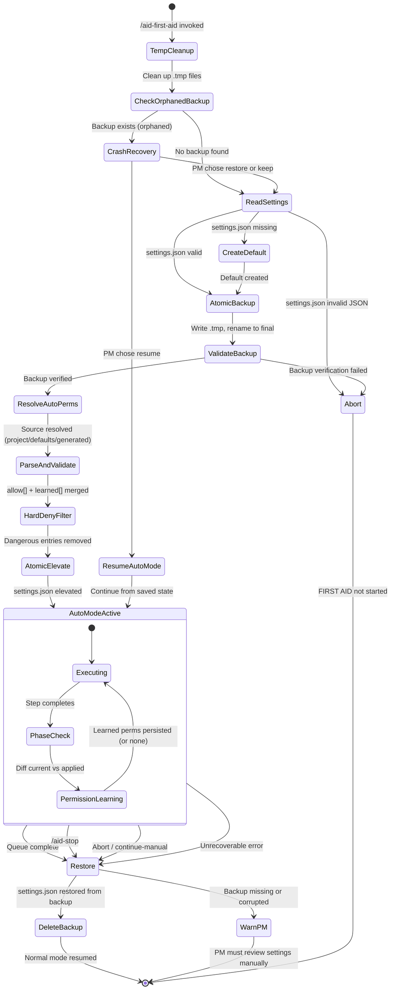

# Permission Sandwich — Auto-Mode Permission Lifecycle

**Skill:** permission-sandwich
**Dependencies:** epic-orchestration, epic-queue

---

## TL;DR

This skill manages the permission lifecycle for FIRST AID auto-mode. Before autonomous
execution begins, the Controller backs up the current `.claude/settings.json`, elevates
permissions to the auto-mode set, and restores the original permissions when execution
completes (or crashes). PM-granted permissions during auto-mode are learned and persisted
for future sessions.

The pattern is: **backup --> elevate --> run --> restore** (the "sandwich").

---

## Terminology

| Term | Meaning |
|------|---------|
| **Permission sandwich** | Backup, elevate, restore cycle around auto-mode execution |
| **Elevation** | Replacing the current `permissions.allow[]` with the auto-mode superset |
| **Restore** | Writing the backup back to `settings.json`, returning to pre-auto state |
| **Orphaned backup** | A backup file left behind by a crashed auto-mode session |
| **Permission learning** | Detecting PM-granted permissions and persisting them for future sessions |
| **Hard-deny list** | Permissions that are NEVER allowed, regardless of config |

---

## Files Involved

| File | Location | Purpose |
|------|----------|---------|
| `settings.json` | `.claude/settings.json` | Claude Code global permission file. Controls what Claude auto-allows without prompting. |
| `settings.local.json` | `.claude/settings.local.json` | Claude Code project-level permission file. CC merges both files — local can override global. |
| `permissions-backup.json` | `.aid-o/03-config/permissions-backup.json` | Backup of original `settings.json` before elevation. Its presence signals an active or crashed auto-mode session. |
| `permissions-local-backup.json` | `.aid-o/03-config/permissions-local-backup.json` | Backup of original `settings.local.json` before elevation. |
| `permissions-auto.yaml` | `.aid-o/03-config/permissions-auto.yaml` (project) or `defaults/policies/permissions-auto.yaml` (plugin) | Auto-mode permission template. Project-specific overrides plugin defaults. |
| `auto-mode-state.yaml` | `.aid-o/04-engine/auto-mode-state.yaml` | Tracks session state including applied permissions and learned permissions. |

### Dual-File Architecture

Claude Code reads permissions from TWO files and merges them:
- `.claude/settings.json` — global (user-level)
- `.claude/settings.local.json` — project-level (created by CC when PM clicks "Allow")

Both files have `permissions.allow[]` and `permissions.deny[]`. CC merges both:
allow = union(global.allow, local.allow), deny = union(global.deny, local.deny).
**deny always wins over allow** — this is CC's hard enforcement.

The Permission Sandwich must handle BOTH files to prevent:
1. **Pattern mismatch** — local learned patterns (e.g., `"Bash(git push)"` without wildcard) don't match commands with different arguments
2. **Deny interference** — local deny entries could block auto-mode operations
3. **Phantom permissions** — local allow entries persisting from a previous session could conflict with the elevated set

---

## 1. Backup Procedure

**When:** First action of `/aid-first-aid` command, BEFORE any EPIC processing begins.

**Caller:** The Controller, from the FIRST_AID_INIT state.

### 1.1 Steps

```
BACKUP_PERMISSIONS:
  1. Read .claude/settings.json
     - IF file does not exist:
       → Create minimal default: {"permissions": {"allow": []}}
       → Write it to .claude/settings.json
       → Log WARNING: "No settings.json found. Created minimal default."
     - IF file exists but is not valid JSON:
       → ABORT with error:
         "Cannot start FIRST AID: .claude/settings.json is not valid JSON.
          Fix it manually and try again."
       → Do NOT proceed. Do NOT attempt to fix the file.

  2. Read .claude/settings.local.json
     - IF file does not exist:
       → Note: no local settings to backup. Set local_exists = false.
     - IF file exists but is not valid JSON:
       → Log WARNING: "settings.local.json is not valid JSON. Will be neutralized."
       → Set local_exists = true (still backup the broken file for restore).
     - IF file exists and valid JSON:
       → Set local_exists = true.

  3. Check for orphaned backup (crash recovery):
     - IF .aid-o/03-config/permissions-backup.json already exists:
       → This means a previous auto-mode session did not complete cleanly.
       → Execute CRASH_RECOVERY protocol (see Section 5).
       → After recovery resolves, continue to step 4.
     - IF no backup exists:
       → Proceed to step 4.

  4. Atomic write backup (settings.json):
     a. Write the full content of settings.json to a temp file:
        .aid-o/03-config/permissions-backup.json.tmp
     b. Read temp file back and validate it is valid JSON.
        - IF validation fails: ABORT. Delete temp file. Report error.
     c. Rename temp file to final path:
        mv .aid-o/03-config/permissions-backup.json.tmp
           .aid-o/03-config/permissions-backup.json
     d. Read final backup file and verify content matches original.
        - IF mismatch: ABORT. Delete backup. Report error.

  5. Atomic write backup (settings.local.json) — only if local_exists:
     a. Write the full content of settings.local.json to:
        .aid-o/03-config/permissions-local-backup.json.tmp
     b. Read temp file back and validate content preserved.
     c. Rename to .aid-o/03-config/permissions-local-backup.json
     d. IF any step fails: Log WARNING (non-blocking). Continue.
        Local backup failure does NOT abort — settings.json backup is sufficient.

  6. Log to stage_log:
     {"state": "FIRST_AID_INIT", "action": "permissions_backup",
      "backup_path": ".aid-o/03-config/permissions-backup.json",
      "local_backup_path": ".aid-o/03-config/permissions-local-backup.json" or null,
      "original_allow_count": {count of entries in permissions.allow[]},
      "local_backed_up": true/false}
```

### 1.2 Atomicity Guarantee

The temp-file-then-rename pattern ensures that `permissions-backup.json` is never in a
partial or corrupt state:

- If the process crashes BEFORE the rename, only the `.tmp` file exists. The next session
  will not see a backup (the `.tmp` file is not checked) and will proceed with a fresh
  backup.
- If the process crashes AFTER the rename, the backup is complete and valid. Crash
  recovery (Section 5) will detect it.

### 1.3 Error Handling

| Condition | Action |
|-----------|--------|
| `settings.json` missing | Create minimal default, continue |
| `settings.json` invalid JSON | ABORT. PM must fix manually. |
| Orphaned backup found | Execute crash recovery (Section 5) |
| Temp file write fails | ABORT. Report filesystem error. |
| Temp file validation fails | ABORT. Delete temp. Report error. |
| Rename fails | ABORT. Delete temp. Report error. |
| Final verification fails | ABORT. Delete backup. Report error. |

---

## 2. Elevation Procedure

**When:** Immediately after backup succeeds, still in FIRST_AID_INIT.

### 2.1 Resolve Permissions Source

The Controller resolves the auto-mode permissions from one of three sources, in priority
order:

```
RESOLVE_PERMISSIONS_AUTO:
  1. Check .aid-o/03-config/permissions-auto.yaml (project-specific override)
     → IF exists and valid YAML: use it. source = "project"

  2. ELSE check defaults/policies/permissions-auto.yaml (plugin defaults)
     → IF exists and valid YAML: use it. source = "defaults"

  3. ELSE generate from template (Section 6):
     → Write generated file to .aid-o/03-config/permissions-auto.yaml
     → source = "generated"
     → Log: "No permissions-auto.yaml found. Generated defaults."
```

### 2.2 Parse and Validate

```
PARSE_AND_VALIDATE:
  1. Parse permissions-auto.yaml:
     → Extract allow[] list (array of permission pattern strings)
     → Extract deny[] list (array of deny pattern strings)
     → Extract learned[] list (array of previously learned permissions)

  2. Merge: effective_allow = allow[] + learned[]

  3. Validate against HARD DENY LIST (Section 3):
     → For each entry in effective_allow:
       - IF entry matches any hard-deny pattern:
         → REMOVE entry from effective_allow
         → Log WARNING: "Removed dangerous permission from auto-mode: {pattern}.
           This permission is on the hard-deny list and cannot be overridden."
         → Increment hard_deny_removed counter

  4. Final effective_allow is the validated set used for elevation.
```

### 2.3 Build and Write Elevated Settings

```
ELEVATE_SETTINGS:
  1. Read current .claude/settings.json (already read in backup step)

  2. Build elevated settings:
     a. Start with the existing settings.json structure
     b. Replace permissions.allow[] with the validated effective_allow list
     c. SET permissions.deny[] with the deny entries from permissions-auto.yaml
        → This is the KEY CHANGE: deny[] is written to CC's settings.json
        → CC deny ALWAYS overrides allow — hard enforcement by CC itself
     d. Preserve all other fields in settings.json (enabledPlugins, etc.)

  3. Atomic write elevated settings.json:
     a. Write to .claude/settings.json.tmp
     b. Validate temp file is valid JSON
     c. Rename to .claude/settings.json

  4. Neutralize settings.local.json:
     → Write {"permissions": {"allow": [], "deny": []}} to .claude/settings.local.json
     → This prevents project-level learned permissions from interfering.
     → The original is safe in permissions-local-backup.json.
     → IF write fails: Log WARNING (non-blocking). The global settings.json
       deny[] will still block dangerous commands.

  5. Record applied permissions in auto-mode-state.yaml:
     → session.permissions.applied_permissions = effective_allow
     → session.permissions.applied_deny = deny entries from permissions-auto.yaml
     → session.permissions.applied_permissions_count = len(effective_allow)
     → session.permissions.elevated_at = {now ISO 8601}
     → session.permissions.source = {source from 2.1}
     → session.permissions.local_neutralized = true/false

  6. Log to stage_log:
     {"state": "FIRST_AID_INIT", "action": "permissions_elevated",
      "source": "{project|defaults|generated}",
      "entries_before": {count of original allow},
      "entries_after": {count of effective_allow},
      "deny_entries": {count of deny patterns written to CC},
      "local_neutralized": true/false,
      "hard_deny_removed": {count}}
```

---

## 3. Hard Deny List

These permissions are NEVER allowed in auto-mode, regardless of what appears in
`permissions-auto.yaml`, regardless of PM grants, regardless of learned permissions.

**Enforcement is dual-layer:**
1. **CC-level:** deny[] entries are written to `.claude/settings.json → permissions.deny[]`.
   CC deny always overrides allow — hard enforcement by Claude Code itself.
2. **Controller-level:** The Controller validates at elevation time and at permission
   learning time. Any allow entry matching a hard-deny pattern is stripped.

### 3.1 Command Patterns (Always Blocked)

```
HARD_DENY_COMMANDS:
  # Destructive filesystem — rm variants (flag-order-independent)
  # Matching all commonly used flag orderings prevents bypass via flag reordering.
  - "Bash(rm -rf /:*)"               # Standard recursive force on root
  - "Bash(rm -rf /*:*)"              # Glob root variant
  - "Bash(rm -r -f:*)"               # Separated flags variant
  - "Bash(rm --recursive --force:*)" # Long-form flags variant
  - "Bash(rm -fr:*)"                 # Reversed short flags variant
  # Destructive filesystem — find delete
  - "Bash(find / -delete:*)"         # Recursive delete via find
  # Destructive filesystem — disk/filesystem operations
  - "Bash(mkfs:*)"                   # Format filesystem (any mkfs variant)
  - "Bash(dd if=/dev/zero:*)"        # Overwrite disk with zeros
  - "Bash(dd if=/dev/random:*)"      # Overwrite disk with random data
  - "Bash(dd if=/dev/urandom:*)"     # Overwrite disk with urandom data
  # Destructive git
  - "Bash(git push --force:*)"
  - "Bash(git push -f:*)"
  - "Bash(git reset --hard:*)"
  # Privilege escalation
  - "Bash(sudo:*)"
  - "Bash(su:*)"
  # Dangerous permissions
  - "Bash(chmod 777:*)"
  - "Bash(chown:*)"
```

### 3.2 Path Patterns (System Directories — Always Blocked)

```
HARD_DENY_PATHS:
  - "/etc/*"
  - "/usr/*"
  - "~/.ssh/*"
  - "~/.aws/*"
  - "~/.gnupg/*"
  - "~/.config/claude/*"
```

### 3.3 Validation Logic

```
is_hard_denied(permission_pattern):
  FOR EACH deny_pattern IN HARD_DENY_COMMANDS:
    IF permission_pattern contains deny_pattern (substring match):
      RETURN true
  FOR EACH deny_path IN HARD_DENY_PATHS:
    IF permission_pattern references deny_path:
      RETURN true
  RETURN false
```

### 3.4 Rationale

| Denied Pattern | Why |
|----------------|-----|
| `rm -rf /`, `rm -rf /*` | Catastrophic filesystem destruction from root |
| `rm -r -f`, `rm --recursive --force`, `rm -fr` | Same destruction via flag reordering — all variants are explicitly denied so reordering flags cannot bypass the check |
| `find / -delete` | Recursive delete of the entire filesystem via find |
| `mkfs` | Formats a filesystem, irreversibly destroying all data on the target device |
| `dd if=/dev/zero`, `dd if=/dev/random`, `dd if=/dev/urandom` | Overwrites a disk device with zeros or random data — all three device variants are denied because argument reordering (`of=... if=...`) is not caught by substring match |
| `git push --force`, `git push -f` | Irreversible remote history rewrite |
| `git reset --hard` | Discards all uncommitted work without confirmation |
| `sudo` / `su` | Privilege escalation beyond project scope |
| `chmod 777` | Makes files world-writable — security exposure |
| `chown` | Changes file ownership, typically requires root |
| `/etc/*`, `/usr/*` | System configuration directories, never within project scope |
| `~/.ssh/*`, `~/.aws/*` | SSH keys and AWS credentials |
| `~/.gnupg/*` | GPG private keys |
| `~/.config/claude/*` | Claude's own configuration (self-modification risk) |

---

## 4. Restore Procedure

**When:** Any of the following events trigger restore:

- `/aid-stop` command invoked by PM
- All EPICs in queue completed successfully (final DONE state)
- Queue aborted (EPIC failed, PM chooses abort)
- PM chooses `"continue-manual"` at an escalation point
- Unrecoverable error during auto-mode

### 4.1 Steps

```
RESTORE_PERMISSIONS:
  1. Check global backup exists:
     a. Read .aid-o/03-config/permissions-backup.json
     b. IF file does not exist:
        → Log ERROR: "No permission backup found. Cannot restore."
        → WARN PM: "Permissions may be in elevated state.
           Review .claude/settings.json manually."
        → Continue (do NOT block other completion actions)
        → SKIP to step 3 (still try to restore local)
     c. IF file exists but is not valid JSON:
        → Log ERROR: "Permission backup is corrupted: {parse error}"
        → WARN PM: "Permission backup is corrupted. Current .claude/settings.json
           may contain elevated auto-mode permissions.
           Review and fix .claude/settings.json manually."
        → Continue (do NOT block other completion actions)
        → SKIP to step 3

  2. Atomic write restore (settings.json):
     a. Write backup content to .claude/settings.json.tmp
     b. Validate temp file is valid JSON
     c. Rename to .claude/settings.json

  3. Restore settings.local.json:
     a. Read .aid-o/03-config/permissions-local-backup.json
     b. IF file does not exist:
        → No local backup was created (original didn't exist). SKIP.
     c. IF file exists:
        → Write content to .claude/settings.local.json
        → IF write fails: Log WARNING (non-blocking).

  4. Delete backup files:
     a. Remove .aid-o/03-config/permissions-backup.json
     b. Remove .aid-o/03-config/permissions-local-backup.json (if exists)
     c. IF remove fails:
        → Log WARNING: "Could not delete backup file: {error}.
           Non-blocking. File can be deleted manually."

  5. Log to stage_log:
     {"state": "FIRST_AID_COMPLETE|AID_STOP|ABORT", "action": "permissions_restored",
      "entries_restored": {count of original allow entries},
      "local_restored": true/false}
```

### 4.2 Error Handling

Restore is designed to be resilient. It should NEVER block the completion flow:

| Condition | Action | Blocking? |
|-----------|--------|-----------|
| Backup missing | Warn PM, continue | No |
| Backup corrupted | Warn PM, continue | No |
| Temp file write fails | Log error, warn PM | No |
| Rename fails | Log error, warn PM | No |
| Backup delete fails | Log warning, continue | No |

**Principle:** A failed restore is a PM-visible warning, not a pipeline stopper.
The PM can always manually edit `.claude/settings.json` to fix permissions.

---

## 5. Crash Recovery

**When:** On next Claude Code session start, or when `/aid-first-aid` is invoked and
an orphaned backup is detected.

### 5.1 Detection

The presence of `.aid-o/03-config/permissions-backup.json` at session start (outside
of an active auto-mode session) indicates a crashed previous session. The backup file
is the crash indicator.

### 5.2 Recovery Protocol

```
CRASH_RECOVERY:
  1. Read .aid-o/03-config/permissions-backup.json
     - IF not valid JSON:
       → Log ERROR: "Orphaned backup is corrupted."
       → Delete corrupted backup file.
       → Log: "Deleted corrupted backup. Current permissions are unchanged."
       → RETURN (proceed without recovery)

  2. Present options to PM:
     "Found orphaned permission backup from a previous FIRST AID session
      that did not complete cleanly.

      Current .claude/settings.json may contain elevated auto-mode permissions.

      Options:
      A) Restore original permissions from backup (recommended)
      B) Keep current permissions and delete backup
      C) Resume auto-mode from saved progress

      What would you like to do?"

  3. Handle PM response:
     OPTION A — Restore (recommended):
       a. Execute RESTORE_PERMISSIONS (Section 4.1 steps 2-4)
       b. Log: {"action": "crash_recovery", "choice": "restore"}
       c. RETURN (normal session continues)

     OPTION B — Keep current:
       a. Delete .aid-o/03-config/permissions-backup.json
       b. Log: {"action": "crash_recovery", "choice": "keep_current",
          "warning": "Elevated permissions may persist"}
       c. RETURN (normal session continues with current permissions)

     OPTION C — Resume auto-mode:
       a. Check .aid-o/04-engine/auto-mode-state.yaml for saved progress
       b. IF state file exists and has valid progress data:
          → Keep backup in place (still in sandwich)
          → Log: {"action": "crash_recovery", "choice": "resume",
             "epic_id": "{progress.current_epic_id}",
             "state": "{progress.current_state}"}
          → Resume from saved state (Controller handles re-entry)
       c. IF state file missing or invalid:
          → Inform PM: "Cannot resume: no saved progress found.
             Falling back to option A (restore)."
          → Execute option A
```

### 5.3 Temp File Cleanup

On every startup, regardless of crash recovery:

```
TEMP_FILE_CLEANUP:
  IF .aid-o/03-config/permissions-backup.json.tmp exists:
    → Delete it (leftover from incomplete backup write)
    → Log: "Cleaned up orphaned temp file"
  IF .aid-o/03-config/permissions-local-backup.json.tmp exists:
    → Delete it (leftover from incomplete local backup write)
    → Log: "Cleaned up orphaned temp file"
  IF .claude/settings.json.tmp exists:
    → Delete it (leftover from incomplete elevation or restore)
    → Log: "Cleaned up orphaned temp file"
```

---

## 6. Permission Learning Protocol

**When:** Checked at each PHASE_CHECK during auto-mode execution.

**Purpose:** When PM manually grants a new permission through the Claude Code permission
prompt (because a needed command was not in the auto-mode allow list), the Controller
detects this and persists it to `permissions-auto.yaml` so it is included automatically
in future sessions.

### 6.1 Detection Mechanism

Claude Code stores user-granted permissions in `.claude/settings.json` (the
`permissions.allow` array grows when a user clicks "Allow"). The Controller detects
new permissions by comparing the current state against what was applied at elevation.

### 6.2 Learning Steps

```
PERMISSION_LEARNING (executed at each PHASE_CHECK):
  1. Read current .claude/settings.json → current_allow[]

  2. Read applied permissions from auto-mode-state.yaml:
     → session.permissions.applied_permissions → applied_allow[]

  3. Compute diff:
     new_permissions = current_allow[] - applied_allow[]
     (Set difference: entries in current that are NOT in applied)

  4. IF new_permissions is empty:
     → No learning needed. RETURN.

  5. IF new_permissions is non-empty:
     For each new_perm in new_permissions:
       a. Validate against hard-deny list (Section 3):
          IF is_hard_denied(new_perm):
            → Log WARNING: "PM-granted permission '{new_perm}' is on the
              hard-deny list. Skipping persistence."
            → SKIP this permission (do NOT persist)
            → CONTINUE to next

       b. Append to .aid-o/03-config/permissions-auto.yaml → learned[]:
          - permission: "{new_perm}"
            learned_at: "{now ISO 8601}"
            session_id: "{session.session_id}"
            comment: "Learned from PM grant during auto-mode"

       c. Update auto-mode-state.yaml:
          → Add new_perm to session.permissions.applied_permissions
          → Add new_perm to session.permissions.learned_permissions
          → Increment session.permissions.applied_permissions_count

  6. Log to stage_log:
     {"state": "PHASE_CHECK", "action": "permission_learned",
      "new_permissions": [{list of new_perm}],
      "hard_denied_skipped": [{list of skipped}],
      "source": "pm_grant"}
```

### 6.3 Persistence Scope

- Learned permissions are written to the **project-specific** file:
  `.aid-o/03-config/permissions-auto.yaml`
- They are NEVER written to the plugin defaults
  (`defaults/policies/permissions-auto.yaml`).
- Learned permissions persist across sessions: the next `/aid-first-aid` invocation
  reads `permissions-auto.yaml` including the `learned[]` section and merges them into
  the effective allow list.

### 6.4 Why at PHASE_CHECK

PHASE_CHECK is a natural pause point between steps. The Controller already reads state
files and performs validation here. Adding permission learning to this checkpoint:
- Avoids checking permissions on every single tool call (expensive)
- Catches grants before the next step begins (grants are typically prompted during
  a step, so they are visible at the next PHASE_CHECK)
- Aligns with the existing PHASE_CHECK responsibility of state validation

---

## 7. Permissions-Auto.yaml Default Template

When no `permissions-auto.yaml` exists (neither project nor plugin defaults), the
elevation procedure generates one from this template. This template is a superset of the
`recommended` preset from `defaults/policies/permissions.yaml`, adding permissions needed
for fully autonomous operation.

```yaml
# FIRST AID Auto-Mode Permissions
# Generated on first /aid-first-aid run. Customize per project.
# deny[] is written to CC's permissions.deny[] — CC hard enforcement.

allow:
  # --- Claude Code Tools ---
  - "Glob(*)"
  - "Grep(*)"
  - "Read(*)"
  - "Edit(*)"
  - "Write(*)"
  - "NotebookEdit(*)"
  - "Task(*)"
  - "TodoWrite(*)"
  - "WebSearch(*)"
  - "WebFetch(*)"
  # --- All Bash (safety via deny[] below) ---
  - "Bash(*)"
  # --- MCP Tools ---
  - "mcp__qdrant-memory__qdrant-store(*)"
  - "mcp__qdrant-memory__qdrant-find(*)"
  - "mcp__shared-github__*(*)"
  - "mcp__shared-minio__*(*)"
  - "mcp__shared-docker__*(*)"
  - "mcp__shared-playwright__*(*)"
  - "mcp__plugin_context7_context7__*(*)"

deny:
  # --- Written to CC permissions.deny[] — hard enforcement ---
  # rm: all flag-order variants (flag reordering must not bypass the check)
  - "Bash(rm -rf /:*)"
  - "Bash(rm -rf /*:*)"
  - "Bash(rm -r -f:*)"
  - "Bash(rm --recursive --force:*)"
  - "Bash(rm -fr:*)"
  - "Bash(find / -delete:*)"
  - "Bash(mkfs:*)"
  - "Bash(dd if=/dev/zero:*)"
  - "Bash(dd if=/dev/random:*)"
  - "Bash(dd if=/dev/urandom:*)"
  - "Bash(git push --force:*)"
  - "Bash(git push -f:*)"
  - "Bash(git reset --hard:*)"
  - "Bash(sudo:*)"
  - "Bash(su:*)"
  - "Bash(chmod 777:*)"
  - "Bash(chown:*)"
  # --- Path deny ---
  - path: "/etc/*"
  - path: "/usr/*"
  - path: "~/.ssh/*"
  - path: "~/.aws/*"
  - path: "~/.gnupg/*"
  - path: "~/.config/claude/*"

# Learned permissions (appended by permission learning protocol)
learned: []
```

---

## 8. State Diagram



---

## 9. Integration Points

### 9.1 Who Calls This Skill

| Caller | When | Procedure |
|--------|------|-----------|
| `/aid-first-aid` command (FIRST_AID_INIT) | Auto-mode startup | Backup (Section 1) then Elevation (Section 2) |
| Controller at PHASE_CHECK | Between steps during auto-mode | Permission Learning (Section 6) |
| Controller at DONE (queue empty) | Final EPIC completes | Restore (Section 4) |
| `/aid-stop` command | PM stops auto-mode | Restore (Section 4) |
| Controller on abort | Unrecoverable error or PM abort | Restore (Section 4) |
| Controller on escalation | PM chooses `"continue-manual"` | Restore (Section 4) |
| Next session start | Session starts with orphaned backup | Crash Recovery (Section 5) |

### 9.2 Related Skills and Files

| Reference | Purpose |
|-----------|---------|
| `skills/epic-orchestration.md` | Controller state machine that invokes backup/elevate/restore at lifecycle points |
| `skills/epic-queue.md` | Queue completion triggers restore |
| `defaults/policies/permissions.yaml` | Base permission presets (reference for what "recommended" includes) |
| `defaults/policies/permissions-auto.yaml` | Plugin-level auto-mode defaults (fallback) |
| `.aid-o/03-config/permissions-auto.yaml` | Project-level auto-mode permissions (overrides plugin defaults) |
| `.aid-o/03-config/permissions-backup.json` | Backup of original settings.json |
| `.aid-o/03-config/permissions-local-backup.json` | Backup of original settings.local.json |
| `.aid-o/04-engine/auto-mode-state.yaml` | Session state including applied and learned permissions |

---

## 10. MUST Rules

1. **ALWAYS backup BOTH files before elevating.** Backup `.claude/settings.json` (mandatory) and `.claude/settings.local.json` (if exists). No global backup means ABORT.
2. **ALWAYS use atomic writes** (temp file then rename) for backup, elevation, and restore.
3. **ALWAYS validate JSON** after writing and before renaming.
4. **ALWAYS write deny[] to CC's permissions.deny[]** during elevation. CC deny overrides allow — this is the primary safety mechanism.
5. **ALWAYS neutralize settings.local.json** during elevation. Write empty permissions to prevent local patterns from interfering.
6. **ALWAYS restore BOTH files** on completion. Global + local.
7. **ALWAYS enforce the hard-deny list** at elevation time AND at permission learning time.
8. **NEVER block the completion flow** on restore failure. Warn PM and continue.
9. **NEVER modify plugin defaults** during permission learning. Only write to project-specific `permissions-auto.yaml`.
10. **NEVER silently swallow a corrupted backup.** Always warn PM.
11. **NEVER proceed with auto-mode if global backup fails.** Abort is the only safe choice. (Local backup failure is non-blocking.)
12. **ALWAYS clean up temp files** on startup (both global and local backup temps).
13. **ALWAYS record applied permissions AND applied deny** in `auto-mode-state.yaml` so permission learning can compute diffs.

---

## Important

- The permission sandwich is a SAFETY mechanism. Its primary job is to ensure that
  elevated permissions never persist beyond the auto-mode session. If in doubt, restore.
- The backup file doubles as a crash indicator. Its presence outside an active session
  means something went wrong. Always prompt PM for recovery.
- Permission learning is a convenience feature, not a security bypass. Learned permissions
  still go through hard-deny validation before being applied.
- The hard-deny list is non-negotiable. It cannot be overridden by PM grants, by
  `permissions-auto.yaml` configuration, or by any other mechanism.
- Restore is intentionally non-blocking. A failed restore is a problem, but it should
  not prevent the Controller from completing other DONE-state actions (auditing, archiving,
  queue transitions). The PM can always fix permissions manually.

**Last Updated:** 2026-02-26
