# AID Orchestrator — Workflow Catalog

**Version:** 0.1.0
**Last Updated:** 2026-02-16

Living document. All AID workflows — new and carried-over from the single-agent framework.

---

## Table of Contents

1. [Workflow Overview Map](#1-workflow-overview-map)
2. [WF-01: Plan Lifecycle](#wf-01-plan-lifecycle)
3. [WF-02: Epic Lifecycle](#wf-02-epic-lifecycle)
4. [WF-03: Epic Orchestration (Controller State Machine)](#wf-03-epic-orchestration-controller-state-machine)
5. [WF-04: Session Lifecycle](#wf-04-session-lifecycle)
6. [WF-05: Quality Gates](#wf-05-quality-gates)
7. [WF-06: Git Workflow](#wf-06-git-workflow)
8. [WF-07: Handoff Protocol](#wf-07-handoff-protocol)
9. [WF-08: Curator Flow](#wf-08-curator-flow)
10. [WF-09: Auditor Flow](#wf-09-auditor-flow)
11. [WF-10: Project Scanner](#wf-10-project-scanner)
12. [WF-11: Onboarding (/aid-setup)](#wf-11-onboarding-aid-setup)
13. [WF-12: Memory System](#wf-12-memory-system)
14. [WF-13: Slack Integration](#wf-13-slack-integration)
15. [Workflow Interconnection Matrix](#workflow-interconnection-matrix)
16. [Global RACI Matrix](#global-raci-matrix)

---

## 1. Workflow Overview Map

The full lifecycle from idea to production:

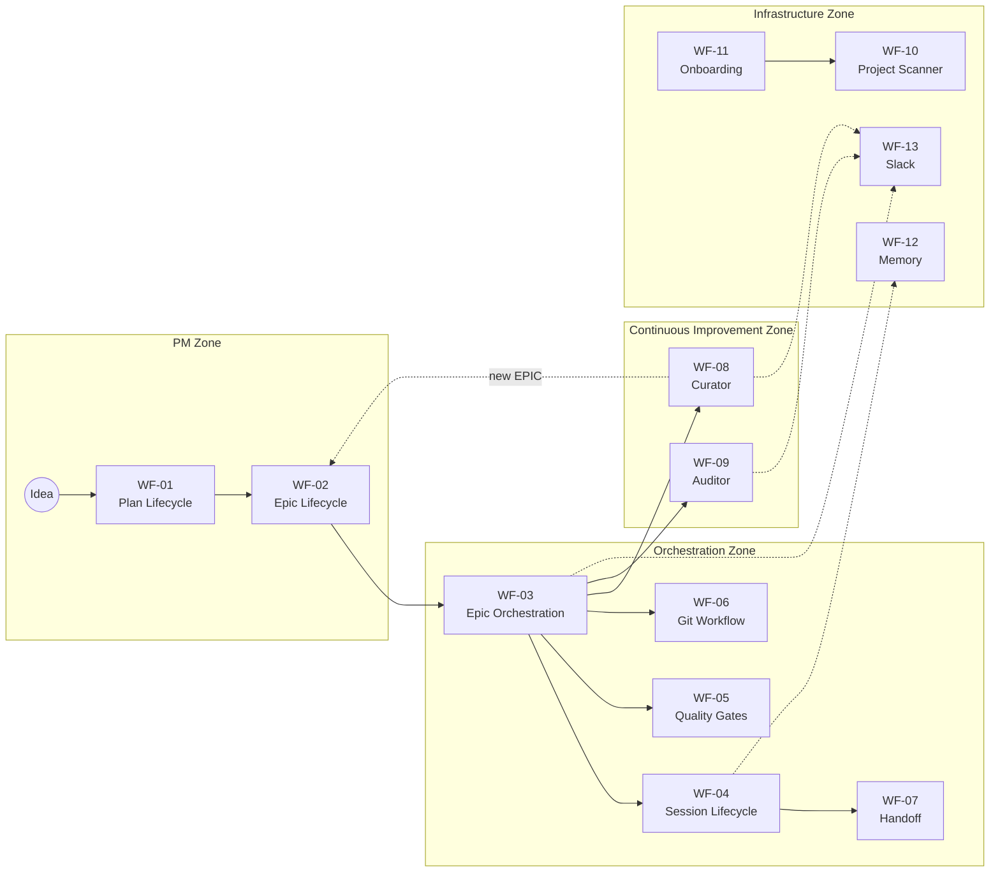

### Origin Legend

| Origin | Workflows | Notes |
|--------|-----------|-------|
| **NEW** (AID multi-agent) | WF-01, WF-02, WF-03, WF-08, WF-09, WF-10, WF-11, WF-12, WF-13 | Designed for Controller + Workers |
| **Carried over** (single-agent) | WF-04, WF-05, WF-06, WF-07 | Adapted from C.I.C.E.R.O. v4.0 |

---

## WF-01: Plan Lifecycle

**Origin:** NEW
**Purpose:** Brainstorm + design ideas into structured Plan documents before EPICs are created.

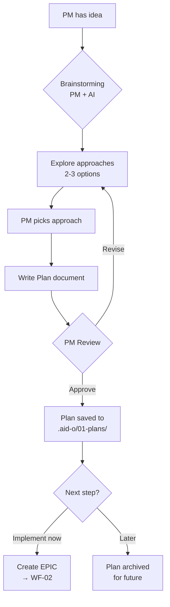

### RACI

| Activity | PM | AI Agent | Orchestrator |
|----------|:--:|:--------:|:------------:|
| Initiate brainstorming | **R** | I | — |
| Explore approaches | C | **R** | — |
| Decide approach | **R** | A | — |
| Write Plan doc | C | **R** | — |
| Approve Plan | **R** | I | — |
| Create EPIC from Plan | **R** | A | — |

### Handoff Points

| From | To | What is handed off |
|------|----|--------------------|
| PM | AI | Idea / problem description |
| AI | PM | 2-3 approach options with trade-offs |
| PM | AI | Chosen approach + feedback |
| AI | PM | Draft Plan document |
| Plan | WF-02 | Approved Plan → EPIC creation |

### Artifacts

| Artifact | Location | Naming |
|----------|----------|--------|
| Plan document | `.aid-o/01-plans/` | `P-{YYYYMMDD}-{hash}-{topic}.md` |
| Archived plan | `.aid-o/01-plans/archive/` | Same |

---

## WF-02: Epic Lifecycle

**Origin:** NEW (enhanced from single-agent Epic workflow)
**Purpose:** Break down a Plan into a detailed, multi-session EPIC specification.

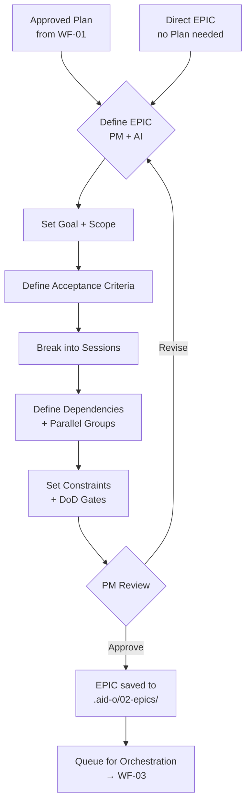

### RACI

| Activity | PM | AI Agent | Orchestrator |
|----------|:--:|:--------:|:------------:|
| Define goal + scope | **R** | A | — |
| Write acceptance criteria | C | **R** | — |
| Break into sessions | C | **R** | — |
| Map dependencies | I | **R** | — |
| Set constraints + DoD | **R** | A | — |
| Approve EPIC | **R** | I | — |

### Handoff Points

| From | To | What is handed off |
|------|----|--------------------|
| WF-01 (Plan) | WF-02 | Approved Plan document |
| PM | AI | Goal, scope, constraints |
| AI | PM | Draft EPIC with sessions |
| WF-02 | WF-03 | Approved EPIC file for orchestration |

### Artifacts

| Artifact | Location | Naming |
|----------|----------|--------|
| EPIC file | `.aid-o/02-epics/` | `E-{YYYYMMDD}-{hash}-{topic}.md` |
| Archived EPIC | `.aid-o/02-epics/archive/` | Same |

---

## WF-03: Epic Orchestration (Controller State Machine)

**Origin:** NEW
**Purpose:** Autonomous execution of an EPIC through role-based agents, managed by the Controller.
**Ref:** `plugins/aid-orchestrator/skills/epic-orchestration.md` (full specification)

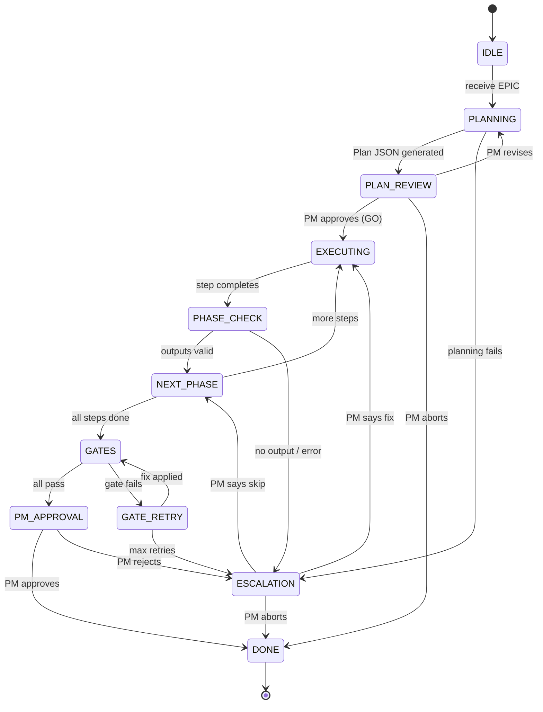

### RACI

| Activity | PM | Orchestrator | Role Agents | Curator | Auditor |
|----------|:--:|:------------:|:-----------:|:-------:|:-------:|
| Receive + validate EPIC | I | **R** | — | — | — |
| Generate Plan JSON | — | **R** | — | — | — |
| Approve plan | **R** | A | — | — | — |
| Dispatch agents | — | **R** | I | — | — |
| Execute step work | — | I | **R** | — | — |
| Phase check (auto-decision) | — | **R** | — | — | — |
| Run quality gates | — | **R** | — | — | — |
| Retry gate fixes | — | **R** | A | — | — |
| Escalate to PM | **R** | A | — | — | — |
| Final approval | **R** | A | — | — | — |
| Post-session curation | — | I | — | **R** | — |
| Post-EPIC audit | — | I | — | — | **R** |
| Merge + archive | — | **R** | — | — | — |

### Handoff Points

| From | To | What is handed off |
|------|----|--------------------|
| WF-02 (EPIC) | Orchestrator | EPIC file + constraints |
| Orchestrator | PM (via Slack) | Plan for review |
| Orchestrator | Role Agent | Playbook + step context + previous outputs |
| Role Agent | Orchestrator | Step outputs + improvement_notes |
| Orchestrator (step N) | Orchestrator (step N+1) | Evidence from step N |
| Architect Agent | All Agents | API contracts, ADR decisions |
| Domain Agent | Backend Agent | Entity definitions, invariants |
| Backend Agent | QA Agent | Implementation + test fixtures |
| Backend Agent | Security Agent | Code to review |
| All Agents | Docs Agent | What changed and why |
| Orchestrator | Curator (WF-08) | Session improvement_notes |
| Orchestrator | Auditor (WF-09) | Completed EPIC for audit |
| Orchestrator | PM (via Slack) | Final report for merge approval |

### Role Agent Dispatch Sequence

| Step | Role | Depends On | Parallel Group |
|------|------|------------|----------------|
| 1 | Architect | — | — |
| 2 | Domain | Architect | — |
| 3 | Backend | Domain | group-1 |
| 4 | Frontend | Architect | group-1 |
| 5 | QA | Backend | group-2 |
| 6 | Security | Backend | group-2 |
| 7 | Observability | Backend | group-2 |
| 8 | Docs | Backend, Frontend | — |
| 9 | Release | ALL | — |

### Evidence Produced

```
.aid-o/04-engine/evidence/{epic_id}/{run_id}/
  epic_input.md
  plan.json
  plan_progress.json
  pm_plan_approval.json
  pm_decision.json
  stage_log.jsonl
  gates_report.json
  final_report.md
  prompts/step_{N}_{role}.md
  steps/step_{N}_{role}/output.md
  steps/step_{N}_{role}/diff.patch
  gates/{gate_name}.txt
```

---

## WF-04: Session Lifecycle

**Origin:** Carried over from C.I.C.E.R.O. v4.0, adapted for AID
**Purpose:** Structured execution of a single unit of work within an EPIC.

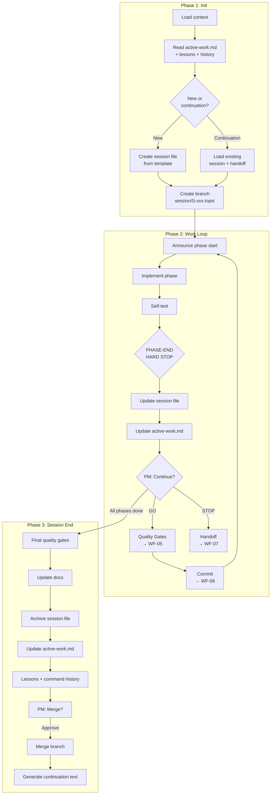

### RACI

| Activity | PM | AI Agent | Orchestrator |
|----------|:--:|:--------:|:------------:|
| Assign task | **R** | I | — |
| Load context + create session | — | **R** | — |
| Approve session plan | **R** | A | — |
| Implement phase | — | **R** | I |
| Phase-end checkpoint | **R** | A | — |
| Run quality gates | — | **R** | — |
| Commit changes | — | **R** | — |
| Request handoff | **R** | A | — |
| Approve merge | **R** | A | — |
| Extract lessons | — | **R** | — |

### Handoff Points

| From | To | What is handed off |
|------|----|--------------------|
| WF-03 (Orchestrator) | Session | EPIC context, step instructions, playbook |
| Previous Session | New Session | active-work.md, handoff block, session file |
| Session (phase end) | PM | Phase summary, manual QA proposal |
| Session | WF-05 | Code changes for gate checks |
| Session | WF-06 | Staged files for commit |
| Session | WF-07 | Incomplete work for handoff |
| Session (end) | WF-08 (Curator) | improvement_notes, lessons |
| Session (end) | WF-12 (Memory) | Decisions, patterns for indexing |

### Artifacts

| Artifact | Location |
|----------|----------|
| Session file | `.aid-o/04-engine/sessions/` → `archive/` |
| Session branch | `session/{id}-{topic}` |
| active-work.md | `.aid-o/04-engine/memory/active-work.md` |
| Commits | Git log with timestamp format |

---

## WF-05: Quality Gates

**Origin:** Carried over from C.I.C.E.R.O. v4.0
**Purpose:** 6-gate pre-commit quality protocol. Mandatory before EVERY commit.

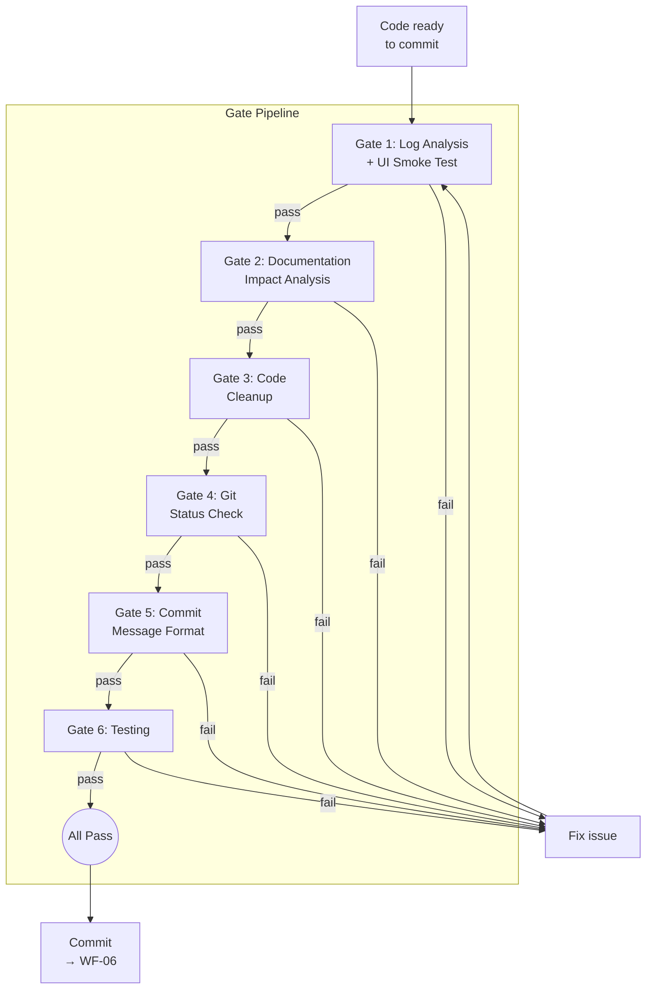

### Gate Details

| # | Gate | Severity | Checks |
|---|------|----------|--------|
| 1 | Log Analysis + Smoke | CRITICAL | Backend/frontend start, no errors, Playwright smoke |
| 2 | Documentation Impact | CRITICAL | Changed files → affected docs, MDX compliance, build |
| 3 | Code Cleanup | HIGH | No debug stmts, no temp files, no secrets, TODOs → backlog |
| 4 | Git Status | HIGH | Correct files staged, no secrets, no build artifacts |
| 5 | Commit Message | MEDIUM | `type(scope): desc (YYYY-MM-DD HH:MM TZ)` format |
| 6 | Testing | MEDIUM | All existing pass, new code has tests, >80% coverage |

### RACI

| Activity | PM | AI Agent | QG Runner Agent |
|----------|:--:|:--------:|:---------------:|
| Trigger gates | — | **R** | — |
| Execute gates | — | I | **R** |
| Fix failures | — | **R** | — |
| Escalate uncertainty | **R** | A | — |
| Approve skip (docs-only) | **R** | A | — |

### Handoff Points

| From | To | What is handed off |
|------|----|--------------------|
| WF-04 (Session) | WF-05 | Changes to validate |
| WF-05 | WF-06 | Validated changes ready for commit |
| WF-05 (Gate 2) | Docs | List of docs to update |
| WF-05 (Gate 3) | Backlog | TODOs extracted from code |

---

## WF-06: Git Workflow

**Origin:** Carried over from C.I.C.E.R.O. v4.0
**Purpose:** Atomic commits with standardized format, branch discipline.

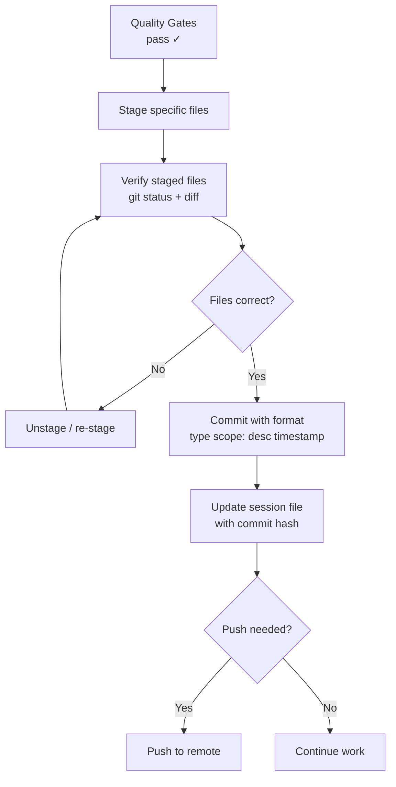

### Commit Format

```
type(scope): description (YYYY-MM-DD HH:MM TZ)

[optional body]

[optional footer: Refs: #123]
```

Types: `feat|fix|docs|refactor|test|chore|style|perf|ci`

### Branch Strategy

| Context | Branch Format | Merge Target |
|---------|---------------|--------------|
| Single session | `session/{id}-{topic}` | `main` |
| EPIC step | `epic/{epic_id}/step_{N}_{role}` | `epic/{epic_id}/main` |
| EPIC final | `epic/{epic_id}/main` | `main` (PR) |
| Hotfix | `hotfix/{date}-{topic}` | `main` |

### RACI

| Activity | PM | AI Agent |
|----------|:--:|:--------:|
| Stage files | — | **R** |
| Write commit msg | — | **R** |
| Commit | — | **R** |
| Push | **R** (approve) | A |
| Merge to main | **R** (approve) | A |
| Force push | **R** (approve) | A |

---

## WF-07: Handoff Protocol

**Origin:** Carried over from C.I.C.E.R.O. v4.0
**Purpose:** Self-contained context transfer when work pauses mid-session.

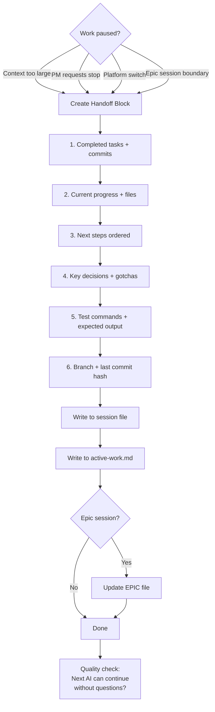

### RACI

| Activity | PM | Current AI | Next AI |
|----------|:--:|:----------:|:-------:|
| Request handoff | **R** | A | — |
| Write handoff block | — | **R** | — |
| Update tracking files | — | **R** | — |
| Read handoff | — | — | **R** |
| Continue from handoff | — | — | **R** |

### Handoff Block Contents

| Section | Purpose |
|---------|---------|
| Completed | What's done (tasks, commits, files) |
| Now Working On | Current progress %, files in progress |
| Next Steps | Ordered remaining actions |
| Important Context | Decisions, gotchas, dependencies |
| Key Locations | Config, tests, docs, log paths |
| How to Test | Commands + expected output |
| Branch | Name + last commit hash |

---

## WF-08: Curator Flow

**Origin:** NEW
**Purpose:** Continuous improvement — collect agent observations, deduplicate, propose improvements to PM.

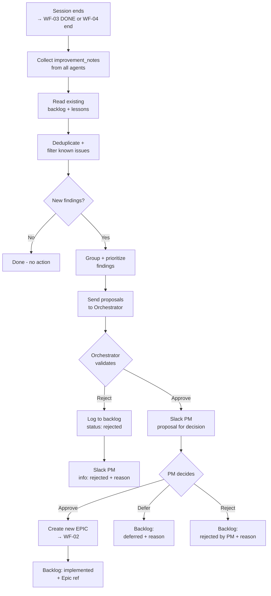

### improvement_notes Format (Standard for all agents)

```yaml
improvement_notes:
  - type: refactoring|performance|security|architecture|dx
    area: "path/to/file"
    observation: "What was noticed"
    suggestion: "Proposed solution"
    priority: low|medium|high
```

### RACI

| Activity | PM | Orchestrator | Curator | Role Agents |
|----------|:--:|:------------:|:-------:|:-----------:|
| Record improvement_notes | — | — | — | **R** |
| Collect + deduplicate | — | — | **R** | — |
| Brainstorm proposals | — | — | **R** | — |
| Validate proposals | — | **R** | A | — |
| Decide on proposals | **R** | I | I | — |
| Create new EPIC | — | **R** | I | — |
| Update backlog | — | — | **R** | — |

### Handoff Points

| From | To | What is handed off |
|------|----|--------------------|
| Role Agents | Curator | improvement_notes YAML |
| Curator | Orchestrator | Deduplicated proposals |
| Orchestrator | PM (Slack) | Validated proposals (or rejection info) |
| PM | Orchestrator | Decision: approve / defer / reject |
| Orchestrator | WF-02 | New EPIC from approved proposal |

### Artifacts

| Artifact | Location |
|----------|----------|
| backlog.md | `.aid-o/04-engine/backlog.md` |
| lessons-learned.md | `.aid-o/04-engine/lessons-learned.md` |

---

## WF-09: Auditor Flow

**Origin:** NEW
**Purpose:** Post-EPIC project audit with trend tracking across milestones.

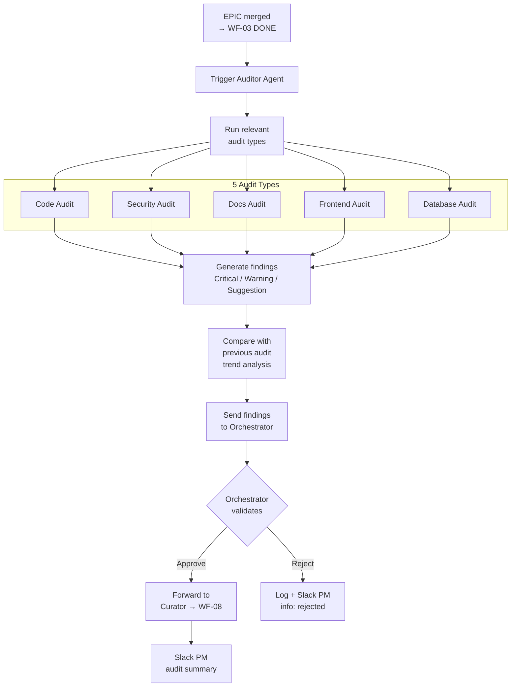

### Audit Types

| Type | When | Checks |
|------|------|--------|
| Code | Always | Quality, patterns, duplication, complexity |
| Security | Always | Vulnerabilities, secrets, OWASP, auth |
| Docs | Always | Currency, missing docs, accuracy |
| Frontend | If UI changes | Components, performance, accessibility |
| Database | If schema changes | Schema health, indexes, queries |

### RACI

| Activity | PM | Orchestrator | Auditor | Curator |
|----------|:--:|:------------:|:-------:|:-------:|
| Trigger audit | — | **R** | I | — |
| Execute audit types | — | — | **R** | — |
| Trend analysis | — | — | **R** | — |
| Validate findings | — | **R** | A | — |
| Process into backlog | — | — | — | **R** |
| Receive summary | **R** | I | — | — |

### Handoff Points

| From | To | What is handed off |
|------|----|--------------------|
| WF-03 (DONE state) | Auditor | Completed EPIC + codebase |
| Auditor | Orchestrator | Audit findings |
| Orchestrator | Curator (WF-08) | Validated findings |
| Auditor | PM (Slack) | Audit summary + trends |

### Artifacts

| Artifact | Location |
|----------|----------|
| Audit report | `.aid-o/04-engine/evidence/{epic_id}/audit-report.md` |
| Trend data | Compared across epic audit reports |

---

## WF-10: Project Scanner

**Origin:** NEW
**Purpose:** Analyze project structure, tech stack, and health for onboarding and milestones.

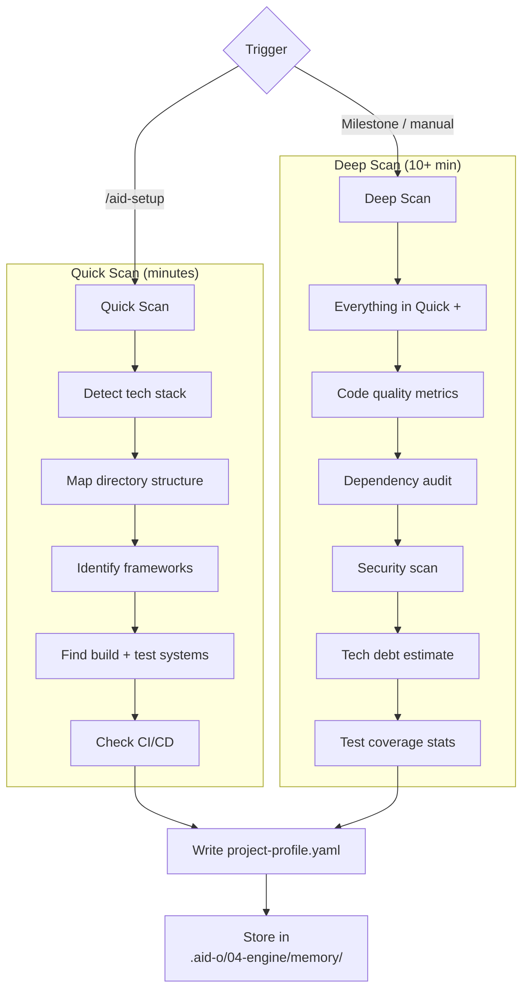

### RACI

| Activity | PM | Scanner Agent | Orchestrator |
|----------|:--:|:------------:|:------------:|
| Trigger quick scan | **R** | I | — |
| Trigger deep scan | **R** | I | — |
| Execute scan | — | **R** | — |
| Write profile | — | **R** | — |
| Use profile for planning | — | — | **R** |

### Artifacts

| Artifact | Location |
|----------|----------|
| project-profile.yaml | `.aid-o/04-engine/memory/project-profile.yaml` |
| Deep analysis report | `.aid-o/04-engine/evidence/` |

---

## WF-11: Onboarding (/aid-setup)

**Origin:** NEW
**Purpose:** Interactive setup for new users / new projects, explains what AID needs.

```mermaid
flowchart TD
    A[/aid-setup] --> B{.aid-o/ exists?}
    B -->|No| C[Run /aid-init<br>create structure]
    B -->|Yes| D[Check existing config]

    C --> D
    D --> E[Run Quick Scan<br>→ WF-10]
    E --> F[Present findings<br>to user in chat]

    F --> G{New project or<br>existing?}

    G -->|New| H[Brainstorming<br>tech stack + structure]
    G -->|Existing| I[Review detected<br>tech stack]

    H --> J[Offer to create/update]
    I --> J

    J --> K[VS Code settings?]
    K --> L[CLAUDE.md?]
    L --> M[README AID section?]
    M --> N[Populate project-profile.yaml]

    N --> O[Next steps guidance<br>→ /aid-help]
```

### RACI

| Activity | PM / User | AI Agent | Scanner Agent |
|----------|:---------:|:--------:|:------------:|
| Run /aid-setup | **R** | I | — |
| Initialize .aid-o/ | — | **R** | — |
| Scan project | — | I | **R** |
| Present findings | — | **R** | — |
| Configure environment | **R** (confirm) | A | — |
| Generate docs | — | **R** | — |

---

## WF-12: Memory System

**Origin:** NEW
**Purpose:** Persistent knowledge across sessions — file-based + vector DB (Qdrant MCP).

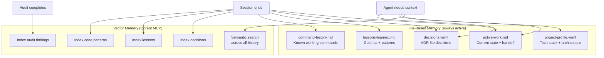

### Two Memory Layers

| Layer | Technology | Content | Access |
|-------|-----------|---------|--------|
| **File-based** | Markdown / YAML in `.aid-o/` | Current state, profile, decisions, lessons, commands | Read/write by all agents |
| **Vector** | Qdrant MCP server | Semantic embeddings of decisions, lessons, patterns, findings | Semantic search by all agents |

### RACI

| Activity | Orchestrator | All Agents | Qdrant MCP |
|----------|:------------:|:----------:|:----------:|
| Write file-based memory | I | **R** | — |
| Index to vector DB | **R** | — | A |
| Query vector DB | I | **R** | A |
| Read file-based memory | — | **R** | — |

---

## WF-13: Slack Integration

**Origin:** NEW
**Purpose:** Async PM communication — escalations, approvals, status updates.
**Principle:** Everything that goes to PM goes through Slack. Even rejections = info.

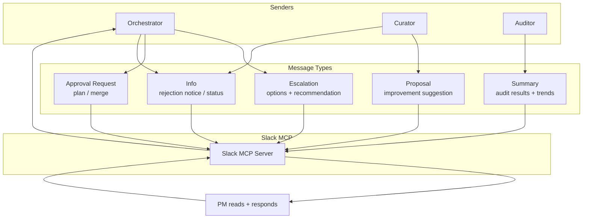

### Message Types

| Type | Sender | Expects Reply? | PM Options |
|------|--------|:--------------:|------------|
| Escalation | Orchestrator | Yes | Fix / Skip / Abort |
| Plan Approval | Orchestrator | Yes | GO / Revise / Abort |
| Merge Approval | Orchestrator | Yes | Approve / Reject / Revise |
| Improvement Proposal | Curator (via Orch.) | Yes | Approve / Defer / Reject |
| Rejection Info | Curator / Orchestrator | No | — (informational) |
| Audit Summary | Auditor (via Orch.) | No | — (informational) |
| Status Update | Orchestrator | No | — (informational) |

---

## Workflow Interconnection Matrix

How each workflow connects to others:

| | WF-01 | WF-02 | WF-03 | WF-04 | WF-05 | WF-06 | WF-07 | WF-08 | WF-09 | WF-10 | WF-11 | WF-12 | WF-13 |
|---|:---:|:---:|:---:|:---:|:---:|:---:|:---:|:---:|:---:|:---:|:---:|:---:|:---:|
| **WF-01 Plan** | — | OUT | | | | | | | | | | | |
| **WF-02 Epic** | IN | — | OUT | | | | | | | | | | |
| **WF-03 Orch** | | IN | — | OUT | OUT | OUT | | OUT | OUT | | | IN | OUT |
| **WF-04 Session** | | | IN | — | OUT | OUT | OUT | OUT | | | | OUT | |
| **WF-05 Gates** | | | IN | IN | — | OUT | | | | | | | |
| **WF-06 Git** | | | IN | IN | IN | — | | | | | | | |
| **WF-07 Handoff** | | | | IN | | | — | | | | | OUT | |
| **WF-08 Curator** | | OUT | IN | IN | | | | — | IN | | | | OUT |
| **WF-09 Auditor** | | | IN | | | | | OUT | — | | | | OUT |
| **WF-10 Scanner** | | | | | | | | | | — | IN | OUT | |
| **WF-11 Setup** | | | | | | | | | | OUT | — | | |
| **WF-12 Memory** | | | OUT | OUT | | | IN | | | IN | | — | |
| **WF-13 Slack** | | | IN | | | | | IN | IN | | | | — |

**Legend:** IN = receives from, OUT = sends to

---

## Global RACI Matrix

All workflows, all roles, all key activities:

| Activity | PM | Orchestrator | Role Agents | Curator | Auditor | Scanner |
|----------|:--:|:------------:|:-----------:|:-------:|:-------:|:-------:|
| **Planning Phase** | | | | | | |
| Brainstorm idea | **R** | — | — | — | — | — |
| Write Plan doc | C | — | **R**¹ | — | — | — |
| Approve Plan | **R** | — | — | — | — | — |
| Write EPIC | C | — | **R**¹ | — | — | — |
| Approve EPIC | **R** | — | — | — | — | — |
| **Orchestration Phase** | | | | | | |
| Generate execution plan | — | **R** | — | — | — | — |
| Approve execution plan | **R** | A | — | — | — | — |
| Dispatch agents | — | **R** | I | — | — | — |
| Execute step | — | I | **R** | — | — | — |
| Phase check (auto) | — | **R** | — | — | — | — |
| Run quality gates | — | **R** | — | — | — | — |
| Retry gate fixes | — | **R** | A | — | — | — |
| Escalate | **R** | A | — | — | — | — |
| Approve merge | **R** | A | — | — | — | — |
| **Post-Execution Phase** | | | | | | |
| Record improvement_notes | — | — | **R** | — | — | — |
| Collect + deduplicate | — | — | — | **R** | — | — |
| Validate proposals | — | **R** | — | A | — | — |
| Decide on proposals | **R** | I | — | I | — | — |
| Execute audit | — | I | — | — | **R** | — |
| Validate audit findings | — | **R** | — | — | A | — |
| Process findings → backlog | — | — | — | **R** | — | — |
| **Infrastructure** | | | | | | |
| Project scan | I | — | — | — | — | **R** |
| Index to memory | — | **R** | — | — | — | — |
| Query memory | — | I | **R** | **R** | **R** | — |
| Send Slack messages | I | **R** | — | I | I | — |

¹ In Plan/EPIC phase, "Role Agent" = the single AI collaborating with PM (not yet dispatched workers)

**RACI Legend:** **R** = Responsible (does the work), **A** = Accountable (assists/executes), **C** = Consulted, **I** = Informed

---

## End-to-End Flow: Idea → Production

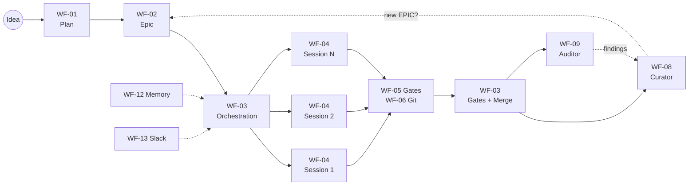

**PM touches:** WF-01 (Plan), WF-02 (Epic), WF-03 (approve plan + escalations + merge), WF-08 (Curator proposals), WF-09 (Audit summary)

**AI autonomous:** WF-03 (execution), WF-04 (session work), WF-05 (gates), WF-06 (git), WF-07 (handoff), WF-08 (collection + dedup), WF-09 (audit execution), WF-10 (scan), WF-12 (memory)

---

**Last Updated:** 2026-02-16
